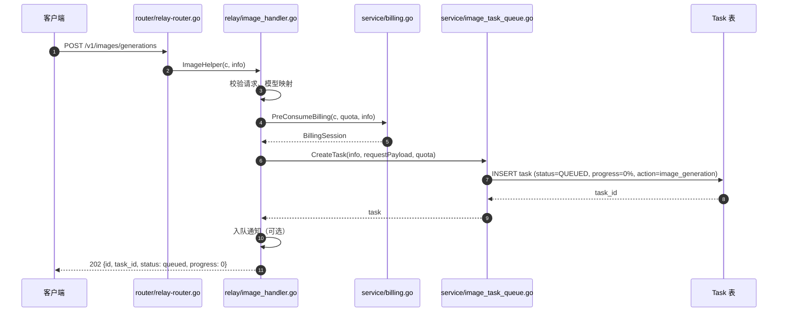
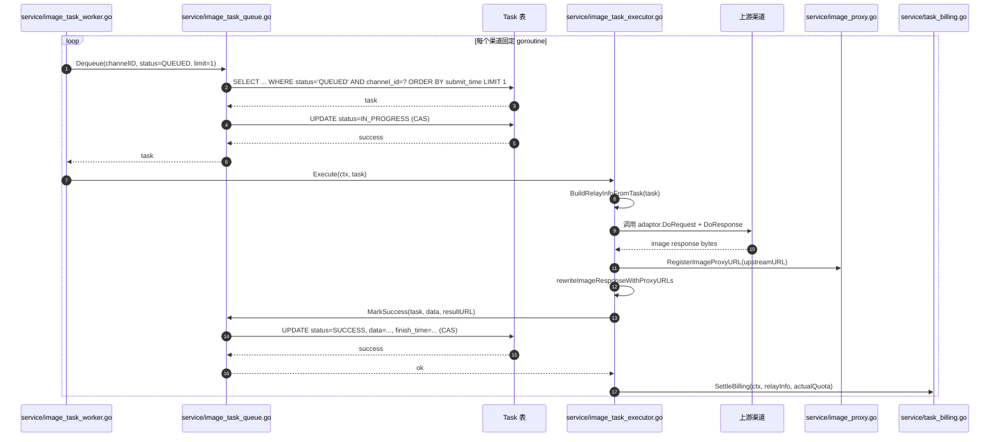
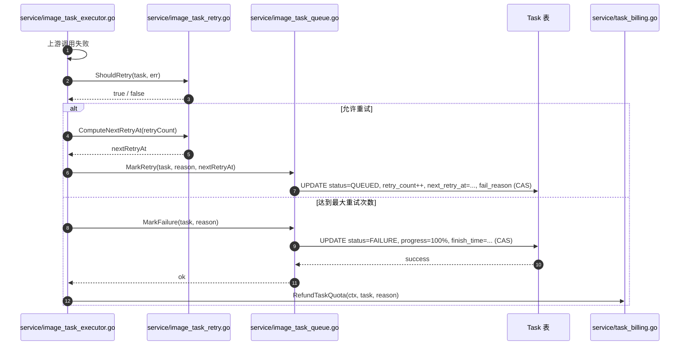
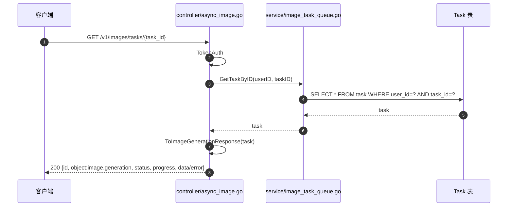
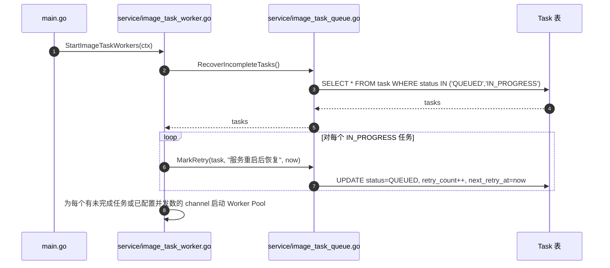

# new-api 图片生成后台任务队列架构设计

> 项目：new-api（Go + Gin + GORM）  
> 范围：将 OpenAI / Google Gemini / 火山方舟 三个渠道的图片生成从“同步等待后落库”改为真正的后台任务队列  
> 输出：系统架构设计、类图、时序图、任务分解

---

## Part A：系统架构设计

### 1. 实现方案与框架选型

#### 1.1 核心设计目标

| 目标 | 说明 |
|------|------|
| 提交即返回 | HTTP 请求在持久化任务记录后立即返回 `task_id` 与 `queued` 状态，HTTP 状态码 202。 |
| 后台异步执行 | 由独立 worker 消费任务，调用上游渠道完成图片生成，更新结果。 |
| 统一轮询语义 | 三个渠道复用同一状态机与同一 `GET /v1/images/tasks/{task_id}` 接口。 |
| 可靠性与可观测性 | 支持重试、死信、超时、服务恢复、队列监控与事件日志。 |
| 计费一致性 | 提交时预扣额度，成功/失败时结算或退款。 |

#### 1.2 关键设计决策

**1. 复用现有 `Task` 表，不新建独立表**
- 理由：现有 `model.Task` 已包含状态、进度、数据、计费上下文、时间戳等字段，且计费、日志、恢复机制均围绕该表构建。复用可最大限度复用 `RefundTaskQuota`、`RecalculateTaskQuota` 等已有能力，降低风险。
- 扩展：将 `retry_count`、`next_retry_at`、`request_payload` 等 worker 专用字段存入 `TaskPrivateData`（JSON 列）。若后续字段膨胀或需要频繁更新，再拆分出 `image_task_contexts` 表。

**2. 使用数据库作为持久化队列，不引入 Redis/RabbitMQ**
- 理由：new-api 已重度依赖 GORM/MySQL，增加消息中间件会提升部署与运维成本。通过 `status + submit_time` 索引的轮询方式即可满足 P0 需求，且天然支持服务重启后的任务恢复。
- 缺点：轮询有少量 DB 压力；未来若队列深度或并发度极高，可再引入 Redis 作为缓冲。

**3. 按渠道隔离的 Worker Pool**
- 理由：OpenAI、Gemini、火山方舟的并发限制、超时、重试策略不同，按渠道隔离可防止某一渠道变慢阻塞整体服务，也便于按渠道配置并发数。
- 实现：每个 `channel_id` 对应一个 `ImageTaskWorkerPool`，内部维护固定数量 goroutine；所有 worker 共享一个 `ImageTaskQueue`。

**4. 任务状态 CAS 更新**
- 所有状态流转（`QUEUED → IN_PROGRESS → SUCCESS/FAILURE`）均使用 `model.Task.UpdateWithStatus()`（GORM `WHERE status = ?` 更新），避免多 worker 或重启恢复时重复消费。

**5. 失败重试与死信**
- 失败时通过 `TaskPrivateData.RetryCount` 与 `NextRetryAt` 实现指数退避；达到最大重试次数后标记为 `FAILURE`，触发 `RefundTaskQuota`。

#### 1.3 架构模式

- **分层**：严格遵循 `controller → service → model`。
- **队列模式**：数据库持久化队列 + 拉取（polling）消费。
- **Worker 模式**：按渠道 Worker Pool（固定 goroutine 数） + 单任务执行器（Executor）。
- **状态机**：`QUEUED → IN_PROGRESS → SUCCESS / FAILURE`（失败可回退到 `QUEUED` 重试）。

#### 1.4 技术选型

| 组件 | 选型 | 理由 |
|------|------|------|
| Web 框架 | Gin（已使用） | 无需变更。 |
| ORM | GORM（已使用） | 复用事务、索引、迁移能力。 |
| 队列 | MySQL `Task` 表 | 与现有架构一致，简化部署。 |
| Worker 调度 | Go goroutine + channel | 轻量，无需第三方库。 |
| 指标（P1） | Prometheus client_golang | 与现有 `/metrics` 监控体系兼容。 |
| 上下文传递 | `TaskPrivateData` JSON | 无需新增表，快速实现。 |

---

### 2. 文件列表

所有路径相对项目根目录 `F:\new api\`。

#### 新增文件

| 相对路径 | 说明 |
|----------|------|
| `service/image_task_queue.go` | 数据库队列封装：创建、拉取、更新、恢复、取消。 |
| `service/image_task_worker.go` | 按渠道 Worker Pool 管理（启动、停止、分发）。 |
| `service/image_task_executor.go` | 单任务执行器：调用上游、结果重写、状态更新。 |
| `service/image_task_retry.go` | 重试策略：指数退避、最大重试、死信判断。 |
| `service/image_task_metrics.go` | 队列指标：深度、处理耗时、失败率、重试次数（P1）。 |
| `service/image_task_context.go` | 任务上下文序列化/反序列化：从 `Task` 重建 `RelayInfo`。 |

#### 修改文件

| 相对路径 | 说明 |
|----------|------|
| `main.go` | 启动 Worker Pool、注册恢复逻辑。 |
| `model/task.go` | 扩展 `TaskPrivateData`：增加 `RetryCount`、`NextRetryAt`、`RequestPayload` 等；补充索引。 |
| `constant/task.go` | 新增 `TaskActionImageGenerate` 动作常量。 |
| `relay/image_handler.go` | 改造 `handleSyncImageAsTaskRelay`：改为仅提交任务并入队，不再同步执行。 |
| `controller/async_image.go` | 轮询接口返回 `image.generation` 统一格式；新增取消任务接口（P1）。 |
| `router/relay-router.go` | 新增 `POST /v1/images/tasks/:task_id/cancel` 路由。 |
| `service/task_billing.go` | 补充/复用任务终态结算与退款逻辑。 |
| `service/image_proxy.go` | 无需修改，继续复用 `RegisterImageProxyURL` / `GetImageProxyURL`。 |
| `go.mod` | 如引入 Prometheus 指标库，需新增依赖。 |
| `.env.example` | 增加 worker 并发、超时、重试、队列轮询间隔等环境变量。 |

---

### 3. 数据结构与数据库表设计

#### 3.1 `Task` 表复用与扩展

现有字段基本保持不变，关键变更如下：

| 字段 | 变更 | 说明 |
|------|------|------|
| `action` | 新增取值 | 使用 `constant.TaskActionImageGenerate`（建议值 `"image_generation"`），区分图片、视频、歌词等任务。 |
| `status` | 复用 | `QUEUED` / `IN_PROGRESS` / `SUCCESS` / `FAILURE`。 |
| `progress` | 复用 | 字符串 `"0%"` ~ `"100%"`，API 层转换为整数。 |
| `data` | 复用 | 存储 OpenAI 格式的图片响应 JSON（含代理后的 URL）。 |
| `private_data` | 扩展 | 新增 `retry_count`、`next_retry_at`、`request_payload` 等。 |

#### 3.2 扩展 `TaskPrivateData`

```go
type TaskPrivateData struct {
    Key            string              `json:"key,omitempty"`              // 渠道密钥（Gemini 等需要）
    UpstreamTaskID string              `json:"upstream_task_id,omitempty"` // 上游真实 task ID
    ResultURL      string              `json:"result_url,omitempty"`       // 结果 URL（代理后）
    BillingSource  string              `json:"billing_source,omitempty"`
    SubscriptionId int                 `json:"subscription_id,omitempty"`
    TokenId        int                 `json:"token_id,omitempty"`
    BillingContext *TaskBillingContext `json:"billing_context,omitempty"`
    RequestPayload string              `json:"request_payload,omitempty"`  // 原始请求体 JSON，用于 worker 重放
    RetryCount     int                 `json:"retry_count,omitempty"`      // 已重试次数
    NextRetryAt    int64               `json:"next_retry_at,omitempty"`    // 下次可重试时间戳
    DownstreamBaseURL string           `json:"downstream_base_url,omitempty"` // 用于生成 proxy URL 的 base URL
}
```

#### 3.3 可选独立上下文表

若 `private_data` 因频繁更新或体积过大产生性能问题，可拆分为 `image_task_contexts`：

| 字段 | 类型 | 说明 |
|------|------|------|
| `task_id` | varchar(191) PK/FK | 关联 `Task.task_id`。 |
| `request_payload` | JSON | 原始请求体。 |
| `request_headers` | JSON | 可选，保留原始头部。 |
| `retry_count` | int | 已重试次数。 |
| `next_retry_at` | int64 | 下次重试时间戳。 |
| `downstream_base_url` | varchar(500) | 用于生成 image-proxy URL。 |
| `created_at` / `updated_at` | int64 | 时间戳。 |

**本次设计建议先复用 `private_data`。**

#### 3.4 索引优化

```sql
-- 按状态 + 提交时间顺序消费 QUEUED 任务
CREATE INDEX idx_task_status_submit_time ON task(status, submit_time);

-- 按状态 + 重试时间调度重试
CREATE INDEX idx_task_status_retry ON task(status, retry_count, next_retry_at);

-- 按渠道 + 状态查询与监控
CREATE INDEX idx_task_channel_status ON task(channel_id, status);

-- 已有索引：task_id、user_id、created_at 等保持不变
```

---

### 4. 程序调用流程

#### 4.1 提交图片生成任务



#### 4.2 Worker 消费并执行成功



#### 4.3 失败重试与死信



#### 4.4 下游轮询结果



#### 4.5 服务重启后任务恢复



---

### 5. 待明确事项

| 编号 | 问题 | 当前假设 |
|------|------|----------|
| 1 | 提交接口是否返回 202？ | 建议返回 202，更符合异步语义；若需兼容 OpenAI SDK，也可返回 200 但 body 仍包含 `status: queued`。 |
| 2 | 计费时机：提交时是否立即全额预扣？ | 是，沿用现有 `PreConsumeBilling`；成功时 `SettleBilling`，最终失败时 `RefundTaskQuota`。 |
| 3 | 部分成功（多图生成部分失败）如何结算？ | 先按整次预扣，成功后再按实际返回图片数或上游 usage 差额结算；若无法准确计算，保持整次扣费。 |
| 4 | 失败时是否固定在同一 `channel_id` 重试？ | 固定同一渠道，避免渠道切换带来计费与上下文不一致。 |
| 5 | 是否设置绝对超时时间？ | 是，建议默认 10 分钟；超时任务标记为 `FAILURE` 并退款。 |
| 6 | 服务重启时 `IN_PROGRESS` 任务如何处理？ | 标记为 `QUEUED` 并立即重试，视为一次重试计数。 |
| 7 | image-proxy 有效期多长？ | 复用现有配置；结果清理（P2）后同步失效由后续迭代处理。 |
| 8 | 下游兼容性：`object` 是否统一为 `image.generation`？ | 统一为 `image.generation`，旧 `video` 值仅在老数据轮询时保留过渡。 |
| 9 | `action` 字段取值 | 建议新增 `"image_generation"`，避免与视频/歌词任务混淆。 |

---

## Part B：任务分解

### 6. 依赖包列表

| 包名 | 版本/说明 | 用途 |
|------|-----------|------|
| `github.com/gin-gonic/gin` | 已依赖 | HTTP 框架。 |
| `gorm.io/gorm` | 已依赖 | ORM。 |
| `github.com/samber/lo` | 已依赖 | 辅助函数。 |
| `github.com/prometheus/client_golang` | 可选（P1） | 队列深度、耗时、失败率指标。 |
| Go 标准库 | 内置 | context、sync、time、encoding/json、fmt。 |

> 核心功能无需新增第三方包；P1 指标功能按需引入 Prometheus。

---

### 7. 任务列表（按实现顺序）

#### T01：项目基础设施与全局配置

- **Task ID**：T01
- **Task Name**：项目基础设施与全局配置
- **Source Files**：
  - `main.go`：添加 worker 启动与恢复调用。
  - `go.mod`：如引入 Prometheus，添加依赖。
  - `.env.example`：新增 `IMAGE_TASK_WORKER_CONCURRENCY`、`IMAGE_TASK_WORKER_POLL_INTERVAL`、`IMAGE_TASK_WORKER_MAX_RETRY`、`IMAGE_TASK_WORKER_TIMEOUT_SECONDS`。
  - `constant/task.go`：新增 `TaskActionImageGenerate`。
- **Dependencies**：无
- **Priority**：P0

#### T02：数据层扩展与队列服务

- **Task ID**：T02
- **Task Name**：数据层扩展与队列服务
- **Source Files**：
  - `model/task.go`：扩展 `TaskPrivateData`；新增 `RetryCount`、`NextRetryAt`、`RequestPayload`、`DownstreamBaseURL`；补充数据库索引迁移。
  - `service/image_task_queue.go`：实现 `ImageTaskQueue`：CreateTask、Dequeue、MarkInProgress、MarkSuccess、MarkRetry、MarkFailure、GetTaskByID、RecoverIncompleteTasks。
  - `service/image_task_context.go`：实现 `BuildRelayInfoFromTask` 与 `SerializeImageRequest`，用于 worker 从任务重建调用上下文。
- **Dependencies**：T01
- **Priority**：P0

#### T03：Worker 调度与执行引擎

- **Task ID**：T03
- **Task Name**：Worker 调度与执行引擎
- **Source Files**：
  - `service/image_task_worker.go`：实现 `ImageTaskWorkerPool`；按 `channel_id` 启动固定 goroutine；从队列拉取任务；处理服务启动恢复。
  - `service/image_task_executor.go`：实现 `ImageTaskExecutor`；调用上游 adaptor、重写 URL 为 image-proxy、更新任务状态、调用计费。
  - `service/image_task_retry.go`：实现重试策略（指数退避、最大重试次数、死信判断）。
- **Dependencies**：T02
- **Priority**：P0

#### T04：HTTP 接口层改造

- **Task ID**：T04
- **Task Name**：HTTP 接口层改造
- **Source Files**：
  - `relay/image_handler.go`：改造 `handleSyncImageAsTaskRelay`，改为预扣费、创建 `QUEUED` 任务、返回 202；不再同步执行。
  - `controller/async_image.go`：轮询接口返回 `object:image.generation` 格式；新增 `AsyncImageTaskCancel` 取消接口。
  - `router/relay-router.go`：注册 `POST /v1/images/tasks/:task_id/cancel` 路由。
- **Dependencies**：T02
- **Priority**：P0

#### T05：计费一致性、监控与恢复

- **Task ID**：T05
- **Task Name**：计费一致性、监控与恢复
- **Source Files**：
  - `service/task_billing.go`：补充任务成功差额结算与失败退款逻辑；确保与 `BillingSession` 生命周期一致。
  - `service/image_task_metrics.go`：实现队列深度、各渠道处理耗时、失败率、重试次数指标暴露（P1）。
  - `service/billing.go`：如需补充 `BillingSession` 方法用于无 gin context 的 settle/refund。
- **Dependencies**：T03、T04
- **Priority**：P0/P1

---

### 8. 共享知识

#### 8.1 跨文件约定

- **任务状态机**：
  ```
  QUEUED → IN_PROGRESS → SUCCESS
                    ↘ FAILURE (可重试时回退到 QUEUED)
  ```
- **`action` 取值**：图片生成任务统一使用 `constant.TaskActionImageGenerate`（建议字符串 `"image_generation"`）。
- **进度表示**：数据库中存储 `"0%"` ~ `"100%"` 字符串；API 返回体中转换为整数 `0` ~ `100`。
- **`object` 字段**：所有图片任务轮询返回 `object: "image.generation"`。
- **结果 URL**：上游返回的原始 URL 必须经 `service.RegisterImageProxyURL` 注册后重写为本地 `/image-proxy/{id}.png`。
- **任务上下文持久化**：`TaskPrivateData.RequestPayload` 保存完整请求体；`BillingContext` 保存计费快照；`DownstreamBaseURL` 保存用于生成 proxy URL 的 base URL。

#### 8.2 错误处理

- **状态流转必须走 CAS**：除初始化插入外，所有涉及状态变化的更新使用 `model.Task.UpdateWithStatus(fromStatus)`，失败表示任务已被其他 worker 处理，应丢弃并拉取下一个。
- **失败分类**：
  - 可重试错误：上游超时、5xx、限流；走重试策略。
  - 不可重试错误：4xx、参数错误、额度不足；直接标记 `FAILURE`。
- **退款幂等**：`RefundTaskQuota` 在标记 `FAILURE` 后调用一次；若退款失败，记录日志但不回滚状态。

#### 8.3 状态流转与计费

| 状态流转 | 计费动作 | 说明 |
|----------|----------|------|
| 提交 → `QUEUED` | `PreConsumeBilling` | 按预扣额度冻结。 |
| `IN_PROGRESS` → `SUCCESS` | `SettleBilling` | 按实际 quota 结算；多退少补。 |
| `IN_PROGRESS` → `FAILURE`（重试耗尽） | `RefundTaskQuota` | 全额退还预扣额度。 |
| 取消 `QUEUED/IN_PROGRESS` | `RefundTaskQuota` | 全额退还并标记 `FAILURE`。 |

#### 8.4 恢复与重试

- 服务启动时，所有 `IN_PROGRESS` 任务被重置为 `QUEUED` 并设置 `next_retry_at=now`，视为一次重试计数。
- `QUEUED` 任务在队列中按 `submit_time` 顺序消费。
- 重试任务必须满足 `next_retry_at <= now()` 才可被消费。

---

### 9. 任务依赖图

```mermaid
graph TD
    T01[\"T01 项目基础设施与全局配置\"]
    T02[\"T02 数据层扩展与队列服务\"]
    T03[\"T03 Worker 调度与执行引擎\"]
    T04[\"T04 HTTP 接口层改造\"]
    T05[\"T05 计费一致性、监控与恢复\"]

    T01 --> T02
    T02 --> T03
    T02 --> T04
    T03 --> T05
    T04 --> T05
```

---

### 10. 关键接口定义（伪代码）

```go
// service/image_task_queue.go
type ImageTaskQueue interface {
    CreateTask(relayInfo *relaycommon.RelayInfo, requestPayload []byte, quota int) (*model.Task, error)
    Dequeue(channelID int, limit int) ([]*model.Task, error)
    MarkInProgress(task *model.Task) (bool, error)
    MarkSuccess(task *model.Task, data []byte, resultURL string) (bool, error)
    MarkRetry(task *model.Task, reason string, nextRetryAt int64) (bool, error)
    MarkFailure(task *model.Task, reason string) (bool, error)
    GetTaskByID(userID int, taskID string) (*model.Task, bool, error)
    RecoverIncompleteTasks() ([]*model.Task, error)
    CancelTask(userID int, taskID string) (bool, error)
}

// service/image_task_worker.go
type ImageTaskWorkerPool struct {
    ChannelID   int
    Concurrency int
    Queue       ImageTaskQueue
    Executor    ImageTaskExecutor
}
func (p *ImageTaskWorkerPool) Start(ctx context.Context)
func (p *ImageTaskWorkerPool) Stop()

// service/image_task_executor.go
type ImageTaskExecutor interface {
    Execute(ctx context.Context, task *model.Task) error
}

// service/image_task_retry.go
type RetryPolicy interface {
    ShouldRetry(task *model.Task, err error) bool
    NextRetryAt(retryCount int) int64
}
```

---

*本文档为架构设计，不包含具体代码实现。*
