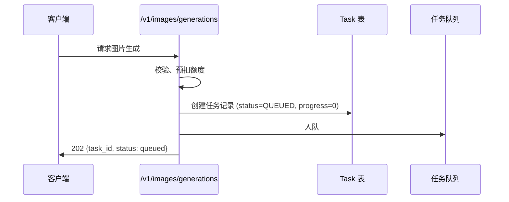
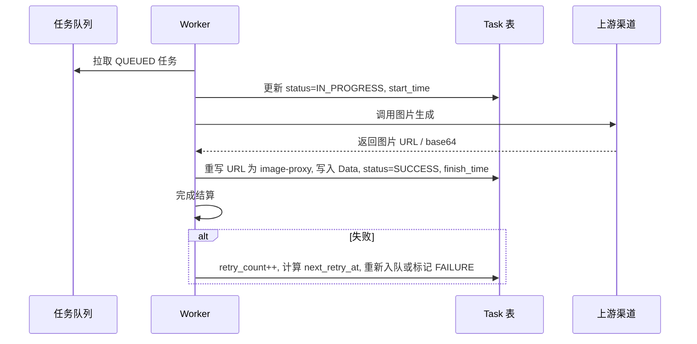
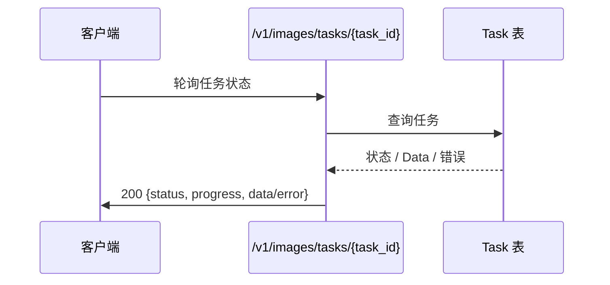

# new-api 图片生成后台任务队列增量 PRD

> 项目：new-api（Go + Gin + GORM）
> 语言：简体中文
> 文档类型：增量产品需求文档
> 范围：将 OpenAI / Google Gemini / 火山方舟 三个渠道的图片生成从“同步等待后落库”改为真正的后台任务队列

---

## 1. 项目信息

- **Project Name**：image_task_queue
- **Programming Language**：Go（Gin + GORM）
- **原始需求**：
  - 当前 OpenAI / Gemini / 火山方舟 的图片生成已包装成异步 task，但本质上仍在 HTTP 请求中同步等待上游生成完成后再写入数据库。
  - 新需求要求：HTTP 请求在提交后立即返回 `task_id`，后台 worker 异步执行图片生成，下游通过 `GET /v1/images/tasks/{task_id}` 轮询结果。

---

## 2. 产品定义

### 2.1 Product Goals

1. **降低接口延迟、提升吞吐**：图片生成的 HTTP 请求提交后必须立即返回 `task_id`，不再阻塞等待上游完成，降低 P95 延迟。
2. **统一异步任务语义**：三个渠道的图片生成复用同一套任务状态（queued / in_progress / success / failure）和同一轮询接口，降低下游接入成本。
3. **保证可靠性与可观测性**：后台 worker 必须具备超时、失败重试、死信（最大重试后失败）和队列监控能力，任务状态变更对运维可见。

### 2.2 User Stories

- **作为 API 调用方**，我希望调用图片生成接口后立即获得 `task_id`，而不是阻塞等待十几秒，这样我可以继续处理其他业务逻辑。
- **作为下游客户端开发者**，我希望通过 `/v1/images/tasks/{task_id}` 轮询任务状态，并在完成后拿到图片 URL 或 base64，这样我可以用统一的模式处理三个渠道。
- **作为运维工程师**，我希望看到各渠道的队列深度、处理耗时、失败率和重试次数，这样我能及时发现渠道异常并调整并发配置。
- **作为渠道管理员**，我希望为每个渠道独立配置 worker 并发数、超时时间和重试策略，这样某个渠道变慢不会影响整体服务。
- **作为计费负责人**，我希望任务提交时预扣额度，任务成功或最终失败时进行结算/退款，这样额度与任务生命周期一致。

---

## 3. 技术规范

### 3.1 Requirements Pool

#### P0（Must have）

| 编号 | 需求 | 验收标准 |
|------|------|----------|
| P0-1 | **提交即返回** | 对 OpenAI / Gemini / 火山方舟 的图片生成请求，`POST /v1/images/generations` 创建任务后必须立即返回 `task_id` 和 `queued` 状态，HTTP 状态码 202。 |
| P0-2 | **后台任务队列** | 引入持久化任务队列（复用现有 `Task` 表），任务初始状态为 `QUEUED`，由后台 worker 异步消费。 |
| P0-3 | **Worker 执行** | worker 取出任务后更新状态为 `IN_PROGRESS`，调用对应渠道适配器完成图片生成，成功后写入 `Data` 并更新为 `SUCCESS`；失败则按重试策略处理。 |
| P0-4 | **状态轮询接口** | `GET /v1/images/tasks/{task_id}` 返回当前状态、进度、结果或错误信息；成功时返回的图片 URL 必须经本地 image-proxy 代理。 |
| P0-5 | **重试与死信** | 任务失败必须支持最大重试次数（默认 3 次）和指数退避；超过最大重试后标记为 `FAILURE` 并触发退款。 |
| P0-6 | **任务持久化恢复** | 服务重启后，worker 必须能从数据库中恢复未完成的 `QUEUED` / `IN_PROGRESS` 任务并继续处理。 |
| P0-7 | **计费一致性** | 提交时预扣额度，任务成功或最终失败时完成结算/退款，确保与现有 `SettleBilling` 逻辑一致。 |

#### P1（Should have）

| 编号 | 需求 | 验收标准 |
|------|------|----------|
| P1-1 | **渠道级并发控制** | 支持按渠道配置 worker 并发数、单次超时时间和重试次数，配置可通过环境变量或配置文件生效。 |
| P1-2 | **任务取消** | `POST /v1/images/tasks/{task_id}/cancel` 允许在 `QUEUED` 或 `IN_PROGRESS` 状态下取消任务，并释放已扣额度。 |
| P1-3 | **队列监控指标** | 暴露队列深度、各渠道处理耗时、失败率、重试次数等指标，可接入现有日志或 `/metrics` 监控。 |
| P1-4 | **任务事件日志** | 记录任务状态流转日志（提交、开始、重试、成功、失败、取消），便于排障和审计。 |
| P1-5 | **提交响应兼容** | 提交接口返回体尽量兼容 OpenAI 异步格式，至少包含 `id`、`task_id`、`object`、`status`、`created_at`、`model`、`progress`。 |

#### P2（Nice to have）

| 编号 | 需求 | 验收标准 |
|------|------|----------|
| P2-1 | **Webhook 回调** | 任务进入终态（成功/失败）时可配置回调 URL，主动通知下游。 |
| P2-2 | **任务优先级** | 支持按 token / 分组设置任务优先级，优先队列中的高优先级任务先被消费。 |
| P2-3 | **批量任务查询** | `GET /v1/images/tasks?ids=task_1,task_2,...` 支持批量查询多个任务状态。 |
| P2-4 | **结果过期清理** | 成功任务的结果数据可按配置周期（如 7 天）自动清理，保留状态摘要。 |

---

## 4. 关键流程

### 4.1 提交任务流程



### 4.2 Worker 消费流程



### 4.3 下游轮询流程



---

## 5. 接口行为

### 5.1 提交图片生成任务

- **端点**：`POST /v1/images/generations`
- **适用渠道**：OpenAI（DALL-E）、Google Gemini（Imagen 等）、火山方舟
- **请求体**：保持现有 OpenAI 图片生成请求格式，不变。
- **响应**：

```json
HTTP/1.1 202 Accepted
Content-Type: application/json

{
  "id": "task_abc123",
  "task_id": "task_abc123",
  "object": "image.generation",
  "status": "queued",
  "created_at": 1715410000,
  "model": "gpt-image-1",
  "progress": 0
}
```

- **注意**：成功提交后不再返回 `data` 字段；图片结果通过轮询接口获取。

### 5.2 轮询任务状态

- **端点**：`GET /v1/images/tasks/{task_id}`
- **鉴权**：现有 TokenAuth
- **响应示例（进行中）**：

```json
{
  "id": "task_abc123",
  "object": "image.generation",
  "status": "in_progress",
  "progress": 45,
  "created_at": 1715410000,
  "model": "gpt-image-1"
}
```

- **响应示例（成功）**：

```json
{
  "id": "task_abc123",
  "object": "image.generation",
  "status": "completed",
  "progress": 100,
  "created_at": 1715410000,
  "completed_at": 1715410015,
  "model": "gpt-image-1",
  "data": [
    {
      "url": "https://api.example.com/image-proxy/xyz.png",
      "revised_prompt": "..."
    }
  ]
}
```

- **响应示例（失败）**：

```json
{
  "id": "task_abc123",
  "object": "image.generation",
  "status": "failed",
  "progress": 100,
  "created_at": 1715410000,
  "completed_at": 1715410020,
  "model": "gpt-image-1",
  "error": {
    "message": "upstream timeout after 3 retries",
    "code": "task_failed"
  }
}
```

### 5.3 取消任务（P1）

- **端点**：`POST /v1/images/tasks/{task_id}/cancel`
- **行为**：仅允许在 `QUEUED` 或 `IN_PROGRESS` 状态下取消；取消后状态变为 `FAILURE` 并触发退款。

---

## 6. 数据模型变化

### 6.1 复用现有 `Task` 表

已有字段基本满足需求，主要变化如下：

- **Action**：新增 `"image_generation"`（或沿用现有 `"generate"`，但建议新增以区分图片、视频、歌词等任务）。
- **Status**：沿用现有状态机 `QUEUED` / `IN_PROGRESS` / `SUCCESS` / `FAILURE`。
- **Progress**：保持现有 `varchar` 字符串 "0%" ~ "100%"，API 层转换为整数百分比返回。
- **Data**：存储最终生成的 OpenAI 格式图片响应（JSON），包含代理后的图片 URL。
- **PrivateData**：新增字段用于 worker 重放和重试：
  - `request_payload`：提交时保存的原始请求体，worker 复用此请求调用上游。
  - `request_context`：包含 `channel_id`、`origin_model_name`、`token_id`、`group`、`price_data` 等计费/路由快照。
  - `retry_count`：已重试次数。
  - `next_retry_at`：下次重试时间戳。
  - `result_url`：已存在，仍用于保存第一张图片代理 URL。

### 6.2 索引优化

为 worker 高效拉取任务，建议新增复合索引：

- `(status, submit_time)`：按时间顺序消费 `QUEUED` 任务。
- `(status, retry_count, next_retry_at)`：重试调度使用。
- `(channel_id, status)`：按渠道查询任务与监控。

### 6.3 可选：图片任务上下文表

如果 `PrivateData` 容量或序列化成本较高，可新增 `image_task_contexts` 表，字段：

- `task_id`（PK/FK）
- `request_payload`（JSON）
- `request_headers`（JSON，可选）
- `retry_count`
- `next_retry_at`
- `created_at`
- `updated_at`

---

## 7. 待确认问题（Open Questions）

1. **响应状态码**：提交接口是否返回 `202 Accepted`，还是为兼容 OpenAI SDK 仍返回 `200 OK`？
2. **计费时机**：提交时是否立即全额预扣额度？部分成功（多图生成部分失败）时如何结算？
3. **任务表选择**：复用现有 `Task` 表，还是新建独立的 `image_generation_tasks` 表？后者有利于独立扩展和清理策略。
4. **Worker 模型**：使用全局 worker 池，还是每个渠道拥有独立 goroutine/队列？后者更便于渠道隔离。
5. **重试策略**：失败时是否固定在同一 `channel_id` 重试，还是允许重新调度到其他同类型渠道？
6. **任务超时**：是否设置从提交到最终失败的绝对超时时间（如 10 分钟），避免无限重试？
7. **进行中任务恢复**：服务重启时，状态为 `IN_PROGRESS` 的任务是重新执行，还是标记为失败并退款？
8. **image-proxy 有效期**：代理 URL 的有效期多长？是否需要在结果清理后同步失效？
9. **下游兼容性**：是否需要在 `GET /v1/images/tasks/{task_id}` 返回体中保留 `object: "video"` 以兼容旧客户端，还是统一为 `image.generation`？

---

*本文档为产品需求分析，不包含具体代码实现。*
