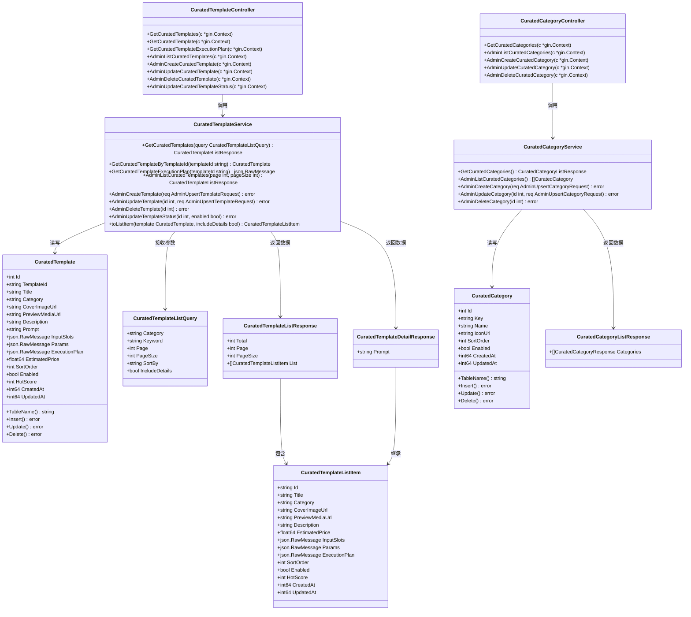
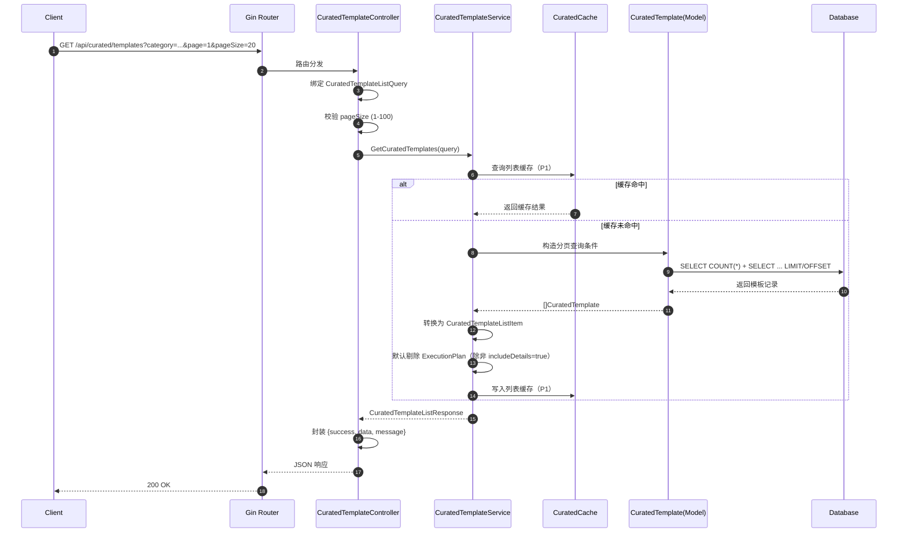
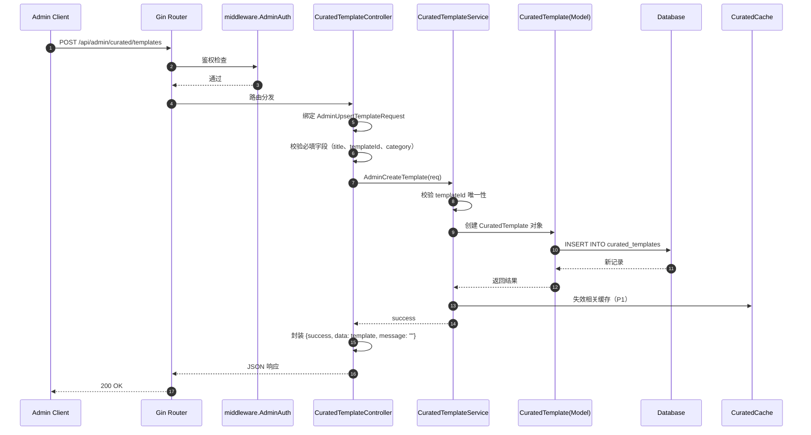
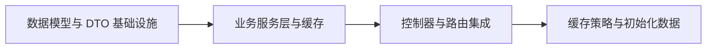

# 一键同款工作流模板市场 API 架构设计

> 版本：v1.0  
> 项目：new-api（Go + Gin + GORM）  
> 作者：软件架构师（software-architect）  
> 日期：2026-07-23

---

## 1. 实现方案 + 框架选型

### 1.1 核心挑战

1. **数据上收与兼容**：前端本地 `curatedTemplates.json` 需要迁移到后端，API 字段必须保持与前端现有 TypeScript 类型一致的 **camelCase** 命名。
2. **JSON 字段跨库兼容**：`inputSlots`、`params`、`executionPlan` 为复杂 JSON 结构，需要在 SQLite / MySQL / PostgreSQL 之间平滑迁移。
3. **公开读取 + 管理鉴权**：下游接口完全公开，管理接口复用现有 `middleware.AdminAuth()`。
4. **列表查询性能**：支持分页、分类、关键词、排序，默认不返回完整的 `executionPlan`。

### 1.2 复用基础设施

| 模块 | 说明 |
|------|------|
| **Gin** | 已集成，用于 HTTP 路由和参数绑定。 |
| **GORM** | 已集成，通过 `model.DB` 访问数据库。 |
| **middleware.AdminAuth()** | 复用现有管理员鉴权中间件。 |
| **common.ApiSuccess / ApiError / ApiErrorMsg** | 统一响应封装 `{success, message, data}`。 |
| **common.GetPageQuery** | 复用分页参数解析（page / page_size），返回时再转换为 camelCase。 |
| **pkg/cachex** | 复用 HybridCache（Memory + Redis），用于 P1 缓存。 |
| **common.Marshal / Unmarshal** | 复用 JSON 序列化工具。 |

### 1.3 新增模块

严格遵循 new-api 现有 `router -> controller -> service -> model` 分层，新增以下文件：

- **数据层**：`model/curated_template.go`、`model/curated_category.go`
- **DTO 层**：`dto/curated_request.go`、`dto/curated_response.go`
- **业务层**：`service/curated_template.go`、`service/curated_category.go`、`service/curated_cache.go`
- **控制层**：`controller/curated_template.go`、`controller/curated_category.go`
- **路由层**：修改 `router/api-router.go` 注册路由

### 1.4 架构模式

- **MVC 分层**：Controller 负责 HTTP 绑定、参数校验、响应封装；Service 负责业务逻辑、缓存、DTO 转换；Model 负责数据访问。
- **DTO 隔离**：公开读取接口使用 DTO 控制字段输出（如列表默认不返回 `executionPlan`），管理接口可直接使用 Model 或独立 Admin DTO。
- **缓存策略**：P1 阶段引入 HybridCache，缓存分类列表、模板详情、列表查询结果；写操作后主动失效缓存。

---

## 2. 文件列表

### 2.1 新增文件

| 相对路径 | 说明 |
|----------|------|
| `model/curated_template.go` | `CuratedTemplate` 表模型，含 JSON 字段定义。 |
| `model/curated_category.go` | `CuratedCategory` 表模型。 |
| `dto/curated_request.go` | 列表查询参数、创建/更新请求 DTO。 |
| `dto/curated_response.go` | 模板列表、详情、分类、执行计划响应 DTO。 |
| `service/curated_template.go` | 模板列表、详情、执行计划、管理 CRUD 业务逻辑。 |
| `service/curated_category.go` | 分类列表、管理 CRUD 业务逻辑。 |
| `service/curated_cache.go` | 缓存 key 生成、HybridCache 实例、缓存失效函数。 |
| `controller/curated_template.go` | 模板公开读取接口 + 管理接口。 |
| `controller/curated_category.go` | 分类公开读取接口 + 管理接口。 |

### 2.2 修改文件

| 相对路径 | 说明 |
|----------|------|
| `router/api-router.go` | 在 `/api` 分组下注册公开路由；在 `/api/admin` 分组下注册管理路由，并挂载 `middleware.AdminAuth()`。 |

---

## 3. 数据结构和接口

### 3.1 Model 定义

```go
// model/curated_template.go

type CuratedTemplate struct {
    Id              int             `json:"-" gorm:"primaryKey;autoIncrement"`
    TemplateId      string          `json:"id" gorm:"column:template_id;size:64;uniqueIndex"`
    Title           string          `json:"title" gorm:"not null"`
    Category        string          `json:"category" gorm:"size:64;index"`
    CoverImageUrl   string          `json:"coverImageUrl" gorm:"column:cover_image_url"`
    PreviewMediaUrl string          `json:"previewMediaUrl" gorm:"column:preview_media_url"`
    Description     string          `json:"description" gorm:"type:text"`
    Prompt          string          `json:"prompt" gorm:"type:text"`
    InputSlots      json.RawMessage `json:"inputSlots" gorm:"column:input_slots;type:json"`
    Params          json.RawMessage `json:"params" gorm:"column:params;type:json"`
    ExecutionPlan   json.RawMessage `json:"executionPlan,omitempty" gorm:"column:execution_plan;type:json"`
    EstimatedPrice  float64         `json:"estimatedPrice" gorm:"column:estimated_price;type:decimal(10,6);default:0"`
    SortOrder       int             `json:"sortOrder" gorm:"column:sort_order;default:0;index"`
    Enabled         bool            `json:"enabled" gorm:"default:true"`
    HotScore        int             `json:"hotScore" gorm:"column:hot_score;default:0"`
    CreatedAt       int64           `json:"createdAt" gorm:"column:created_at;autoCreateTime"`
    UpdatedAt       int64           `json:"updatedAt" gorm:"column:updated_at;autoUpdateTime"`
}

func (CuratedTemplate) TableName() string {
    return "curated_templates"
}
```

```go
// model/curated_category.go

type CuratedCategory struct {
    Id        int    `json:"-" gorm:"primaryKey;autoIncrement"`
    Key       string `json:"key" gorm:"size:64;uniqueIndex"`
    Name      string `json:"name" gorm:"not null"`
    IconUrl   string `json:"iconUrl" gorm:"column:icon_url"`
    SortOrder int    `json:"sortOrder" gorm:"column:sort_order;default:0;index"`
    Enabled   bool   `json:"enabled" gorm:"default:true"`
    CreatedAt int64  `json:"createdAt" gorm:"column:created_at;autoCreateTime"`
    UpdatedAt int64  `json:"updatedAt" gorm:"column:updated_at;autoUpdateTime"`
}

func (CuratedCategory) TableName() string {
    return "curated_categories"
}
```

### 3.2 DTO 定义

```go
// dto/curated_request.go

type CuratedTemplateListQuery struct {
    Category       string `form:"category"`
    Keyword        string `form:"keyword"`
    Page           int    `form:"page"`
    PageSize       int    `form:"pageSize"`
    SortBy         string `form:"sortBy"`
    IncludeDetails bool   `form:"includeDetails"`
}

type AdminUpsertTemplateRequest struct {
    TemplateId      string          `json:"id"` // template_id
    Title           string          `json:"title"`
    Category        string          `json:"category"`
    CoverImageUrl   string          `json:"coverImageUrl"`
    PreviewMediaUrl string          `json:"previewMediaUrl"`
    Description     string          `json:"description"`
    Prompt          string          `json:"prompt"`
    InputSlots      json.RawMessage `json:"inputSlots"`
    Params          json.RawMessage `json:"params"`
    ExecutionPlan   json.RawMessage `json:"executionPlan"`
    EstimatedPrice  float64         `json:"estimatedPrice"`
    SortOrder       int             `json:"sortOrder"`
    Enabled         bool            `json:"enabled"`
    HotScore        int             `json:"hotScore"`
}

type AdminUpdateTemplateStatusRequest struct {
    Enabled *bool `json:"enabled" binding:"required"`
}

type AdminUpsertCategoryRequest struct {
    Key       string `json:"key"`
    Name      string `json:"name"`
    IconUrl   string `json:"iconUrl"`
    SortOrder int    `json:"sortOrder"`
    Enabled   bool   `json:"enabled"`
}
```

```go
// dto/curated_response.go

type CuratedTemplateListItem struct {
    Id              string          `json:"id"`
    Title           string          `json:"title"`
    Category        string          `json:"category"`
    CoverImageUrl   string          `json:"coverImageUrl"`
    PreviewMediaUrl string          `json:"previewMediaUrl"`
    Description     string          `json:"description"`
    EstimatedPrice  float64         `json:"estimatedPrice"`
    InputSlots      json.RawMessage `json:"inputSlots"`
    Params          json.RawMessage `json:"params"`
    ExecutionPlan   json.RawMessage `json:"executionPlan,omitempty"`
    SortOrder       int             `json:"sortOrder"`
    Enabled         bool            `json:"enabled"`
    HotScore        int             `json:"hotScore"`
    CreatedAt       int64           `json:"createdAt"`
    UpdatedAt       int64           `json:"updatedAt"`
}

type CuratedTemplateListResponse struct {
    Total    int                       `json:"total"`
    Page     int                       `json:"page"`
    PageSize int                       `json:"pageSize"`
    List     []CuratedTemplateListItem `json:"list"`
}

type CuratedTemplateDetailResponse struct {
    CuratedTemplateListItem
    Prompt string `json:"prompt"`
}

type CuratedCategoryResponse struct {
    Key       string `json:"key"`
    Name      string `json:"name"`
    IconUrl   string `json:"iconUrl"`
    SortOrder int    `json:"sortOrder"`
    Enabled   bool   `json:"enabled"`
}

type CuratedCategoryListResponse struct {
    Categories []CuratedCategoryResponse `json:"categories"`
}
```

### 3.3 类图

类图详见独立文件：`docs/class-diagram-curated.mermaid`



---

## 4. 程序调用流程

时序图详见独立文件：`docs/sequence-diagram-curated.mermaid`

### 4.1 模板列表请求



### 4.2 管理创建模板



---

## 5. 任务列表（按依赖顺序）

> 约束：按功能模块分组，每个任务包含不少于 3 个相关文件；任务总数不超过 5 个。

| 任务 ID | 任务名称 | 输出文件 | 依赖 | 优先级 | 验收标准 |
|---------|----------|----------|------|--------|----------|
| **T01** | 数据模型与 DTO 基础设施 | `model/curated_template.go`<br>`model/curated_category.go`<br>`dto/curated_request.go`<br>`dto/curated_response.go` | - | P0 | 1. 模型字段、索引、JSON 标签符合 PRD；<br>2. 表名通过 `TableName()` 显式声明；<br>3. DTO 字段全部为 camelCase；<br>4. `json.RawMessage` + `gorm:"type:json"` 兼容三库。 |
| **T02** | 业务服务层与缓存 | `service/curated_template.go`<br>`service/curated_category.go`<br>`service/curated_cache.go` | T01 | P0 | 1. 实现公开列表/详情/执行计划/分类查询；<br>2. 实现管理端 CRUD、启用/禁用、排序逻辑；<br>3. 列表查询支持 `category`、`keyword`、`sortBy`、`includeDetails`；<br>4. 缓存 key 与失效函数封装到 `curated_cache.go`（P1 可先实现接口）。 |
| **T03** | 控制器与路由集成 | `controller/curated_template.go`<br>`controller/curated_category.go`<br>`router/api-router.go` | T02 | P0 | 1. 公开接口无鉴权；<br>2. 管理接口挂载 `middleware.AdminAuth()`；<br>3. 路由路径与 PRD 完全一致；<br>4. 参数校验与错误响应复用 `common.ApiErrorMsg`。 |
| **T04** | 缓存策略与初始化数据 | `service/curated_cache.go` 补充实现<br>`scripts/seed_curated_templates.go`（可选）<br>集成测试/Postman 集合 | T03 | P1 | 1. 列表、分类、详情缓存命中；<br>2. 管理写操作后缓存失效；<br>3. 提供种子脚本或测试数据；<br>4. 通过本地 SQLite 集成测试。 |

### 任务依赖图



---

## 6. 依赖包

本项目 **无需新增第三方 Go 依赖**，全部复用 new-api 已引入的包：

| 包名 | 来源 | 用途 |
|------|------|------|
| `github.com/gin-gonic/gin` | 已存在 | HTTP 路由、参数绑定 |
| `gorm.io/gorm` | 已存在 | ORM、自动迁移 |
| `github.com/QuantumNous/new-api/pkg/cachex` | 已存在 | HybridCache（Memory + Redis） |
| `github.com/QuantumNous/new-api/common` | 已存在 | 响应封装、分页、Marshal/Unmarshal |
| `github.com/QuantumNous/new-api/model` | 已存在 | DB 连接、基础模型风格 |
| `github.com/QuantumNous/new-api/middleware` | 已存在 | `AdminAuth()` |
| `encoding/json` | 标准库 | `json.RawMessage` |

> 注：若后续 P1/P2 阶段需要更复杂的搜索（如全文检索），再评估引入 `bleve` 或 Elasticsearch 客户端。

---

## 7. 共享知识（跨文件约定）

### 7.1 响应格式

所有接口统一使用：

```json
{ "success": true, "message": "", "data": ... }
```

- 成功：`common.ApiSuccess(c, data)`
- 失败：`common.ApiError(c, err)` 或 `common.ApiErrorMsg(c, "错误描述")`
- 业务状态码由 HTTP 状态码承载，具体见 PRD 错误码表。

### 7.2 字段命名

- API 请求/响应字段统一使用 **camelCase**（如 `coverImageUrl`、`pageSize`、`executionPlan`）。
- 数据库字段使用 **snake_case**（如 `cover_image_url`、`execution_plan`），通过 GORM `column` 标签映射。
- Go 结构体字段使用 **PascalCase**。

### 7.3 JSON 字段存储

- `input_slots`、`params`、`execution_plan` 使用 `json.RawMessage` + `gorm:"type:json"`。
- GORM 自动映射：
  - PostgreSQL → `JSONB`
  - MySQL → `JSON`
  - SQLite → `TEXT`
- 写入时由 `gin` 绑定为 `json.RawMessage`，直接落库；读取时直接返回给前端，无需二次解析。

### 7.4 分页参数

- 公开列表：`page`（默认 1）、`pageSize`（默认 20，最大 100）。
- 管理列表：可复用 `common.GetPageQuery(c)`，响应时转换为 `pageSize`（camelCase）。
- 返回结构：`{total, page, pageSize, list}`。

### 7.5 排序规则

| sortBy 值 | 排序逻辑 |
|-----------|----------|
| `hot`（默认） | `hot_score DESC, sort_order ASC, id DESC` |
| `newest` | `created_at DESC` |
| `price_asc` | `estimated_price ASC` |
| `price_desc` | `estimated_price DESC` |

### 7.6 缓存键名

| 缓存对象 | 命名空间 | 示例 key |
|----------|----------|----------|
| 模板详情 | `new-api:curated_template:v1` | `template:{templateId}` |
| 分类列表 | `new-api:curated_category:v1` | `categories:enabled` |
| 模板列表 | `new-api:curated_template_list:v1` | `list:{category}:{keyword}:{sortBy}:{page}:{pageSize}:{includeDetails}` |

- 缓存 TTL：分类列表 10 分钟；模板详情 5 分钟；列表缓存 5 分钟。
- 管理写操作（创建/更新/删除/状态变更）后统一调用 `InvalidateCuratedTemplateCache()` / `InvalidateCuratedCategoryCache()`。

### 7.7 路由注册位置

在 `router/api-router.go` 的 `SetApiRouter` 函数内，按以下分组注册：

```go
// 公开接口
apiRouter.GET("/curated/templates", controller.GetCuratedTemplates)
apiRouter.GET("/curated/templates/:id", controller.GetCuratedTemplate)
apiRouter.GET("/curated/templates/:id/execution-plan", controller.GetCuratedTemplateExecutionPlan)
apiRouter.GET("/curated/categories", controller.GetCuratedCategories)

// 管理接口
curatedTemplateAdminRoute := apiRouter.Group("/admin/curated/templates")
curatedTemplateAdminRoute.Use(middleware.AdminAuth())
curatedTemplateAdminRoute.GET("/", controller.AdminListCuratedTemplates)
curatedTemplateAdminRoute.POST("/", controller.AdminCreateCuratedTemplate)
curatedTemplateAdminRoute.PUT("/:id", controller.AdminUpdateCuratedTemplate)
curatedTemplateAdminRoute.DELETE("/:id", controller.AdminDeleteCuratedTemplate)
curatedTemplateAdminRoute.PATCH("/:id/status", controller.AdminUpdateCuratedTemplateStatus)

curatedCategoryAdminRoute := apiRouter.Group("/admin/curated/categories")
curatedCategoryAdminRoute.Use(middleware.AdminAuth())
curatedCategoryAdminRoute.GET("/", controller.AdminListCuratedCategories)
curatedCategoryAdminRoute.POST("/", controller.AdminCreateCuratedCategory)
curatedCategoryAdminRoute.PUT("/:id", controller.AdminUpdateCuratedCategory)
curatedCategoryAdminRoute.DELETE("/:id", controller.AdminDeleteCuratedCategory)
```

### 7.8 公开接口默认行为

- `GET /api/curated/templates` 默认 `includeDetails=false`，返回精简字段（不含 `executionPlan`）。
- `category=all` 或空时返回全部启用模板；`category` 支持逗号分隔多值（P1）。
- 仅返回 `enabled=true` 的记录；管理接口返回全部记录。
- 分类列表接口在返回时自动追加 `all` 分类（`key: "all"`, `name: "全部"`, `sortOrder: -1`），便于前端统一处理。

### 7.9 数据库主键

- `curated_templates` 表使用自增 `id` 作为主键，业务唯一键为 `template_id`。
- `curated_categories` 表使用自增 `id` 作为主键，业务唯一键为 `key`。
- 管理接口 URL 参数 `:id` 为自增主键 `id`；公开接口 `:id` 为业务键 `template_id`。

---

## 8. 待明确事项

| 序号 | 问题 | 当前假设 | 建议确认方 |
|------|------|----------|------------|
| 1 | 分类列表中的 `all` 是硬编码返回，还是作为一条数据存入 `curated_categories` 表？ | 硬编码返回，不存表；`sortOrder=-1` 始终置顶。 | 产品经理 / 前端 |
| 2 | 管理接口 DELETE 是物理删除还是逻辑删除（仅禁用）？ | 物理删除，与电商案例管理接口保持一致；但删除前校验是否有关联模板。 | 产品经理 |
| 3 | 是否需要在 V1 实现 P1 的服务端缓存？ | 架构预留缓存接口和失效点，实现顺序为 T04（P1），不影响 P0 上线。 | 产品经理 / 团队负责人 |
| 4 | `category` 是否支持多值（逗号分隔）？ | P1 支持，V1 先支持单值；多值时按 OR 查询。 | 前端 |
| 5 | `keyword` 模糊搜索范围是否包含 `prompt`？ | 包含 `title`、`description`、`prompt`，P1 实现。 | 产品经理 |
| 6 | 模板封面/预览媒体是否提供上传接口，还是仅存储外部 CDN URL？ | 仅存储 URL；若需要上传，复用现有的 `/api/prompt-media` 或新增 `/api/curated/media`（P2）。 | 产品经理 |
| 7 | `template_id` 是否有格式规范（如 `template-xxx`）？ | 仅要求非空且唯一，长度不超过 64。 | 前端 |
| 8 | 是否需要 `defaultMediaUrl` / `defaultMediaFileName` 字段（P1-4）？ | V1 不实现，预留字段可在后续快速追加。 | 产品经理 |
| 9 | 是否需要在公开接口返回 `lastUpdatedAt` 支持前端增量刷新（P2-1）？ | V1 在每个模板/分类中返回 `updatedAt`，由前端自行判断；不额外实现 `If-None-Match`。 | 前端 |
| 10 | 管理端列表是否也需要分页？ | 是，复用 `common.GetPageQuery`，返回 camelCase 分页字段。 | 产品经理 |

---

## 9. 附录：接口路由速查

### 公开接口（无鉴权）

| 方法 | 路径 | 对应 Controller |
|------|------|-----------------|
| GET | `/api/curated/templates` | `GetCuratedTemplates` |
| GET | `/api/curated/templates/:id` | `GetCuratedTemplate` |
| GET | `/api/curated/templates/:id/execution-plan` | `GetCuratedTemplateExecutionPlan` |
| GET | `/api/curated/categories` | `GetCuratedCategories` |

### 管理接口（AdminAuth）

| 方法 | 路径 | 对应 Controller |
|------|------|-----------------|
| GET | `/api/admin/curated/templates` | `AdminListCuratedTemplates` |
| POST | `/api/admin/curated/templates` | `AdminCreateCuratedTemplate` |
| PUT | `/api/admin/curated/templates/:id` | `AdminUpdateCuratedTemplate` |
| DELETE | `/api/admin/curated/templates/:id` | `AdminDeleteCuratedTemplate` |
| PATCH | `/api/admin/curated/templates/:id/status` | `AdminUpdateCuratedTemplateStatus` |
| GET | `/api/admin/curated/categories` | `AdminListCuratedCategories` |
| POST | `/api/admin/curated/categories` | `AdminCreateCuratedCategory` |
| PUT | `/api/admin/curated/categories/:id` | `AdminUpdateCuratedCategory` |
| DELETE | `/api/admin/curated/categories/:id` | `AdminDeleteCuratedCategory` |

---

*文档输出位置：* `F:/new api/docs/arch-curated-workflow-templates-api.md`  
*类图文件：* `F:/new api/docs/class-diagram-curated.mermaid`  
*时序图文件：* `F:/new api/docs/sequence-diagram-curated.mermaid`
