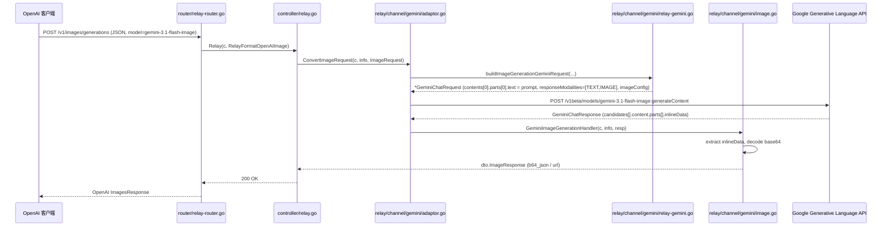
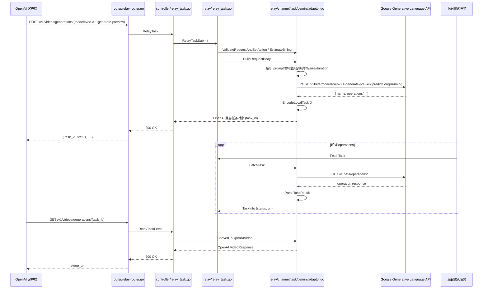
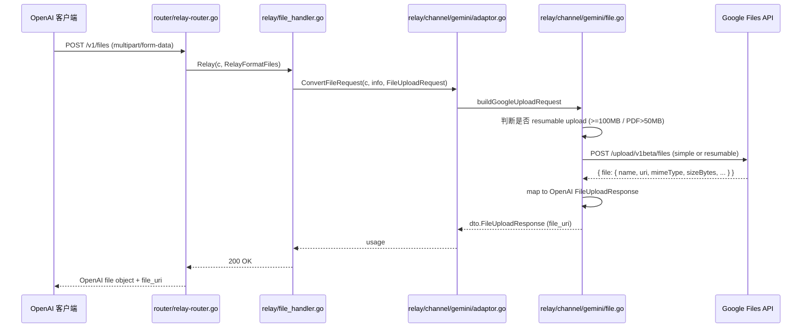
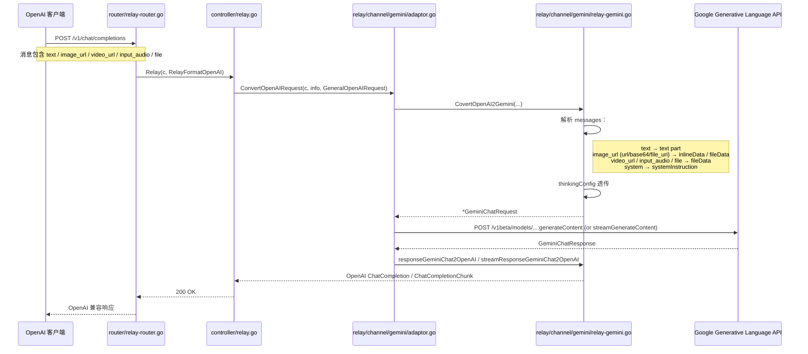
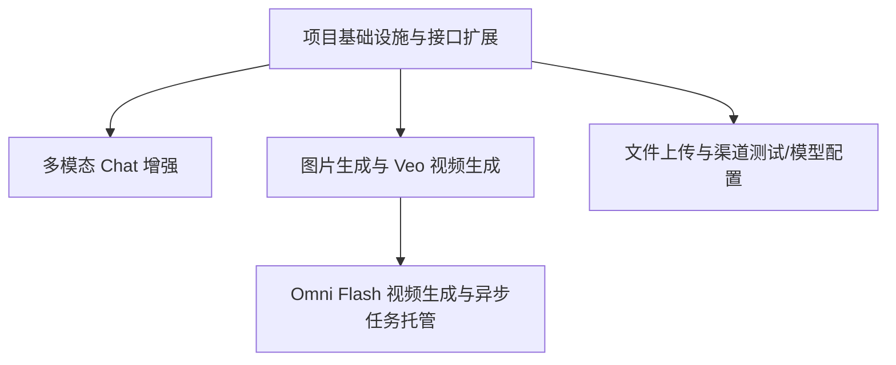

# Gemini 渠道增强系统架构设计

## 项目信息

- **项目名称**：new-api Gemini 渠道增强
- **目标**：在 new-api 中全面升级 Google Gemini 渠道能力，覆盖图片生成、Veo 视频生成、Omni Flash 视频生成、文件上传、多模态 Chat 五项能力，并以 OpenAI 兼容接口对外暴露。
- **语言**：Go
- **架构负责人**：software-architect

---

## Part A：系统架构设计

### 1. 实现方案与框架选型

#### 1.1 核心架构思路

整体采用**在现有 new-api 渠道适配器层扩展**的方案，而非新建独立服务。理由：

- **复用现有 channel 抽象**：`relay/channel/adapter.go` 已定义 `Adaptor`、`FileUploadAdaptor`、`TaskAdaptor`、`OpenAIVideoConverter` 等接口，Gemini 增强能力可以自然接入。
- **复用现有 task 异步平台**：`relay/relay_task.go` 提供 `RelayTaskSubmit`、`RelayTaskFetch` 和统一轮询，Veo/Omni Flash 的视频生成都可挂载在该平台。
- **复用文件上传 handler**：`relay/file_handler.go` 已统一处理 `RelayFormatFiles`，只需为 Gemini 渠道实现 `FileUploadAdaptor`。
- **复用多模态 Chat 适配器**：`relay/channel/gemini/relay-gemini.go` 已支持 `inlineData` 和 `fileData`，本次在 content 解析层补全 `video_url`、`input_audio`、`file` 等 OpenAI 消息类型。
- **渠道模型配置复用**：new-api 的模型映射、倍率、Quota 体系无需改动，只需要新增模型元数据并在 `ChannelTypeGemini` 渠道表单中暴露。

#### 1.2 关键架构决策

| 决策点 | 决策 | 说明 |
|--------|------|------|
| 图片生成是否复用 `imagen` 路径 | **否，新增 Gemini 原生图片生成路径** | PRD 要求 `gemini-3.1-flash-image`、`gemini-3-pro-image` 走 `generateContent` + `responseModalities: [TEXT, IMAGE]`，与现有 `imagen` 的 `:predict` 路径不同。 |
| 图片生成是否走 task 平台 | **否，走同步 `/v1/images/generations` → `generateContent` 即时返回** | Gemini 图片生成是同步接口，返回 `inlineData`，直接映射为 OpenAI `ImagesResponse`。 |
| Veo 视频生成走哪个平台 | **复用 `relay/channel/task/gemini` 适配器** | 已有 `predictLongRunning` 支持，只需扩展 `BuildRequestBody` 支持参考图、首帧/尾帧、更多参数。 |
| Omni Flash 视频生成走哪个平台 | **新建 `relay/channel/task/omniflash` 适配器** | Omni Flash 使用 Interactions API（`/interactions`），请求/响应/轮询格式与 Veo 不同，需要独立适配器。 |
| 文件上传是否通用化 | **为 Gemini 单独实现 `ConvertFileRequest` / `DoFileResponse`** | 不同渠道文件 API 差异大（Google Files API 有 resumable upload 协议），保持 channel-specific 实现更简洁。 |
| 渠道类型 | **复用 `ChannelTypeGemini`（24），不再新增 `ChannelTypeVeo`** | 图片、视频、聊天都通过同一个 Gemini 渠道，按模型名分发到不同适配器或 handler。避免渠道类型爆炸。 |
| 结果下载/托管 | **P1 默认由客户端直接访问 Google URL；可选在 task 完成后转存到 new-api 内部代理 URL** | 先最小实现，后续按 P1-2 需求增加代理/转存。 |

#### 1.3 框架与库

- **Go 标准库**：`net/http`、`mime/multipart`、`encoding/base64`、`io` 等。
- **第三方库**：`github.com/gin-gonic/gin`、`github.com/samber/lo` 已在项目中使用。
- **不新增外部依赖**：所有能力均基于现有依赖和标准库实现。

---

### 2. 文件列表

#### 新增文件

- `relay/channel/gemini/file.go`：Gemini 文件上传 `FileUploadAdaptor` 实现。
- `relay/channel/gemini/image.go`：Gemini 图片生成 handler（`GeminiImageGenerationHandler`）。
- `relay/channel/gemini/multimodal.go`：多模态 content 解析辅助函数（OpenAI content → Gemini parts）。
- `relay/channel/task/omniflash/adaptor.go`：Omni Flash 视频生成 task 适配器。
- `relay/channel/task/omniflash/dto.go`：Omni Flash 请求/响应结构体。
- `dto/gemini_file.go`：Google Files API 响应/上传 DTO。
- `dto/gemini_image.go`：原生 Gemini 图片生成相关 DTO 扩展。
- `docs/sequence-diagram.mermaid`：时序图。
- `docs/class-diagram.mermaid`：类图。

#### 修改文件

- `relay/channel/gemini/relay-gemini.go`：多模态 Chat 增强、新增图片生成 handler 调用。
- `relay/channel/gemini/adaptor.go`：图片生成请求转换、模型分发、URL 构建。
- `relay/channel/gemini/dto.go`（或扩展 `relay/channel/task/gemini/dto.go`）：Veo 参考图/首帧尾帧结构扩展。
- `relay/channel/task/gemini/adaptor.go`：Veo 适配器参数补全（参考图、首帧/尾帧、resolution 等）。
- `relay/relay_adaptor.go`：注册 Omni Flash task 适配器（或按模型名在 Gemini 渠道内分发）。
- `relay/file_handler.go`：确保 Gemini 渠道被识别为 `FileUploadAdaptor`。
- `router/relay-router.go`：新增/确认 `/v1/videos/generations` 路由。
- `dto/file.go`：扩展 `FileUploadResponse` 增加 `FileURI` 字段（可选，用于返回 Google `file_uri`）。
- `controller/channel-test.go`：增加 Gemini 图片/视频/文件模型的测试路径识别。
- `constant/channel.go`：确认 `ChannelTypeGemini` 和 `ChannelTypeVeo` 的取舍；推荐不再新增 `ChannelTypeVeo`。
- `setting/model_setting/model_setting.go`：补充 `IsGeminiImageModel`、`IsGeminiVideoModel` 等模型识别函数。

---

### 3. 数据结构与接口

> 以下使用 Mermaid `classDiagram` 描述核心类与接口。完整类图见 `docs/class-diagram.mermaid`。

```mermaid
classDiagram
    direction TB

    class Adaptor {
        +Init(info *RelayInfo)
        +GetRequestURL(info *RelayInfo) string
        +SetupRequestHeader(c *gin.Context, req *http.Header, info *RelayInfo) error
        +ConvertOpenAIRequest(c *gin.Context, info *RelayInfo, request *GeneralOpenAIRequest) (any, error)
        +ConvertImageRequest(c *gin.Context, info *RelayInfo, request ImageRequest) (any, error)
        +DoRequest(c *gin.Context, info *RelayInfo, requestBody io.Reader) (any, error)
        +DoResponse(c *gin.Context, resp *http.Response, info *RelayInfo) (usage any, err *NewAPIError)
        +GetModelList() []string
    }

    class FileUploadAdaptor {
        <<interface>>
        +ConvertFileRequest(c *gin.Context, info *RelayInfo, request *FileUploadRequest) (any, error)
        +DoFileResponse(c *gin.Context, resp *http.Response, info *RelayInfo) (usage any, err *NewAPIError)
    }

    class TaskAdaptor {
        <<interface>>
        +Init(info *RelayInfo)
        +ValidateRequestAndSetAction(c *gin.Context, info *RelayInfo) *TaskError
        +EstimateBilling(c *gin.Context, info *RelayInfo) map[string]float64
        +AdjustBillingOnSubmit(info *RelayInfo, taskData []byte) map[string]float64
        +AdjustBillingOnComplete(task *model.Task, taskResult *TaskInfo) int
        +BuildRequestURL(info *RelayInfo) (string, error)
        +BuildRequestHeader(c *gin.Context, req *http.Request, info *RelayInfo) error
        +BuildRequestBody(c *gin.Context, info *RelayInfo) (io.Reader, error)
        +DoRequest(c *gin.Context, info *RelayInfo, requestBody io.Reader) (*http.Response, error)
        +DoResponse(c *gin.Context, resp *http.Response, info *RelayInfo) (taskID string, taskData []byte, err *TaskError)
        +FetchTask(baseUrl string, key string, body map[string]any, proxy string) (*http.Response, error)
        +ParseTaskResult(respBody []byte) (*TaskInfo, error)
    }

    class OpenAIVideoConverter {
        <<interface>>
        +ConvertToOpenAIVideo(originTask *model.Task) ([]byte, error)
    }

    class gemini_Adaptor {
        +ConvertImageRequest(...) (any, error)
        +ConvertOpenAIRequest(...) (any, error)
        +DoResponse(...) (any, *NewAPIError)
    }

    class gemini_FileUploadAdaptor {
        +ConvertFileRequest(...) (any, error)
        +DoFileResponse(...) (any, *NewAPIError)
    }

    class gemini_GeminiImageHandler {
        +Handle(c *gin.Context, info *RelayInfo, resp *http.Response) (*Usage, *NewAPIError)
    }

    class gemini_CovertOpenAI2Gemini {
        +Convert(c *gin.Context, textRequest GeneralOpenAIRequest, info *RelayInfo) (*GeminiChatRequest, error)
    }

    class task_gemini_TaskAdaptor {
        +BuildRequestURL(...) (string, error)
        +BuildRequestBody(...) (io.Reader, error)
        +DoResponse(...) (string, []byte, *TaskError)
        +FetchTask(...) (*http.Response, error)
        +ParseTaskResult(...) (*TaskInfo, error)
        +EstimateBilling(...) map[string]float64
        +ConvertToOpenAIVideo(...) ([]byte, error)
    }

    class task_omniflash_TaskAdaptor {
        +BuildRequestURL(...) (string, error)
        +BuildRequestBody(...) (io.Reader, error)
        +DoResponse(...) (string, []byte, *TaskError)
        +FetchTask(...) (*http.Response, error)
        +ParseTaskResult(...) (*TaskInfo, error)
        +EstimateBilling(...) map[string]float64
        +ConvertToOpenAIVideo(...) ([]byte, error)
    }

    class GeminiChatRequest {
        +Requests []GeminiChatRequest
        +Contents []GeminiChatContent
        +SafetySettings []GeminiChatSafetySettings
        +GenerationConfig GeminiChatGenerationConfig
        +Tools json.RawMessage
        +ToolConfig *ToolConfig
        +SystemInstructions *GeminiChatContent
        +CachedContent string
    }

    class GeminiChatGenerationConfig {
        +Temperature *float64
        +TopP *float64
        +TopK *float64
        +MaxOutputTokens *uint
        +StopSequences []string
        +ResponseMimeType string
        +ResponseSchema any
        +ResponseModalities []string
        +ThinkingConfig *GeminiThinkingConfig
        +SpeechConfig json.RawMessage
        +ImageConfig json.RawMessage
    }

    class GeminiPart {
        +Text string
        +Thought bool
        +InlineData *GeminiInlineData
        +FunctionCall *FunctionCall
        +FunctionResponse *GeminiFunctionResponse
        +FileData *GeminiFileData
        +ExecutableCode *GeminiPartExecutableCode
        +CodeExecutionResult *GeminiPartCodeExecutionResult
    }

    class GeminiImageRequest {
        +Contents []GeminiChatContent
        +GenerationConfig GeminiChatGenerationConfig
        +SafetySettings []GeminiChatSafetySettings
        +SystemInstruction *GeminiChatContent
    }

    class GeminiFileUploadResponse {
        +Name string
        +DisplayName string
        +URI string
        +MimeType string
        +SizeBytes int64
        +CreateTime string
        +ExpireTime string
        +State string
    }

    class VeoRequestPayload {
        +Instances []VeoInstance
        +Parameters *VeoParameters
    }

    class VeoInstance {
        +Prompt string
        +Image *VeoImageInput
        +ReferenceImages []VeoImageInput
        +FirstFrame *VeoImageInput
        +LastFrame *VeoImageInput
    }

    class VeoParameters {
        +SampleCount int
        +DurationSeconds int
        +AspectRatio string
        +Resolution string
        +NegativePrompt string
        +PersonGeneration string
    }

    class OmniFlashRequest {
        +Input []OmniFlashInput
        +Config OmniFlashConfig
    }

    class OmniFlashInput {
        +Text string
        +Image *OmniFlashImage
        +Video *OmniFlashVideo
        +Reference *OmniFlashReference
    }

    class OmniFlashConfig {
        +AspectRatio string
        +Resolution string
        +DurationSeconds int
        +SessionID string
    }

    class FileUploadRequest {
        +File *multipart.FileHeader
        +URL string
        +Purpose string
        +PreprocessConfigs json.RawMessage
    }

    class FileUploadResponse {
        +ID string
        +Object string
        +Purpose string
        +Filename string
        +Bytes int64
        +MimeType string
        +CreatedAt int64
        +ExpireAt int64
        +Status string
        +URL string
        +FileURI string
    }

    Adaptor <|.. gemini_Adaptor : implements
    FileUploadAdaptor <|.. gemini_FileUploadAdaptor : implements
    TaskAdaptor <|.. task_gemini_TaskAdaptor : implements
    TaskAdaptor <|.. task_omniflash_TaskAdaptor : implements
    OpenAIVideoConverter <|.. task_gemini_TaskAdaptor : implements
    OpenAIVideoConverter <|.. task_omniflash_TaskAdaptor : implements
    gemini_Adaptor ..> gemini_GeminiImageHandler : calls
    gemini_Adaptor ..> gemini_CovertOpenAI2Gemini : calls
    gemini_FileUploadAdaptor ..> GeminiFileUploadResponse : uses
    GeminiChatRequest o-- GeminiPart : contains
    GeminiChatRequest o-- GeminiChatGenerationConfig : contains
    GeminiImageRequest ..> GeminiChatRequest : similar shape
    VeoRequestPayload o-- VeoInstance : contains
    VeoRequestPayload o-- VeoParameters : contains
    OmniFlashRequest o-- OmniFlashInput : contains
    OmniFlashRequest o-- OmniFlashConfig : contains
    FileUploadRequest ..> FileUploadResponse : produces
```



#### 关键接口签名

```go
// relay/channel/adapter.go （已有，此处列出供对照）
type FileUploadAdaptor interface {
    ConvertFileRequest(c *gin.Context, info *relaycommon.RelayInfo, request *dto.FileUploadRequest) (any, error)
    DoFileResponse(c *gin.Context, resp *http.Response, info *relaycommon.RelayInfo) (usage any, err *types.NewAPIError)
}

type TaskAdaptor interface {
    Init(info *relaycommon.RelayInfo)
    ValidateRequestAndSetAction(c *gin.Context, info *relaycommon.RelayInfo) *dto.TaskError
    EstimateBilling(c *gin.Context, info *relaycommon.RelayInfo) map[string]float64
    AdjustBillingOnSubmit(info *relaycommon.RelayInfo, taskData []byte) map[string]float64
    AdjustBillingOnComplete(task *model.Task, taskResult *relaycommon.TaskInfo) int
    BuildRequestURL(info *relaycommon.RelayInfo) (string, error)
    BuildRequestHeader(c *gin.Context, req *http.Request, info *relaycommon.RelayInfo) error
    BuildRequestBody(c *gin.Context, info *relaycommon.RelayInfo) (io.Reader, error)
    DoRequest(c *gin.Context, info *relaycommon.RelayInfo, requestBody io.Reader) (*http.Response, error)
    DoResponse(c *gin.Context, resp *http.Response, info *relaycommon.RelayInfo) (taskID string, taskData []byte, err *dto.TaskError)
    FetchTask(baseUrl, key string, body map[string]any, proxy string) (*http.Response, error)
    ParseTaskResult(respBody []byte) (*relaycommon.TaskInfo, error)
}

type OpenAIVideoConverter interface {
    ConvertToOpenAIVideo(originTask *model.Task) ([]byte, error)
}

// 新增/扩展的 Gemini channel 方法
type GeminiImageHandler interface {
    Handle(c *gin.Context, info *relaycommon.RelayInfo, resp *http.Response) (*dto.Usage, *types.NewAPIError)
}

// 新增文件上传 DTO 字段（建议扩展）
type FileUploadResponse struct {
    // ... 已有字段
    FileURI string `json:"file_uri,omitempty"` // Google Files API 返回的 file.uri
}
```

---

### 4. 程序调用流程

#### 4.1 `/v1/images/generations` → Gemini 图片生成



#### 4.2 `/v1/videos/generations` → Veo `predictLongRunning`（异步）



#### 4.3 `POST /v1/files` → Google Files API



#### 4.4 `/v1/chat/completions` → 多模态 Chat



---

### 5. 待明确事项与假设

基于 PRD 第 7 节的 10 个待确认问题，给出架构视角的建议和需要产品经理确认的点：

| 编号 | 问题 | 建议 / 待确认 |
|------|------|--------------|
| 1 | 模型列表与部署名 | 建议：统一使用 `models/{model}` 形式，如 `models/gemini-3.1-flash-image`。需要确认最终模型名，特别是 `gemini-3-pro-image` 是否真实存在。 |
| 2 | 计费方式 | 建议：图片按张计费；Veo 按 `seconds × resolution_ratio` 计费；Omni Flash 按秒计费。需要确认是否按输出时长还是固定按请求。 |
| 3 | Base64 处理策略 | 建议：Chat 中图片/音频 base64 超过 20MB 时自动转 Files API；视频统一先转 Files API。输出图片压缩保持原格式。 |
| 4 | Omni Flash stateful session | 建议：P1 阶段先不维护 session，每次请求独立；stateful editing 延后实现。需要确认是否必须 P1。 |
| 5 | Files API file_uri 有效期 | 建议：在 `FileUploadResponse` 增加 `file_uri` 和 `expire_at` 字段，但不在数据库持久化；需要时由用户重新上传。 |
| 6 | 图片生成响应格式 | 建议：当 `TEXT` 和 `IMAGE` 同时返回时，`/v1/images/generations` 只返回 `IMAGE` 部分，`TEXT` 丢弃或放入 `revised_prompt`。 |
| 7 | 异步任务结果存储 | 建议：P1 默认直接返回 Google 临时 URL；P1-2 可选将结果下载到 new-api 服务器或 R2，转存路径由配置决定。 |
| 8 | grounding / dynamic_retrieval 透传 | 建议：通过 `extra_body.google.grounding` / `extra_body.google.dynamic_retrieval` 透传，new-api 层不做校验。 |
| 9 | 视频生成参考图数量 | 建议：Veo 3.1 最多 3 张参考图 + 首帧/尾帧，在 `BuildRequestBody` 中校验并返回 400。 |
| 10 | 错误码映射 | 建议：Google 配额耗尽 → `rate_limit_exceeded`；内容安全 → `content_filter`；文件格式不支持 → `invalid_request_error`；文件过大 → `invalid_request_error`。 |

---

## Part B：任务分解

### 6. 依赖包列表

- **无新增 Go 依赖包**：所有能力均使用项目现有依赖实现。
- 依赖已在 `go.mod` 中存在的包：
  - `github.com/gin-gonic/gin`
  - `github.com/samber/lo`
  - `github.com/pkg/errors`

### 7. 任务列表（按依赖排序）

> 说明：为符合任务分解硬约束（最多 5 个任务，每个任务不少于 3 个文件，第一个任务为项目基础设施），将 PRD 建议的 8 个逻辑阶段合并为 5 个任务。每个任务覆盖一个完整可交付的能力集合。

| 任务 ID | 任务名称 | 源文件（新增/修改） | 依赖 | 优先级 |
|---------|----------|---------------------|------|--------|
| **T01** | 项目基础设施与接口扩展 | 新增：`relay/channel/gemini/image.go`、`relay/channel/gemini/multimodal.go`、`dto/gemini_image.go`、`dto/gemini_file.go`；修改：`relay/relay_adaptor.go`、`relay/file_handler.go`、`router/relay-router.go`、`controller/channel-test.go`、`constant/channel.go` | 无 | P0 |
| **T02** | 多模态 Chat 增强 | 修改：`relay/channel/gemini/relay-gemini.go`、`relay/channel/gemini/adaptor.go`、`setting/model_setting/model_setting.go` | T01 | P0 |
| **T03** | 图片生成与 Veo 视频生成 | 修改：`relay/channel/gemini/adaptor.go`、`relay/channel/gemini/image.go`、`relay/channel/gemini/relay-gemini.go`；修改：`relay/channel/task/gemini/dto.go`、`relay/channel/task/gemini/adaptor.go` | T01 | P0 |
| **T04** | Omni Flash 视频生成与异步任务托管 | 新增：`relay/channel/task/omniflash/adaptor.go`、`relay/channel/task/omniflash/dto.go`；修改：`relay/relay_adaptor.go`、`relay/relay_task.go`（结果下载/托管可选）、`controller/channel-test.go` | T01、T03 | P1 |
| **T05** | 文件上传与渠道测试/模型配置 | 新增：`relay/channel/gemini/file.go`；修改：`dto/file.go`、`relay/channel/gemini/adaptor.go`、管理后台模型配置相关文件、`controller/channel-test.go` | T01 | P0/P1 |

### 8. 共享知识

- **模型识别规则**：
  - 图片生成模型：`strings.HasPrefix(model, "gemini-") && strings.HasSuffix(model, "-image")`。
  - Veo 视频模型：`strings.HasPrefix(model, "veo-") && strings.Contains(model, "generate")`。
  - Omni Flash 模型：`model == "gemini-omni-flash-preview"`。
- **请求分发规则**：
  - 同一 `ChannelTypeGemini` 渠道下，所有模型都先进入 `gemini.Adaptor`；`DoResponse` 根据 `UpstreamModelName` 分发到图片 handler、聊天 handler、嵌入 handler 等。
  - 视频生成模型（Veo/Omni）由于需要异步任务平台，在 `controller.Relay` 层或 `RelayTask` 层按模型名分发给对应 task adaptor。
- **文件上传限制**：
  - 单文件最大 2 GB；项目总 20 GB；`file_uri` 48 小时有效。
  - `<100MB` 简单上传；`>=100MB` 或 `PDF>50MB` 走 resumable upload（`X-Goog-Upload-Protocol: resumable`）。
- **媒体输入限制**：
  - 图片生成参考图最多 14 张。
  - Veo 3.1 参考图最多 3 张 + 首帧/尾帧。
  - 图片 base64 输入在 Chat 中建议不超过 20MB，否则转 Files API。
- **错误码映射**：
  - Google `QuotaExceeded` → OpenAI `rate_limit_exceeded`。
  - Google `ContentFilter` / `Safety` → OpenAI `content_filter`。
  - 文件格式不支持 / 文件过大 → OpenAI `invalid_request_error`。
- **OpenAI 兼容字段**：
  - 图片返回统一使用 `b64_json`；如配置 CDN/代理则返回 `url`。
  - 文件返回在 `FileUploadResponse` 中增加 `file_uri` 字段；为兼容 OpenAI 客户端，仍保留原有字段。
- **异步任务约定**：
  - 上游 operation name 使用 `taskcommon.EncodeLocalTaskID` / `DecodeLocalTaskID` 编解码。
  - `DoResponse` 返回 `OpenAIVideo` 对象后立即写 body；`taskID` 用于轮询。
  - 任务成功时 `ResultURL` 优先从 `ParseTaskResult.Url` 取，否则构建 `taskcommon.BuildProxyURL`。

### 9. 任务依赖图



---

## 附录：交付物清单

- `docs/architecture-gemini-enhancement.md`（本文件）
- `docs/sequence-diagram.mermaid`
- `docs/class-diagram.mermaid`
