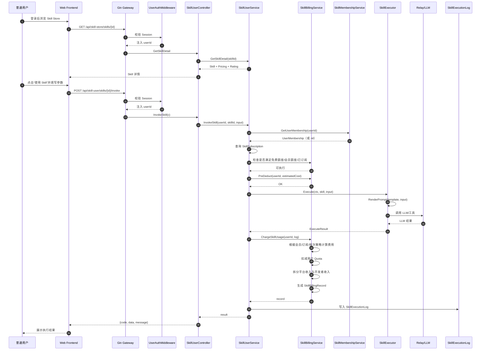
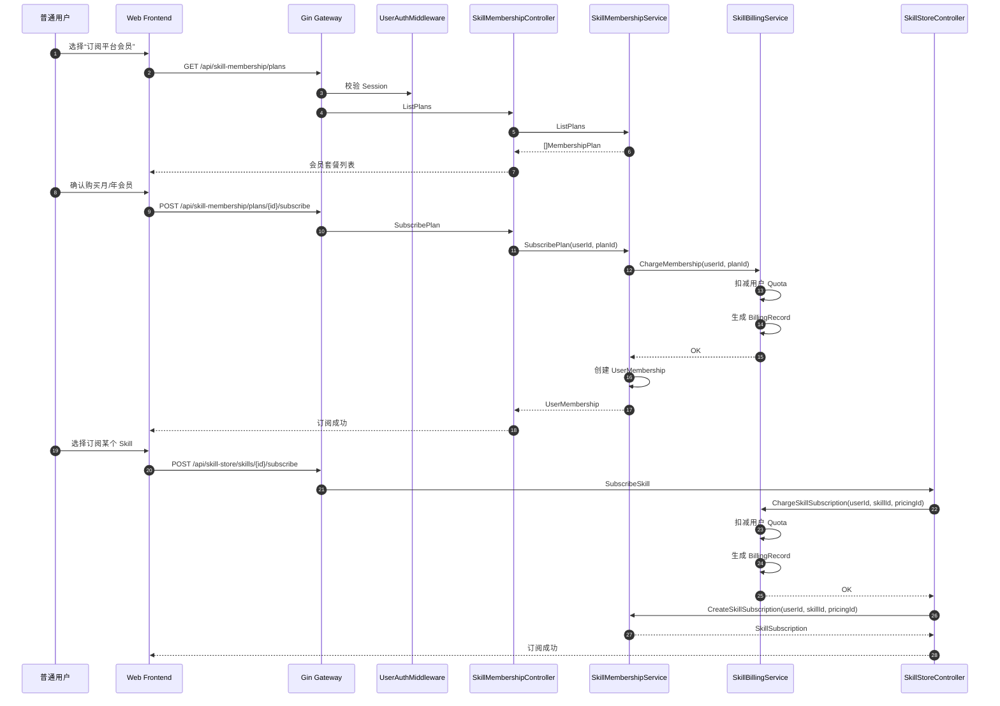
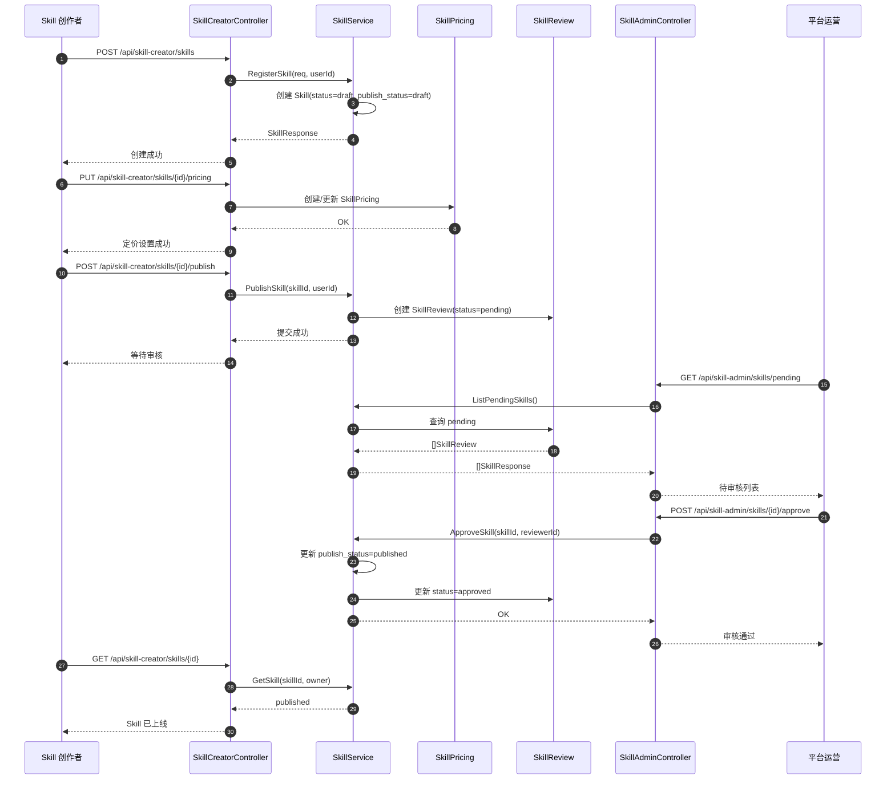
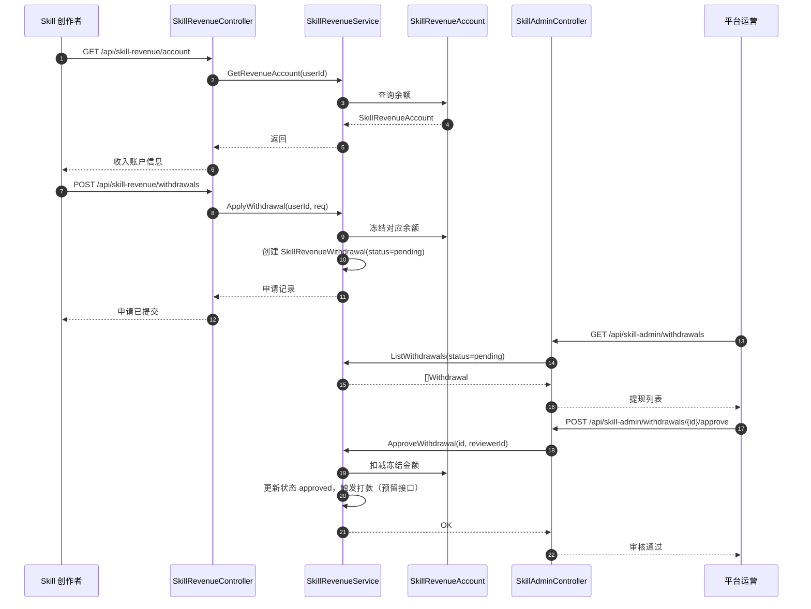
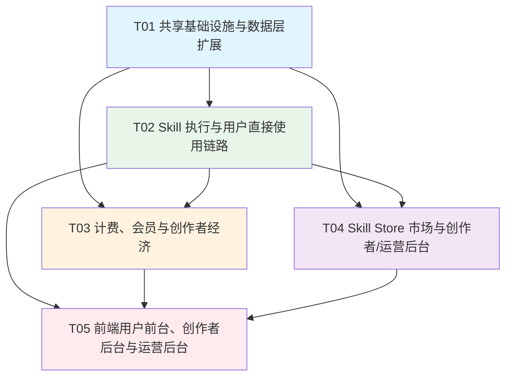

# Skill as a Service 系统架构设计（B2C 方向）

> 基于 PRD `docs/prd-skill-as-a-service.md`，并针对用户确认的 **B2C（面向普通消费者）优先** 进行架构调整。面向 MVP 阶段（P0）的架构与任务分解。

---

## Part A: System Design

### 1. Implementation Approach（实现方案与框架选型）

#### 1.1 核心方向调整

用户需求从 **B2D（面向外部开发者）** 调整为 **B2C（面向普通消费者）**：

- **P0 核心链路**：用户登录 → 浏览 Skill Store → 订阅/购买 Skill 或平台会员 → 在前端点击使用 → 后端同步执行 Skill → 计费 → 结果直接返回用户。
- **P1/P2 能力**：外部开发者 API Key 网关、OpenAPI 调用能力降级为非核心扩展能力。
- **Skill 创作者**（Creator）面向普通用户中的内容创作者：创建/配置 Skill、设置定价、发布审核、查看收入、提现。
- **平台运营**（Operator）：审核 Skill、管理分类/推荐/会员配置、配置平台分润、处理提现。

因此，P0 阶段聚焦 **Skill Store 用户前台 + 创作者后台 + 运营后台**，弱化外部 API 网关与 API Key 体系。

#### 1.2 核心难点分析

| 难点 | 说明 | 应对策略 |
|------|------|----------|
| P0 用户直接使用链路 | 用户无需 API Key，直接在前端点击触发 Skill 执行 | 新增 `SkillUserController` 提供会话鉴权下的同步执行接口；`SkillAPIKey` 与外部网关降级为 P1/P2 |
| 用户会员体系 | 平台会员（月/年）与 Skill 单独订阅需共存 | 新增 `MembershipPlan` 与 `UserMembership` 模型；计费时优先判断会员权益，再判断 Skill 订阅/按次付费 |
| 计费模式多样性 | 免费、按次、按 token、Skill 单独订阅、平台会员 | 扩展 `SkillPricing` 支持平台会员折扣；`SkillBillingService` 根据用户权益路由计费策略 |
| Store 市场能力 | 分类、搜索、推荐、评分、收藏、评论、订阅 | 新增 `SkillStore` 服务层与独立路由；搜索复用数据库 LIKE + 标签过滤，后续引入 Elasticsearch |
| 创作者经济 | 收入账户、分成结算、提现接口预留 | 保留 `SkillRevenueAccount` 与 `SkillRevenueWithdrawal`；计费服务拆分平台收入与开发者收入 |
| 复用现有 Skill 运行时 | 已有 `model/skill.go` 和内部 Skill 配置，需避免破坏现有画布链路 | 在现有 `Skill` 表上增量扩展字段；新增 `Skill as a Service` 专用路由；执行引擎复用 `relay` 层 |
| 同步执行稳定性 | 用户点击后需快速返回结果 | 同步调用复用 HTTP 上下文；超时可配置；异步调用作为 P1 扩展 |
| 调用监控 | 需要 QPS、成功率、延迟等 dashboard | 所有调用写入 `SkillExecutionLog`，结合现有监控基础设施汇总 |

#### 1.3 技术栈与框架选型

| 层次 | 选型 | 理由 |
|------|------|------|
| 后端框架 | **Go 1.25 + Gin** | 现有项目已使用，保持团队技术栈一致 |
| ORM | **GORM v2** | 已存在，复用 `model.DB` 与迁移机制 |
| 数据库 | MySQL/PostgreSQL/SQLite（由 GORM 支持） | 兼容现有部署形态，生产推荐 MySQL/PostgreSQL |
| 缓存 | **Redis** | 现有 `common/redis.go` 已支持，用于限流、会员权益缓存、热门 Skill 缓存 |
| 执行引擎 | 复用 `relay` 层 + 新增 `service/skill_executor.go` | 避免重复建设 LLM/工具调用能力；对复杂 Skill 后续可扩展为独立执行器 |
| 网关 | Gin Middleware 组合（P0 以 Session 鉴权为主） | 用户侧接口复用现有 `middleware/user_auth.go`；外部 API Key 网关 `middleware/skill_auth.go` 降级为 P1 |
| 前端 | **React 18 + Vite + MUI + Tailwind CSS** | 与现有 `web/` 技术栈一致 |
| 任务队列 | 数据库轮询 + goroutine（P1 异步执行使用） | 降低部署复杂度；后续可替换为 Redis Stream / RabbitMQ |
| 部署 | Docker / 二进制 | 与现有 `new-api` 部署方式一致 |
| 鉴权协议 | Session/Cookie（P0）+ API Key 预留扩展（P1/P2） | B2C 场景下用户直接在前端使用，复用现有登录态最自然 |
| 搜索 | 数据库 LIKE + 标签过滤（P0） | 快速落地；后续引入 Elasticsearch/Meilisearch |
| 支付 | 复用现有 `controller/topup.go` 充值体系 | 用户通过 quota/余额购买会员或订阅；创作者提现复用现有出款渠道 |

#### 1.4 架构模式

- **分层架构（Layered）**：`router → controller → service → model → common`，与现有项目一致。
- **网关模式（Gateway）**：通过 Gin 中间件组合实现统一入口；P0 复用现有用户鉴权中间件，P1 补充 API Key 鉴权中间件。
- **CQRS 只读分离**：执行日志、账单查询与写入分离，避免写入阻塞查询。
- **插件化执行器**：`SkillExecutor` 接口化，后续可接入 MCP、Function Calling 等协议。
- **Marketplace 模式**：Store 模块独立演化，创作者经济与 Skill 执行引擎解耦。

#### 1.5 权限模型（RBAC）

| 角色 | 标识 | 权限说明 |
|------|------|----------|
| **普通用户（Consumer）** | 已登录普通用户 | 浏览 Store、收藏/评分/评论、订阅 Skill/会员、点击使用 Skill、查看个人中心/使用历史/账单 |
| **Skill 创作者（Creator）** | 普通用户且拥有自己创建的 Skill | 创建/编辑/发布 Skill、管理 Skill 定价与版本、查看创作者数据看板、申请提现 |
| **平台运营（Operator）** | `User.Role` 为 Admin/Root | 审核 Skill、管理分类/推荐/会员配置、配置平台分润、管理开发者资质、处理提现、查看平台大盘 |

> 注：一个用户可以同时是消费者和创作者。角色判断通过 `Skill.OwnerId` 与 `User.Role` 组合完成，无需新建角色表。

#### 1.6 P0 / P1 / P2 边界

| 优先级 | 能力范围 |
|--------|----------|
| **P0** | 用户登录态下的 Skill Store 前台、Skill 直接使用（同步）、Skill 订阅/平台会员、计费扣费、创作者发布 Skill、运营审核、创作者收入/提现、基础监控 |
| **P1** | 异步 Skill 执行、任务状态查询、OpenAPI 文档、沙箱隔离增强、内容 moderation 服务、个性化推荐、用户消息通知 |
| **P2** | 外部 API Key 网关、外部开发者入驻（B2D）、API 按量套餐、Webhook 回调、MCP / Function Calling 协议兼容、Elasticsearch 搜索 |

#### 1.7 复用现有基础设施

| 现有能力 | 复用方式 |
|----------|----------|
| 用户系统（`model/user.go`） | Skill 用户/开发者/运营者直接复用 `User` 模型，`owner_id`/`user_id` 关联 |
| 鉴权中间件（`middleware/user_auth.go`） | P0 用户侧与创作者后台继续使用 Cookie/Session 鉴权 |
| 限流器（`common/rate-limit.go`） | 用户级限流 + 平台级限流；P1 再叠加 Key 级限流 |
| 配额系统（`User.Quota`） | 用户扣费直接扣减 `User.Quota`；Skill 创作者收入计入 `SkillRevenueAccount` |
| 支付/充值（`controller/topup.go`） | 用户充值复用现有渠道；会员/订阅购买扣减 Quota；创作者提现复用支付通道反向出款 |
| 日志与监控（`logger/`、`common/sys_log.go`） | 统一日志格式与追踪 ID |
| 模型管理（`relay/`） | Skill 执行调用 LLM 时复用渠道路由与模型配置 |

---

### 2. File List（文件清单）

#### 2.1 后端文件

```
F:\new api
├── bin
│   └── migration_v0.x-v0.x+1_skill_service.sql    # 新增表迁移脚本
├── common
│   ├── skill_error.go                             # Skill 错误码体系
│   └── skill_price.go                             # 价格计算辅助函数
├── dto
│   ├── skill_service.go                           # Skill 服务 DTO
│   ├── skill_invoke.go                            # 调用/响应 DTO
│   ├── skill_store.go                             # Store 市场 DTO
│   ├── skill_revenue.go                           # 创作者收入/提现 DTO
│   ├── skill_membership.go                      # 会员/订阅 DTO
│   └── skill_billing.go                         # 用户账单 DTO
├── model
│   ├── skill.go                                   # 扩展现有 Skill 模型（修改）
│   ├── skill_api_key.go                           # 外部 API Key 模型（P1/P2）
│   ├── skill_execution_log.go                     # 调用执行日志
│   ├── skill_billing.go                           # 用户计费记录
│   ├── skill_pricing.go                           # Skill 定价策略
│   ├── skill_quota_usage.go                       # 配额使用记录
│   ├── skill_review.go                            # Skill 审核记录
│   ├── skill_subscription.go                      # Skill 单独订阅
│   ├── skill_order.go                             # 按次/按 token 购买订单
│   ├── membership_plan.go                         # 平台会员套餐
│   ├── user_membership.go                         # 用户会员订阅
│   ├── skill_rating.go                            # 评分记录
│   ├── skill_favorite.go                          # 收藏记录
│   ├── skill_comment.go                           # 评论记录
│   ├── skill_creator_profile.go                   # 创作者资料
│   ├── skill_revenue_account.go                   # 创作者收入账户
│   └── skill_revenue_withdrawal.go                # 创作者提现申请
├── service
│   ├── skill_service.go                           # Skill 业务服务
│   ├── skill_executor.go                          # Skill 执行引擎
│   ├── skill_billing.go                           # 计费服务（含会员/订阅/按次）
│   ├── skill_quota.go                             # 配额服务（P1 扩展）
│   ├── skill_store.go                             # Skill Store 市场服务
│   ├── skill_revenue.go                           # 创作者收入与提现服务
│   ├── skill_membership.go                        # 会员与订阅服务
│   ├── skill_user.go                              # 用户侧 Skill 服务
│   ├── skill_creator.go                           # 创作者后台服务
│   └── skill_admin.go                             # 运营后台服务
├── controller
│   ├── skill_user.go                              # 用户侧 Skill 调用/历史/收藏（P0 核心）
│   ├── skill_creator.go                           # 创作者后台控制器
│   ├── skill_admin.go                             # 运营后台控制器
│   ├── skill_store.go                             # Skill Store 市场控制器
│   ├── skill_revenue.go                           # 创作者收入与提现控制器
│   ├── skill_membership.go                        # 会员与订阅控制器
│   ├── skill_billing.go                           # 用户账单/用量查询控制器
│   └── skill_invoke.go                            # 外部 API 调用控制器（P1/P2）
├── middleware
│   └── skill_auth.go                              # API Key 鉴权中间件（P1/P2）
└── router
    └── skill_service.go                           # Skill as a Service 路由注册
```

#### 2.2 前端文件

```
F:\new api\web
├── src
│   ├── types
│   │   ├── skill.ts                               # Skill 相关类型
│   │   ├── skillStore.ts                        # Store 市场类型
│   │   ├── skillRevenue.ts                      # 创作者收入类型
│   │   ├── skillMembership.ts                   # 会员/订阅类型
│   │   └── skillBilling.ts                      # 用户账单类型
│   ├── services
│   │   ├── skillService.ts                      # Skill API 请求封装
│   │   ├── skillStoreService.ts                 # Store API 请求封装
│   │   ├── skillRevenueService.ts               # 收入/提现 API 请求封装
│   │   ├── skillMembershipService.ts            # 会员/订阅 API 请求封装
│   │   └── skillBillingService.ts               # 账单 API 请求封装
│   ├── pages
│   │   ├── SkillStore
│   │   │   ├── Home.tsx                         # Store 首页（分类/推荐/热门）
│   │   │   ├── Search.tsx                       # 搜索页
│   │   │   ├── SkillDetail.tsx                  # Skill 详情页
│   │   │   └── Category.tsx                     # 分类列表页
│   │   ├── SkillUser
│   │   │   ├── MyMembership.tsx                 # 我的会员
│   │   │   ├── MySubscriptions.tsx              # 我的 Skill 订阅
│   │   │   ├── MyOrders.tsx                     # 我的购买订单
│   │   │   ├── UsageHistory.tsx                 # 使用历史
│   │   │   └── MyFavorites.tsx                  # 我的收藏
│   │   ├── SkillCreator
│   │   │   ├── CreatorProfile.tsx               # 创作者资料设置
│   │   │   ├── MySkills.tsx                     # 我的 Skill 列表
│   │   │   ├── SkillEditor.tsx                  # Skill 创建/编辑
│   │   │   ├── SkillPricing.tsx                 # 定价设置
│   │   │   ├── SkillDashboard.tsx               # 创作者数据看板
│   │   │   ├── RevenueDashboard.tsx             # 收入看板
│   │   │   └── Withdrawal.tsx                   # 提现申请页
│   │   └── SkillAdmin
│   │       ├── SkillReview.tsx                    # Skill 审核
│   │       ├── SkillCategories.tsx                # 分类管理
│   │       ├── MembershipPlans.tsx                # 会员套餐管理
│   │       ├── SkillPlatformDashboard.tsx         # 平台大盘
│   │       ├── SkillBillingAdmin.tsx              # 计费策略/分成配置
│   │       └── WithdrawalReview.tsx               # 提现审核
│   └── components
│       └── Skill
│           ├── SkillCard.tsx                      # Store 列表卡片
│           ├── SkillInvokeButton.tsx              # 用户使用按钮（P0 核心）
│           ├── SkillResultPanel.tsx               # 执行结果展示
│           ├── SkillPricingForm.tsx               # 定价表单
│           ├── SkillRating.tsx                    # 评分组件
│           ├── SkillComment.tsx                   # 评论组件
│           ├── SkillSubscriptionCard.tsx          # 订阅卡片
│           └── SkillCreatorCard.tsx               # 创作者卡片
```

---

### 3. Data Structures and Interfaces（数据结构与接口）

```mermaid
classDiagram
    direction TB

    class Skill {
        +Id int
        +SkillId string
        +Name string
        +NameEn string
        +Icon string
        +Cost int
        +SupportedNodeTypes string
        +Description string
        +ExecutionType string
        +SystemPromptTemplate string
        +UserPromptTemplate string
        +OverrideLocal bool
        +Status int
        +OwnerId int
        +Visibility int
        +PublishStatus int
        +Category string
        +Tags string
        +InputSchema string
        +OutputSchema string
        +Version string
        +AvgRating float64
        +RatingCount int
        +InvokeCount int64
        +CreatedAt int64
        +UpdatedAt int64
        +TableName() string
        +ToResponse() SkillResponse
    }

    class SkillCreatorProfile {
        +Id int
        +UserId int
        +DisplayName string
        +Bio string
        +Website string
        +Avatar string
        +VerifiedStatus int
        +ContactEmail string
        +CreatedAt int64
        +UpdatedAt int64
        +TableName() string
    }

    class SkillAPIKey {
        +Id int
        +Key string
        +Name string
        +UserId int
        +SkillId string
        +Permissions int
        +Quota int64
        +UsedQuota int64
        +RateLimit int
        +Status int
        +ExpiredAt int64
        +LastUsedAt int64
        +CreatedAt int64
        +TableName() string
        +HasPermission(op string) bool
        +IsGlobal() bool
    }

    class MembershipPlan {
        +Id int
        +Name string
        +Description string
        +Period string
        +Price decimal
        +QuotaPerMonth int64
        +DiscountPercent int
        +Status int
        +CreatedAt int64
        +UpdatedAt int64
        +TableName() string
    }

    class UserMembership {
        +Id int64
        +UserId int
        +PlanId int
        +Status int
        +StartAt int64
        +ExpireAt int64
        +CreatedAt int64
        +UpdatedAt int64
        +TableName() string
        +IsValid() bool
    }

    class SkillSubscription {
        +Id int64
        +UserId int
        +SkillId string
        +PricingId int
        +Status int
        +StartAt int64
        +ExpireAt int64
        +CreatedAt int64
        +TableName() string
        +IsValid() bool
    }

    class SkillOrder {
        +Id int64
        +UserId int
        +SkillId string
        +PricingId int
        +OrderType string
        +Quantity int64
        +Amount decimal
        +Status int
        +PaidAt int64
        +CreatedAt int64
        +TableName() string
    }

    class SkillExecutionLog {
        +Id int64
        +TaskId string
        +SkillId string
        +UserId int
        +APIKeyId int
        +Status string
        +Input string
        +Output string
        +ErrorCode string
        +ErrorMessage string
        +LatencyMs int
        +TokensUsed int
        +Cost decimal
        +Sandbox bool
        +CreatedAt int64
        +FinishedAt int64
        +TableName() string
    }

    class SkillBillingRecord {
        +Id int64
        +TaskId string
        +SkillId string
        +UserId int
        +DeveloperId int
        +SubscriptionId int64
        +OrderId int64
        +Amount decimal
        +PlatformFee decimal
        +DeveloperRevenue decimal
        +Currency string
        +BillingType string
        +Status int
        +BillingCycle string
        +CreatedAt int64
        +SettledAt int64
        +TableName() string
    }

    class SkillPricing {
        +Id int
        +SkillId string
        +Strategy string
        +UnitPrice decimal
        +TokenPriceInput decimal
        +TokenPriceOutput decimal
        +DurationPricePerSecond decimal
        +SubscriptionPrice decimal
        +SubscriptionPeriod string
        +SubscriptionQuota int64
        +MembershipDiscount int
        +FreeQuota int64
        +CreatedAt int64
        +UpdatedAt int64
        +TableName() string
        +CalculateCost(tokens, seconds, count, subscribed, membership) decimal
    }

    class SkillQuotaUsage {
        +Id int64
        +UserId int
        +SkillId string
        +UsageDate string
        +InvokeCount int64
        +TokenCount int64
        +Cost decimal
        +CreatedAt int64
        +UpdatedAt int64
        +TableName() string
    }

    class SkillReview {
        +Id int
        +SkillId string
        +ReviewerId int
        +Status int
        +Comment string
        +CreatedAt int64
        +TableName() string
    }

    class SkillRating {
        +Id int
        +SkillId string
        +UserId int
        +Rating int
        +Comment string
        +CreatedAt int64
        +UpdatedAt int64
        +TableName() string
    }

    class SkillFavorite {
        +Id int
        +SkillId string
        +UserId int
        +CreatedAt int64
        +TableName() string
    }

    class SkillComment {
        +Id int
        +SkillId string
        +UserId int
        +ParentId int
        +Content string
        +Status int
        +CreatedAt int64
        +UpdatedAt int64
        +TableName() string
    }

    class SkillRevenueAccount {
        +Id int
        +UserId int
        +Balance decimal
        +TotalRevenue decimal
        +TotalWithdrawal decimal
        +Currency string
        +Status int
        +CreatedAt int64
        +UpdatedAt int64
        +TableName() string
    }

    class SkillRevenueWithdrawal {
        +Id int64
        +UserId int
        +Amount decimal
        +Currency string
        +Channel string
        +Account string
        +Status int
        +ReviewerId int
        +Remark string
        +CreatedAt int64
        +ReviewedAt int64
        +TableName() string
    }

    class SkillService {
        +RegisterSkill(req CreateSkillRequest, userId int) SkillResponse
        +UpdateSkill(skillId string, req UpdateSkillRequest, userId int) SkillResponse
        +PublishSkill(skillId string, userId int) error
        +GetSkill(skillId string, visibility int) SkillResponse
        +ListSkills(filter SkillFilter, page PageInfo) []SkillResponse
        +ApproveSkill(skillId string, reviewerId int) error
        +RejectSkill(skillId string, reviewerId int, comment string) error
    }

    class SkillStoreService {
        +ListCategories() []SkillCategory
        +SearchSkills(query string, filters SkillSearchFilter, page PageInfo) []SkillResponse
        +GetRecommendations(userId int, limit int) []SkillResponse
        +GetTrendingSkills(limit int) []SkillResponse
        +GetSkillDetail(skillId string) SkillDetailResponse
        +ToggleFavorite(userId int, skillId string) bool
        +RateSkill(userId int, skillId string, req RatingRequest) SkillRating
        +AddComment(userId int, req CommentRequest) SkillComment
        +ListComments(skillId string, page PageInfo) []SkillComment
    }

    class SkillMembershipService {
        +ListPlans() []MembershipPlan
        +SubscribePlan(userId int, planId int) UserMembership
        +GetUserMembership(userId int) UserMembership
        +CancelMembership(userId int) error
        +RenewMembership(userId int) UserMembership
    }

    class SkillBillingService {
        +ChargeSkillUsage(userId int, log SkillExecutionLog) SkillBillingRecord
        +ChargeSkillSubscription(userId int, skillId string, pricingId int) SkillBillingRecord
        +ChargeMembership(userId int, planId int) UserMembership
        +ChargeOrder(userId int, skillId string, pricingId int, quantity int64) SkillOrder
        +Refund(orderId int64) error
        +SettleBillingCycle(cycle string) error
        +GetUserBill(userId int, cycle string) []SkillBillingRecord
    }

    class SkillExecutor {
        +Execute(ctx context.Context, skill Skill, input map) ExecuteResult
        +ExecuteAsync(ctx context.Context, skill Skill, input map, callback string) string
        +RenderPrompt(template string, input map) string
        +CallLLM(ctx context.Context, req LLMRequest) LLMResponse
    }

    class SkillUserService {
        +InvokeSkill(userId int, skillId string, input map) ExecuteResult
        +GetUsageHistory(userId int, page PageInfo) []SkillExecutionLog
        +GetFavorites(userId int, page PageInfo) []SkillResponse
        +GetSubscriptions(userId int) []SkillSubscription
        +GetOrders(userId int) []SkillOrder
        +GetBills(userId int, page PageInfo) []SkillBillingRecord
    }

    class SkillCreatorService {
        +ListMySkills(userId int) []SkillResponse
        +GetSkillStats(userId int, skillId string) SkillStats
        +GetRevenueStats(userId int, start, end string) RevenueStats
    }

    class SkillRevenueService {
        +GetRevenueAccount(userId int) SkillRevenueAccount
        +GetRevenueStats(userId int, start, end string) RevenueStats
        +ApplyWithdrawal(userId int, req WithdrawalRequest) SkillRevenueWithdrawal
        +ApproveWithdrawal(id int64, reviewerId int) error
        +RejectWithdrawal(id int64, reviewerId int, remark string) error
        +SettleDeveloperRevenue(cycle string) error
    }

    class SkillUserController {
        +InvokeSkill(c *gin.Context)
        +GetUsageHistory(c *gin.Context)
        +GetFavorites(c *gin.Context)
        +GetSubscriptions(c *gin.Context)
        +GetOrders(c *gin.Context)
        +GetBills(c *gin.Context)
    }

    class SkillCreatorController {
        +ListMySkills(c *gin.Context)
        +CreateSkill(c *gin.Context)
        +UpdateSkill(c *gin.Context)
        +DeleteSkill(c *gin.Context)
        +PublishSkill(c *gin.Context)
        +SetSkillPricing(c *gin.Context)
        +GetCreatorDashboard(c *gin.Context)
        +GetRevenueDashboard(c *gin.Context)
    }

    class SkillStoreController {
        +ListCategories(c *gin.Context)
        +SearchSkills(c *gin.Context)
        +GetSkillDetail(c *gin.Context)
        +GetRecommendations(c *gin.Context)
        +GetTrendingSkills(c *gin.Context)
        +RateSkill(c *gin.Context)
        +ToggleFavorite(c *gin.Context)
        +AddComment(c *gin.Context)
        +ListComments(c *gin.Context)
    }

    class SkillMembershipController {
        +ListPlans(c *gin.Context)
        +GetMyMembership(c *gin.Context)
        +SubscribePlan(c *gin.Context)
        +CancelMembership(c *gin.Context)
    }

    class SkillRevenueController {
        +GetRevenueAccount(c *gin.Context)
        +GetRevenueStats(c *gin.Context)
        +ApplyWithdrawal(c *gin.Context)
        +ListWithdrawals(c *gin.Context)
    }

    class SkillAdminController {
        +ListPendingSkills(c *gin.Context)
        +ReviewSkill(c *gin.Context)
        +ListAllSkills(c *gin.Context)
        +ManageCategories(c *gin.Context)
        +ManageMembershipPlans(c *gin.Context)
        +SetFeaturedSkills(c *gin.Context)
        +UpdatePlatformPricing(c *gin.Context)
        +GetPlatformDashboard(c *gin.Context)
        +ListWithdrawals(c *gin.Context)
        +ReviewWithdrawal(c *gin.Context)
    }

    class SkillInvokeController {
        +InvokeSync(c *gin.Context)
        +InvokeAsync(c *gin.Context)
        +GetTaskStatus(c *gin.Context)
    }

    class SkillAuthMiddleware {
        +Authenticate(c *gin.Context) SkillAPIKey
        +CheckPermission(c *gin.Context, skillId string, op string) error
    }

    Skill "1" --> "0..1" SkillPricing : has
    Skill "1" --> "0..*" SkillExecutionLog : produces
    Skill "1" --> "0..*" SkillBillingRecord : bills
    Skill "1" --> "0..*" SkillSubscription : subscribed_by
    Skill "1" --> "0..*" SkillOrder : ordered_by
    Skill "1" --> "0..*" SkillRating : rated_by
    Skill "1" --> "0..*" SkillFavorite : favorited_by
    Skill "1" --> "0..*" SkillComment : commented_by
    Skill "1" --> "0..*" SkillReview : reviewed_by
    User "1" --> "0..1" SkillCreatorProfile : has
    User "1" --> "0..1" SkillRevenueAccount : has
    User "1" --> "0..1" UserMembership : has
    User "1" --> "0..*" SkillRevenueWithdrawal : applies
    MembershipPlan "1" --> "0..*" UserMembership : subscribed_by
    SkillAPIKey "1" --> "0..*" SkillExecutionLog : uses
    SkillAPIKey "1" --> "0..*" SkillQuotaUsage : consumes

    SkillService ..> Skill : manages
    SkillStoreService ..> Skill : discovers
    SkillStoreService ..> SkillRating : manages
    SkillStoreService ..> SkillFavorite : manages
    SkillStoreService ..> SkillComment : manages
    SkillMembershipService ..> MembershipPlan : manages
    SkillMembershipService ..> UserMembership : manages
    SkillUserService ..> Skill : invokes
    SkillUserService ..> SkillExecutionLog : reads
    SkillUserService ..> SkillSubscription : reads
    SkillUserService ..> SkillOrder : reads
    SkillCreatorService ..> Skill : manages
    SkillCreatorService ..> SkillRevenueAccount : reads
    SkillRevenueService ..> SkillRevenueAccount : manages
    SkillRevenueService ..> SkillRevenueWithdrawal : manages
    SkillRevenueService ..> SkillBillingRecord : reads
    SkillExecutor ..> Skill : executes
    SkillBillingService ..> SkillBillingRecord : creates
    SkillBillingService ..> SkillExecutionLog : reads
    SkillBillingService ..> SkillPricing : reads
    SkillBillingService ..> UserMembership : reads
    SkillBillingService ..> SkillSubscription : reads
    SkillBillingService ..> SkillOrder : creates
    SkillUserController ..> SkillUserService : uses
    SkillUserController ..> SkillBillingService : uses
    SkillCreatorController ..> SkillService : uses
    SkillCreatorController ..> SkillCreatorService : uses
    SkillStoreController ..> SkillStoreService : uses
    SkillMembershipController ..> SkillMembershipService : uses
    SkillMembershipController ..> SkillBillingService : uses
    SkillRevenueController ..> SkillRevenueService : uses
    SkillAdminController ..> SkillService : uses
    SkillAdminController ..> SkillStoreService : uses
    SkillAdminController ..> SkillRevenueService : uses
    SkillAdminController ..> SkillMembershipService : uses
    SkillInvokeController ..> SkillAuthMiddleware : uses
    SkillInvokeController ..> SkillExecutor : invokes
    SkillInvokeController ..> SkillBillingService : charges
```



---

### 4. Program Call Flow（程序调用流程）

#### 4.1 B2C 用户直接使用 Skill（P0 核心链路）



#### 4.2 用户订阅 Skill / 会员流程



#### 4.3 创作者发布 Skill 流程



#### 4.4 计费扣费与创作者分成流程

```mermaid
sequenceDiagram
    autonumber
    participant UserSvc as SkillUserService
    participant Billing as SkillBillingService
    membership Pricing as SkillPricing
    participant Membership as SkillMembershipService
    participant Revenue as SkillRevenueService
    participant UserModel as User
    participant Log as SkillBillingRecord

    UserSvc->>Billing: ChargeSkillUsage(userId, executionLog)
    Billing->>Pricing: GetPricing(skillId)
    Pricing-->>Billing: SkillPricing

    Billing->>Membership: GetUserMembership(userId)
    Membership-->>Billing: UserMembership
    Billing->>Billing: 查询 SkillSubscription
    Billing->>Pricing: CalculateCost(tokens, seconds, count, subscribed, membership)
    Pricing-->>Billing: totalCost

    Billing->>Billing: 计算平台抽成 platformFee
    Billing->>Billing: 计算开发者收入 developerRevenue
    Billing->>UserModel: 扣减用户 Quota
    Billing->>Revenue: IncreaseDeveloperRevenue(developerId, developerRevenue)
    Revenue->>Revenue: 更新 SkillRevenueAccount.Balance
    Billing->>Log: 创建 SkillBillingRecord
    Billing-->>UserSvc: BillingRecord
```

#### 4.5 创作者提现流程



---

### 5. Anything UNCLEAR（待明确事项与假设）

| 问题 | 当前假设 | 需要确认 |
|------|----------|----------|
| Skill 执行引擎是否复用现有 WorkBuddy 运行时 | **假设复用**：MVP 通过 `relay` 层调用 LLM，复杂工具链后续扩展 | 是否需要独立部署执行器？ |
| 定价基线 | **假设创作者自主定价 + 平台指导价**：免费/按次/按 token/Skill 订阅/平台会员 | 平台是否设定价格上限/下限？ |
| 平台会员权益 | **假设会员每月赠送固定 Quota + Skill 折扣/免费使用** | 会员权益具体如何设计？ |
| 平台与创作者分成 | **假设平台抽成 20%**，开发者收入进入 `SkillRevenueAccount` | 具体分成比例、结算周期、提现方式？ |
| 提现渠道 | **假设预留接口，先走人工审核 + 现有支付渠道反向出款** | 是否接入自动打款（支付宝/银行卡/Stripe）？ |
| 内容审核 | **假设接入现有敏感词过滤 + 输出日志审计** | 是否需要第三方 moderation 服务？ |
| 数据驻留 | **假设不限制数据驻留** | 是否需要数据驻留、等保/ISO 认证？ |
| 开放协议 | **假设 P0 只提供前端直接调用**，P1 兼容 API Key，P2 兼容 MCP / Function Calling | 是否 P1 就要兼容 MCP？ |
| 存量 Skill | **假设现有 Skill 默认不对外**，需要创作者主动申请发布 | 现有 Skill 是否直接对外开放？ |
| 推荐算法 | **假设 P0 使用简单规则**：热门、最新、评分排序 | 是否需要个性化推荐算法？ |
| 异步执行 | **假设 P0 以同步为主，异步为 P1 扩展** | 是否有必须异步执行的 Skill 场景？ |
| 沙箱 | **假设 P0 提供前端调试但不扣费**，通过 `sandbox=true` 标记 | 沙箱是否必须完全隔离执行环境？ |

---

## Part B: Task Decomposition

### 6. Required Packages（依赖包）

#### 6.1 Go 依赖（需新增）

```
- github.com/shopspring/decimal v1.4.0: 已存在，用于精确计费计算
- github.com/go-redis/redis/v8 v8.11.5: 已存在，用于限流/缓存/会员权益缓存/Store 热门缓存
- github.com/google/uuid v1.6.0: 已存在，用于生成 task_id / API Key
- github.com/tidwall/gjson v1.18.0: 已存在，用于输入/输出 JSON 解析
- github.com/golang-jwt/jwt/v5 v5.3.0: 已存在，OAuth2 扩展时使用
- github.com/go-playground/validator/v10 v10.20.0: 已存在，用于 DTO 校验
- github.com/robfig/cron/v3: 可选，用于计费日汇总/月结算/会员续费/创作者分成定时任务
```

> 说明：MVP 所需核心依赖大多已在 `go.mod` 中，无需新增大量依赖。

#### 6.2 npm 依赖（前端）

```
- react@^18.2.0: 已存在
- @mui/material@^5.14.0: 已存在
- react-router-dom@^6.x: 已存在
- axios: 已存在（或直接使用现有请求封装）
- react-jsonschema-form: 可选，用于 Skill 参数 schema 可视化表单
- @mui/x-data-grid: 可选，用于数据表格展示
- recharts: 可选，用于数据看板图表
- @mui/x-date-pickers: 可选，用于日期范围选择
```

---

### 7. Task List（任务列表，按依赖排序）

> 硬性约束：共 5 个任务；每个任务至少 3 个相关文件；按功能模块/层次分组；T01 为基础设施与数据层。

| 任务 ID | 任务名称 | 源文件（新建/修改） | 依赖 | 优先级 |
|---------|----------|---------------------|------|--------|
| **T01** | **共享基础设施与数据层扩展** | `bin/migration_v0.x-v0.x+1_skill_service.sql`（新建）、`model/skill.go`（修改）、`model/skill_pricing.go`（新建）、`model/skill_subscription.go`（新建）、`model/skill_order.go`（新建）、`model/membership_plan.go`（新建）、`model/user_membership.go`（新建）、`model/skill_billing.go`（新建）、`model/skill_execution_log.go`（新建）、`model/skill_rating.go`（新建）、`model/skill_favorite.go`（新建）、`model/skill_comment.go`（新建）、`model/skill_creator_profile.go`（新建）、`model/skill_revenue_account.go`（新建）、`model/skill_revenue_withdrawal.go`（新建）、`common/skill_error.go`（新建）、`dto/skill_service.go`（新建）、`dto/skill_store.go`（新建）、`dto/skill_membership.go`（新建）、`dto/skill_revenue.go`（新建） | 无 | **P0** |
| **T02** | **Skill 执行与用户直接使用链路** | `service/skill_executor.go`（新建）、`service/skill_user.go`（新建）、`controller/skill_user.go`（新建）、`service/skill_service.go`（新建）、`router/skill_service.go`（新建/修改） | T01 | **P0** |
| **T03** | **计费、会员与创作者经济** | `service/skill_billing.go`（新建）、`service/skill_membership.go`（新建）、`service/skill_revenue.go`（新建）、`controller/skill_billing.go`（新建）、`controller/skill_membership.go`（新建）、`controller/skill_revenue.go`（新建）、`common/skill_price.go`（新建） | T01, T02 | **P0** |
| **T04** | **Skill Store 市场与创作者/运营后台** | `service/skill_store.go`（新建）、`service/skill_creator.go`（新建）、`service/skill_admin.go`（新建）、`controller/skill_store.go`（新建）、`controller/skill_creator.go`（新建）、`controller/skill_admin.go`（新建）、`model/skill_review.go`（新建） | T01, T02 | **P0** |
| **T05** | **前端用户前台、创作者后台与运营后台** | `web/src/types/skill.ts`（新建）、`web/src/types/skillStore.ts`（新建）、`web/src/types/skillMembership.ts`（新建）、`web/src/types/skillRevenue.ts`（新建）、`web/src/services/skillService.ts`（新建）、`web/src/services/skillStoreService.ts`（新建）、`web/src/services/skillMembershipService.ts`（新建）、`web/src/pages/SkillStore/Home.tsx`（新建）、`web/src/pages/SkillStore/SkillDetail.tsx`（新建）、`web/src/pages/SkillUser/MyMembership.tsx`（新建）、`web/src/pages/SkillUser/UsageHistory.tsx`（新建）、`web/src/pages/SkillCreator/MySkills.tsx`（新建）、`web/src/pages/SkillCreator/SkillEditor.tsx`（新建）、`web/src/pages/SkillCreator/RevenueDashboard.tsx`（新建）、`web/src/pages/SkillAdmin/SkillReview.tsx`（新建）、`web/src/pages/SkillAdmin/MembershipPlans.tsx`（新建） | T02, T03, T04 | **P0** |

> **P1/P2 边界**：`model/skill_api_key.go`、`middleware/skill_auth.go`、`controller/skill_invoke.go`、`service/skill_quota.go` 等相关外部 API 网关能力不在 P0 任务列表中，留待后续迭代实现。

---

### 8. Shared Knowledge（跨文件共享约定）

#### 8.1 命名规范

- **文件命名**：Go 文件使用小写下划线，如 `skill_execution_log.go`；前端组件使用 PascalCase，如 `SkillEditor.tsx`。
- **包名**：Go 包名与目录名一致，如 `package model`、`package service`。
- **表名**：统一使用 `skill_` 前缀（会员相关表使用 `membership_` 和 `user_membership`）。
- **API 路径**：
  - 用户直接使用（P0）：`POST /api/skill-user/skills/{skill_id}/invoke`
  - Store 市场：`/api/skill-store/...`
  - 会员/订阅：`/api/skill-membership/...`
  - 创作者后台：`/api/skill-creator/...`
  - 创作者收入：`/api/skill-revenue/...`
  - 运营后台：`/api/skill-admin/...`
  - 外部开放 API（P1/P2）：`POST /v1/skills/{skill_id}/invoke`
- **变量命名**：数据库 ID 使用 `Id`（复用现有项目风格），JSON 字段使用 camelCase。

#### 8.2 权限模型

| 角色 | 判定方式 |
|------|----------|
| 普通用户 | 已登录普通用户（`User.Role == common.RoleCommonUser`） |
| 创作者 | 已登录用户且是某个 Skill 的 `OwnerId` |
| 平台运营 | `User.Role == common.RoleAdminUser` 或 `common.RoleRootUser` |

- P0 用户侧与创作者后台均使用现有 Session/Cookie 鉴权。
- P1/P2 外部 API 调用才启用 `Authorization: Bearer {api_key}` 鉴权。

#### 8.3 错误码体系

统一错误码格式：`{code: int, message: string}`，code 按域划分：

| 错误域 | 范围 | 示例 |
|--------|------|------|
| 平台错误 | 1000–1999 | 1001: 非法请求参数；1002: 系统内部错误；1003: 服务不可用 |
| Skill 错误 | 2000–2999 | 2001: Skill 不存在；2002: Skill 未发布；2003: Skill 执行失败 |
| 鉴权/权限错误 | 3000–3999 | 3001: 未登录；3002: 权限不足；3003: 未订阅；3004: 会员已过期 |
| 计费/配额错误 | 4000–4999 | 4001: Quota 不足；4002: 扣费失败；4003: 订阅失败；4004: 订单支付失败 |
| 任务错误 | 5000–5999 | 5001: 任务不存在；5002: 任务执行超时；5003: 任务回调失败 |
| Store 市场错误 | 6000–6999 | 6001: 评分已存在；6002: 评论被禁言；6003: 收藏失败 |
| 创作者收入错误 | 7000–7999 | 7001: 余额不足；7002: 提现申请失败；7003: 提现审核失败 |

#### 8.4 API 响应格式

```json
{
  "code": 0,
  "data": {},
  "message": "success"
}
```

- `code = 0` 表示成功，非零表示失败。
- 所有接口统一返回该格式。

#### 8.5 日志与追踪

- 所有请求必须生成 `request_id`（复用现有 `middleware.RequestId`）。
- `SkillExecutionLog.TaskId` 与 `SkillBillingRecord.TaskId` 必须保持一致。
- 日志格式：`[{request_id}] [{user_id}] [{skill_id}] {message}`，便于审计和排障。
- 调用日志保留 180 天（可通过配置调整）。

#### 8.6 数据类型约定

- 时间戳：数据库统一使用 `int64` 秒级时间戳（复用现有项目风格）。
- 金额：使用 `shopspring/decimal` 类型，避免浮点误差；数据库使用 `decimal(20, 10)`。
- JSON 字段：数据库中 `string` 存储，使用 `common.Marshal`/`Unmarshal` 序列化。

#### 8.7 数据库迁移

- 所有新表通过 `bin/migration_v0.x-v0.x+1_skill_service.sql` 统一迁移。
- 现有 `skill` 表通过 `ALTER TABLE` 增加字段，不影响现有数据。
- 新增字段默认允许空值，避免历史数据问题。

---

### 9. Task Dependency Graph（任务依赖图）



---

## 附录：关键数据表结构（MVP）

### 附录 A：现有 `skill` 表扩展字段

```sql
ALTER TABLE skill ADD COLUMN owner_id INT DEFAULT 0 COMMENT 'Skill 创作者用户 ID';
ALTER TABLE skill ADD COLUMN visibility INT DEFAULT 1 COMMENT '1: 私有, 2: 公开';
ALTER TABLE skill ADD COLUMN publish_status INT DEFAULT 1 COMMENT '1: 草稿, 2: 审核中, 3: 已发布, 4: 已下架';
ALTER TABLE skill ADD COLUMN category VARCHAR(64) DEFAULT '' COMMENT 'Skill 分类';
ALTER TABLE skill ADD COLUMN tags TEXT DEFAULT '' COMMENT '标签 JSON 数组';
ALTER TABLE skill ADD COLUMN input_schema TEXT DEFAULT '' COMMENT '输入参数 JSON Schema';
ALTER TABLE skill ADD COLUMN output_schema TEXT DEFAULT '' COMMENT '输出参数 JSON Schema';
ALTER TABLE skill ADD COLUMN version VARCHAR(32) DEFAULT '1.0.0' COMMENT '版本号';
ALTER TABLE skill ADD COLUMN avg_rating DECIMAL(3,2) DEFAULT 0 COMMENT '平均评分';
ALTER TABLE skill ADD COLUMN rating_count INT DEFAULT 0 COMMENT '评分次数';
ALTER TABLE skill ADD COLUMN invoke_count BIGINT DEFAULT 0 COMMENT '总调用次数';
ALTER TABLE skill ADD COLUMN updated_at BIGINT DEFAULT 0;
```

### 附录 B：新建表 SQL

```sql
CREATE TABLE skill_creator_profile (
    id INT PRIMARY KEY AUTO_INCREMENT,
    user_id INT NOT NULL UNIQUE COMMENT '关联用户 ID',
    display_name VARCHAR(128) DEFAULT '' COMMENT '创作者显示名',
    bio TEXT DEFAULT '' COMMENT '简介',
    website VARCHAR(255) DEFAULT '' COMMENT '个人/公司网站',
    avatar VARCHAR(255) DEFAULT '' COMMENT '头像 URL',
    verified_status INT DEFAULT 1 COMMENT '1: 未认证, 2: 认证中, 3: 已认证',
    contact_email VARCHAR(128) DEFAULT '' COMMENT '联系邮箱',
    created_at BIGINT DEFAULT 0,
    updated_at BIGINT DEFAULT 0,
    INDEX idx_user_id (user_id)
);

CREATE TABLE skill_api_key (
    id INT PRIMARY KEY AUTO_INCREMENT,
    `key` VARCHAR(64) NOT NULL UNIQUE COMMENT 'API Key 完整值（P1/P2 使用）',
    name VARCHAR(64) DEFAULT '' COMMENT 'Key 名称',
    user_id INT NOT NULL COMMENT '所属用户',
    skill_id VARCHAR(64) DEFAULT '' COMMENT '空表示通配所有 Skill',
    permissions INT DEFAULT 4 COMMENT '权限位：1=读, 2=写, 4=执行',
    quota BIGINT DEFAULT 0 COMMENT '总配额',
    used_quota BIGINT DEFAULT 0 COMMENT '已用配额',
    rate_limit INT DEFAULT 60 COMMENT '每分钟最大请求数',
    status INT DEFAULT 1 COMMENT '1=启用, 2=禁用',
    expired_at BIGINT DEFAULT 0,
    last_used_at BIGINT DEFAULT 0,
    created_at BIGINT DEFAULT 0,
    INDEX idx_user_id (user_id),
    INDEX idx_skill_id (skill_id)
);

CREATE TABLE skill_execution_log (
    id BIGINT PRIMARY KEY AUTO_INCREMENT,
    task_id VARCHAR(64) NOT NULL UNIQUE,
    skill_id VARCHAR(64) NOT NULL,
    user_id INT NOT NULL COMMENT '调用用户 ID',
    api_key_id INT DEFAULT 0 COMMENT 'P1/P2 外部调用时记录',
    status VARCHAR(32) DEFAULT 'pending',
    input TEXT,
    output LONGTEXT,
    error_code VARCHAR(32),
    error_message TEXT,
    latency_ms INT DEFAULT 0,
    tokens_used INT DEFAULT 0,
    cost DECIMAL(20,10) DEFAULT 0,
    sandbox TINYINT DEFAULT 0,
    created_at BIGINT DEFAULT 0,
    finished_at BIGINT DEFAULT 0,
    INDEX idx_skill_id (skill_id),
    INDEX idx_user_id (user_id),
    INDEX idx_created_at (created_at),
    INDEX idx_status (status)
);

CREATE TABLE skill_billing (
    id BIGINT PRIMARY KEY AUTO_INCREMENT,
    task_id VARCHAR(64) DEFAULT '' COMMENT '关联执行日志',
    skill_id VARCHAR(64) NOT NULL,
    user_id INT NOT NULL COMMENT '调用方用户 ID',
    developer_id INT NOT NULL COMMENT '开发者用户 ID',
    subscription_id BIGINT DEFAULT 0 COMMENT 'Skill 订阅 ID',
    order_id BIGINT DEFAULT 0 COMMENT '按次订单 ID',
    amount DECIMAL(20,10) DEFAULT 0 COMMENT '总费用',
    platform_fee DECIMAL(20,10) DEFAULT 0 COMMENT '平台抽成',
    developer_revenue DECIMAL(20,10) DEFAULT 0 COMMENT '开发者收入',
    currency VARCHAR(16) DEFAULT 'quota',
    billing_type VARCHAR(32) DEFAULT 'per_call' COMMENT 'per_call|subscription|membership|order|refund',
    status INT DEFAULT 1 COMMENT '1: 未结算, 2: 已结算',
    billing_cycle VARCHAR(16) DEFAULT '',
    created_at BIGINT DEFAULT 0,
    settled_at BIGINT DEFAULT 0,
    INDEX idx_user_id (user_id),
    INDEX idx_developer_id (developer_id),
    INDEX idx_billing_cycle (billing_cycle)
);

CREATE TABLE skill_pricing (
    id INT PRIMARY KEY AUTO_INCREMENT,
    skill_id VARCHAR(64) NOT NULL,
    strategy VARCHAR(32) DEFAULT 'free' COMMENT 'free|per_call|per_token|per_duration|subscription',
    unit_price DECIMAL(20,10) DEFAULT 0 COMMENT '按次单价',
    token_price_input DECIMAL(20,10) DEFAULT 0 COMMENT '输入 token 单价',
    token_price_output DECIMAL(20,10) DEFAULT 0 COMMENT '输出 token 单价',
    duration_price_per_second DECIMAL(20,10) DEFAULT 0 COMMENT '每秒执行单价',
    subscription_price DECIMAL(20,10) DEFAULT 0 COMMENT '订阅价格',
    subscription_period VARCHAR(32) DEFAULT 'monthly' COMMENT 'monthly|yearly',
    subscription_quota BIGINT DEFAULT 0 COMMENT '订阅套餐包含调用额度，0 表示无限',
    membership_discount INT DEFAULT 0 COMMENT '平台会员折扣百分比，0-100',
    free_quota BIGINT DEFAULT 0 COMMENT '免费额度',
    created_at BIGINT DEFAULT 0,
    updated_at BIGINT DEFAULT 0,
    INDEX idx_skill_id (skill_id)
);

CREATE TABLE skill_subscription (
    id BIGINT PRIMARY KEY AUTO_INCREMENT,
    user_id INT NOT NULL COMMENT '消费者用户 ID',
    skill_id VARCHAR(64) NOT NULL,
    pricing_id INT NOT NULL COMMENT '关联 SkillPricing',
    status INT DEFAULT 1 COMMENT '1: 有效, 2: 已过期, 3: 已取消',
    start_at BIGINT DEFAULT 0,
    expire_at BIGINT DEFAULT 0,
    created_at BIGINT DEFAULT 0,
    UNIQUE KEY uk_user_skill_pricing (user_id, skill_id, pricing_id),
    INDEX idx_skill_id (skill_id)
);

CREATE TABLE skill_order (
    id BIGINT PRIMARY KEY AUTO_INCREMENT,
    user_id INT NOT NULL COMMENT '消费者用户 ID',
    skill_id VARCHAR(64) NOT NULL,
    pricing_id INT NOT NULL COMMENT '关联 SkillPricing',
    order_type VARCHAR(32) DEFAULT 'per_call' COMMENT 'per_call|token_pack|duration_pack',
    quantity BIGINT DEFAULT 1 COMMENT '购买数量（调用次数/token 数/秒数）',
    amount DECIMAL(20,10) DEFAULT 0,
    status INT DEFAULT 1 COMMENT '1: 待支付, 2: 已支付, 3: 已取消, 4: 已退款',
    paid_at BIGINT DEFAULT 0,
    created_at BIGINT DEFAULT 0,
    INDEX idx_user_id (user_id),
    INDEX idx_skill_id (skill_id)
);

CREATE TABLE membership_plan (
    id INT PRIMARY KEY AUTO_INCREMENT,
    name VARCHAR(64) NOT NULL COMMENT '套餐名',
    description TEXT,
    period VARCHAR(32) DEFAULT 'monthly' COMMENT 'monthly|yearly',
    price DECIMAL(20,10) DEFAULT 0,
    quota_per_month BIGINT DEFAULT 0 COMMENT '每月赠送 Quota',
    discount_percent INT DEFAULT 0 COMMENT 'Skill 折扣百分比',
    status INT DEFAULT 1,
    created_at BIGINT DEFAULT 0,
    updated_at BIGINT DEFAULT 0
);

CREATE TABLE user_membership (
    id BIGINT PRIMARY KEY AUTO_INCREMENT,
    user_id INT NOT NULL UNIQUE COMMENT '用户 ID',
    plan_id INT NOT NULL,
    status INT DEFAULT 1 COMMENT '1: 有效, 2: 已过期, 3: 已取消',
    start_at BIGINT DEFAULT 0,
    expire_at BIGINT DEFAULT 0,
    created_at BIGINT DEFAULT 0,
    updated_at BIGINT DEFAULT 0,
    INDEX idx_user_id (user_id)
);

CREATE TABLE skill_quota_usage (
    id BIGINT PRIMARY KEY AUTO_INCREMENT,
    user_id INT NOT NULL,
    skill_id VARCHAR(64) NOT NULL,
    usage_date VARCHAR(16) NOT NULL COMMENT 'YYYY-MM-DD',
    invoke_count BIGINT DEFAULT 0,
    token_count BIGINT DEFAULT 0,
    cost DECIMAL(20,10) DEFAULT 0,
    created_at BIGINT DEFAULT 0,
    updated_at BIGINT DEFAULT 0,
    UNIQUE KEY uk_user_skill_date (user_id, skill_id, usage_date),
    INDEX idx_usage_date (usage_date)
);

CREATE TABLE skill_review (
    id INT PRIMARY KEY AUTO_INCREMENT,
    skill_id VARCHAR(64) NOT NULL,
    reviewer_id INT DEFAULT 0,
    status INT DEFAULT 1 COMMENT '1: 待审核, 2: 通过, 3: 驳回',
    comment TEXT,
    created_at BIGINT DEFAULT 0,
    INDEX idx_skill_id (skill_id)
);

CREATE TABLE skill_rating (
    id INT PRIMARY KEY AUTO_INCREMENT,
    skill_id VARCHAR(64) NOT NULL,
    user_id INT NOT NULL,
    rating INT DEFAULT 5 COMMENT '1-5 星',
    comment TEXT,
    created_at BIGINT DEFAULT 0,
    updated_at BIGINT DEFAULT 0,
    UNIQUE KEY uk_skill_user (skill_id, user_id),
    INDEX idx_skill_id (skill_id)
);

CREATE TABLE skill_favorite (
    id INT PRIMARY KEY AUTO_INCREMENT,
    skill_id VARCHAR(64) NOT NULL,
    user_id INT NOT NULL,
    created_at BIGINT DEFAULT 0,
    UNIQUE KEY uk_skill_user (skill_id, user_id),
    INDEX idx_user_id (user_id)
);

CREATE TABLE skill_comment (
    id INT PRIMARY KEY AUTO_INCREMENT,
    skill_id VARCHAR(64) NOT NULL,
    user_id INT NOT NULL,
    parent_id INT DEFAULT 0 COMMENT '回复评论 ID',
    content TEXT,
    status INT DEFAULT 1 COMMENT '1: 正常, 2: 隐藏',
    created_at BIGINT DEFAULT 0,
    updated_at BIGINT DEFAULT 0,
    INDEX idx_skill_id (skill_id),
    INDEX idx_parent_id (parent_id)
);

CREATE TABLE skill_revenue_account (
    id INT PRIMARY KEY AUTO_INCREMENT,
    user_id INT NOT NULL UNIQUE COMMENT '创作者用户 ID',
    balance DECIMAL(20,10) DEFAULT 0 COMMENT '可提现余额',
    total_revenue DECIMAL(20,10) DEFAULT 0 COMMENT '累计收入',
    total_withdrawal DECIMAL(20,10) DEFAULT 0 COMMENT '累计提现',
    currency VARCHAR(16) DEFAULT 'quota',
    status INT DEFAULT 1 COMMENT '1: 正常, 2: 冻结',
    created_at BIGINT DEFAULT 0,
    updated_at BIGINT DEFAULT 0,
    INDEX idx_user_id (user_id)
);

CREATE TABLE skill_revenue_withdrawal (
    id BIGINT PRIMARY KEY AUTO_INCREMENT,
    user_id INT NOT NULL COMMENT '创作者用户 ID',
    amount DECIMAL(20,10) DEFAULT 0,
    currency VARCHAR(16) DEFAULT 'quota',
    channel VARCHAR(64) DEFAULT '' COMMENT '提现渠道：支付宝/银行卡/Stripe',
    account VARCHAR(255) DEFAULT '' COMMENT '收款账号',
    status INT DEFAULT 1 COMMENT '1: 待审核, 2: 通过, 3: 驳回, 4: 已打款',
    reviewer_id INT DEFAULT 0,
    remark TEXT,
    created_at BIGINT DEFAULT 0,
    reviewed_at BIGINT DEFAULT 0,
    INDEX idx_user_id (user_id),
    INDEX idx_status (status)
);

CREATE TABLE skill_category (
    id INT PRIMARY KEY AUTO_INCREMENT,
    name VARCHAR(64) NOT NULL UNIQUE COMMENT '分类名',
    name_en VARCHAR(64) DEFAULT '',
    description TEXT,
    sort_order INT DEFAULT 0,
    status INT DEFAULT 1,
    created_at BIGINT DEFAULT 0,
    updated_at BIGINT DEFAULT 0
);
```

> 注：以上为 MySQL 语法；PostgreSQL/SQLite 需做对应类型调整（如 `BIGINT` 兼容，`AUTO_INCREMENT` 替换为 `SERIAL`/`AUTOINCREMENT`）。

---

## 文档信息

- 作者：高见远（software-architect）
- 输出时间：2025-07-09
- 关联文档：`docs/prd-skill-as-a-service.md`、`docs/skill-api.md`
- 输出路径：`F:\new api\docs\architecture-skill-as-a-service.md`
