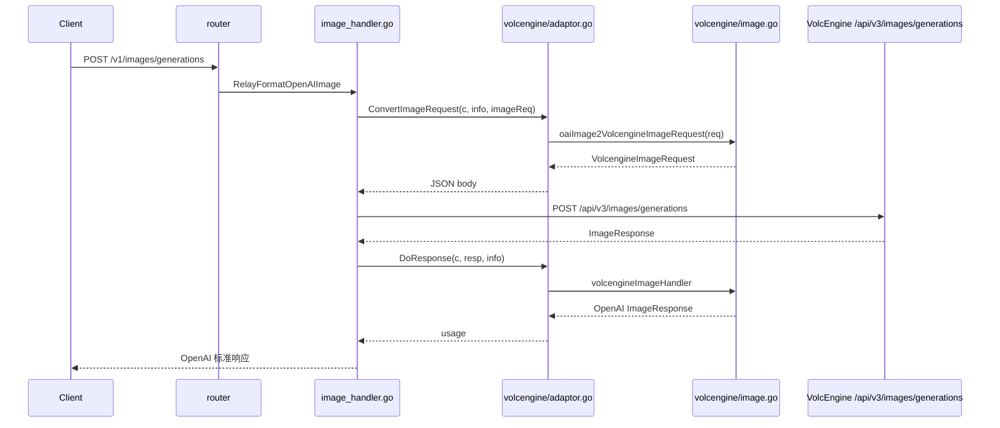
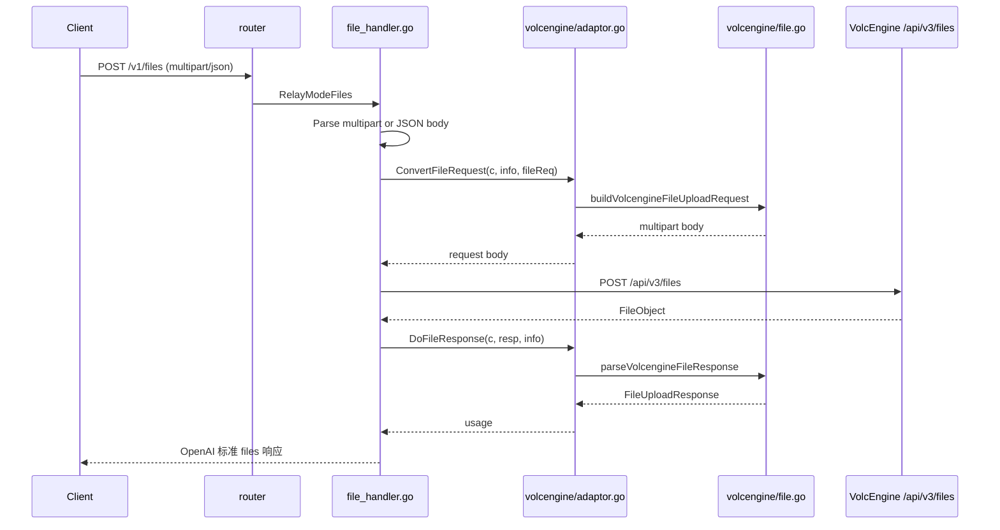
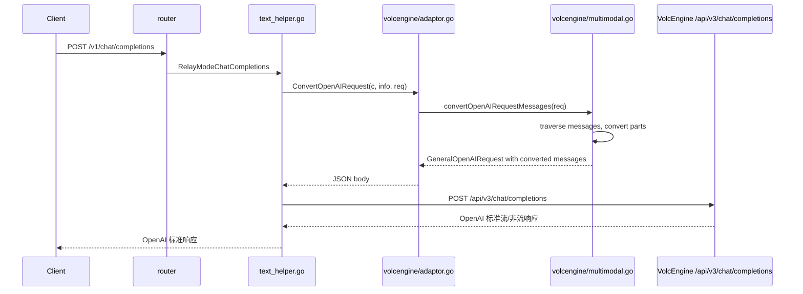

# VolcEngine 渠道增强架构设计

> **项目**：new-api 火山方舟（VolcEngine / Ark）渠道能力增强  
> **架构设计版本**：v1.0  
> **编写日期**：2026-07-02  
> **建议落盘路径**：`F:\new api\docs\architecture-volcengine-enhancement.md`  
> **负责人**：架构师 · 高见远（software-architect）

---

## 1. 设计目标

基于 PRD《VolcEngine 渠道增强 PRD》，对 new-api 的 VolcEngine 渠道进行最小侵入式增强，实现：

1. 图片生成请求与响应的完整转换（含 `2K/3K/4K`、多图参考、`sequential_image_generation`、`b64_json`）。
2. 通过 `/v1/files` 路由接入火山方舟 `/api/v3/files` 文件上传（二进制 + URL）。
3. 多模态 Chat 消息转换（`image_url` / `video_url` / `input_audio` / `file`）。

所有改动遵循现有 `channel.Adaptor` 接口与 OpenAI 兼容层，避免影响其他渠道。

---

## 2. 总体架构


### 2.1 新增/改动模块一览

| 模块 | 类型 | 说明 |
|------|------|------|
| `relay/constant/relay_mode.go` | 修改 | 新增 `RelayModeFiles` |
| `relay/channel/adapter.go` | 修改 | 新增可选接口 `FileUploadAdaptor` |
| `router/relay-router.go` | 修改 | `/v1/files` POST 路由由 `RelayNotImplemented` 改为 `controller.Relay` |
| `controller/relay.go` | 修改 | `relayHandler` 增加 `RelayModeFiles` 分支 |
| `relay/file_handler.go` | 新增 | 文件上传通用处理逻辑 |
| `dto/file.go` | 新增 | 文件上传 Request/Response DTO |
| `relay/channel/volcengine/image.go` | 新增 | VolcEngine 图片生成请求/响应转换 |
| `relay/channel/volcengine/file.go` | 新增 | VolcEngine 文件上传实现 |
| `relay/channel/volcengine/multimodal.go` | 新增 | VolcEngine 多模态消息转换 |
| `relay/channel/volcengine/adaptor.go` | 修改 | 接入新增能力 |
| `relay/channel/volcengine/*_test.go` | 新增 | 单元测试 |

---

## 3. 文件列表与职责

### 3.1 通用层（新增/修改）

```text
relay/constant/relay_mode.go
├── 新增 RelayModeFiles 常量

relay/channel/adapter.go
├── 新增 FileUploadAdaptor 可选接口
│   ├── ConvertFileRequest(c, info, request) (any, error)
│   └── DoFileResponse(c, resp, info) (usage any, err *types.NewAPIError)

router/relay-router.go
├── 修改 /v1/files POST 路由：controller.RelayNotImplemented -> controller.Relay

controller/relay.go
├── relayHandler 新增 case RelayModeFiles -> relay.FileHelper

dto/file.go
├── FileUploadRequest
│   ├── File        multipart.FileHeader
│   ├── URL         string
│   ├── Purpose     string
│   ├── PreprocessConfigs json.RawMessage
│   ├── TOS         json.RawMessage
│   └── ExpireAt    int64
├── FileUploadResponse
│   ├── ID, Object, Purpose, Filename, Bytes, MimeType, CreatedAt, ExpireAt, Status, URL

relay/file_handler.go
├── FileHelper(c, info) -> 调用 adaptor 的 ConvertFileRequest / DoFileResponse
```

### 3.2 VolcEngine 渠道层

```text
relay/channel/volcengine/image.go
├── VolcengineImageRequest DTO
├── VolcengineImageResponse DTO
├── oaiImage2VolcengineImageRequest(req) -> 支持 image 字符串/数组、2K/3K/4K、sequential_image_generation 等
├── volcengineImageResponse2OpenAI(resp, info) -> 支持 b64_json 下载转换
└── volcengineImageHandler(c, resp, info) -> 包装为 OpenAI ImageResponse

relay/channel/volcengine/file.go
├── VolcengineFileUploadRequest DTO
├── VolcengineFileUploadResponse DTO
├── buildVolcengineFileUploadRequest(c, info, req) -> multipart 构建
├── parseVolcengineFileResponse(body) -> FileUploadResponse
└── 实现 FileUploadAdaptor 接口

relay/channel/volcengine/multimodal.go
├── convertMessageContent(parts) -> 转换 image_url/video_url/input_audio/file
├── isFileID(str) / isBase64(str) / isURL(str) 辅助函数
└── convertOpenAIRequestMessages(req) -> 遍历 messages 并转换 content

relay/channel/volcengine/adaptor.go
├── ConvertImageRequest -> 调用 image.go
├── ConvertOpenAIRequest -> 调用 multimodal.go
├── DoResponse -> 图片响应走 image.go，其余保持 openai.Adaptor
└── 实现 FileUploadAdaptor 接口方法
```

---

## 4. 数据结构与接口设计

### 4.1 图片生成 DTO

```go
type VolcengineImageRequest struct {
    Model                         string          `json:"model"`
    Prompt                        string          `json:"prompt"`
    N                             *uint           `json:"n,omitempty"`
    Size                          string          `json:"size,omitempty"`
    Quality                       string          `json:"quality,omitempty"`
    ResponseFormat                string          `json:"response_format,omitempty"`
    Style                         json.RawMessage `json:"style,omitempty"`
    OutputFormat                  json.RawMessage `json:"output_format,omitempty"`
    Watermark                     *bool           `json:"watermark,omitempty"`
    Image                         any             `json:"image,omitempty"`            // string or []string
    SequentialImageGeneration      string          `json:"sequential_image_generation,omitempty"`
    SequentialImageGenerationOptions json.RawMessage `json:"sequential_image_generation_options,omitempty"`
    Extra                         map[string]json.RawMessage `json:"-"`
}

type VolcengineImageResponse struct {
    Created int64                  `json:"created"`
    Data    []VolcengineImageData  `json:"data"`
}

type VolcengineImageData struct {
    URL           string `json:"url,omitempty"`
    B64JSON       string `json:"b64_json,omitempty"`
    RevisedPrompt string `json:"revised_prompt,omitempty"`
}
```

### 4.2 文件上传 DTO

```go
type FileUploadRequest struct {
    File              *multipart.FileHeader `json:"-"`
    URL               string                `json:"url,omitempty"`
    Purpose           string                `json:"purpose,omitempty"`
    PreprocessConfigs json.RawMessage       `json:"preprocess_configs,omitempty"`
    TOS               json.RawMessage       `json:"tos,omitempty"`
    ExpireAt          int64                 `json:"expire_at,omitempty"`
}

type FileUploadResponse struct {
    ID              string          `json:"id"`
    Object          string          `json:"object"`
    Purpose         string          `json:"purpose"`
    Filename        string          `json:"filename"`
    Bytes           int64           `json:"bytes"`
    MimeType        string          `json:"mime_type"`
    CreatedAt       int64           `json:"created_at"`
    ExpireAt        int64           `json:"expire_at"`
    Status          string          `json:"status"`
    URL             string          `json:"url,omitempty"`
    PreprocessConfigs json.RawMessage `json:"preprocess_configs,omitempty"`
}
```

### 4.3 多模态消息转换规则

VolcEngine Chat API 对 OpenAI 多模态 content part 格式高度兼容，转换规则如下：

| OpenAI Part | 源格式 | 输出给 VolcEngine |
|-------------|--------|-------------------|
| `text` | `{"type":"text","text":"..."}` | 原样透传 |
| `image_url` | `{"url":"https://..."}` | 原样透传 |
| `image_url` | `{"url":"data:image/png;base64,..."}` | 原样透传 |
| `image_url` | `{"url":"file-xxx"}` | 转为 VolcEngine 可识别的 file_id 格式（如 `{"file_id":"file-xxx"}`） |
| `video_url` | `{"video_url":"https://..."}` | 原样透传 |
| `video_url` | `{"video_url":"file-xxx"}` | 转为 `{"file_id":"file-xxx"}` |
| `input_audio` | `{"data":"base64","format":"mp3"}` | 原样透传，format 必填 |
| `input_audio` | `{"url":"https://..."}` | 转为 VolcEngine 音频格式 |
| `input_audio` | `{"file_id":"file-xxx"}` | 原样透传 |
| `file` | `{"file_id":"file-xxx"}` | 原样透传 |
| `file` | `{"filename":"x.pdf","file_data":"base64"}` | 转为 VolcEngine 可识别的文件格式 |
| `file` | `{"url":"https://..."}` | 转为 VolcEngine 可识别的文件格式 |

### 4.4 可选接口设计

为避免影响所有渠道，文件上传采用**可选接口 + 运行时断言**模式：

```go
// relay/channel/adapter.go

type FileUploadAdaptor interface {
    ConvertFileRequest(c *gin.Context, info *relaycommon.RelayInfo, request *dto.FileUploadRequest) (any, error)
    DoFileResponse(c *gin.Context, resp *http.Response, info *relaycommon.RelayInfo) (usage any, err *types.NewAPIError)
}
```

`relay.FileHelper` 中通过 `adaptor, ok := GetAdaptor(info.ApiType).(channel.FileUploadAdaptor)` 判断是否支持。

---

## 5. 程序调用流程

### 5.1 图片生成流程



### 5.2 文件上传流程



### 5.3 多模态 Chat 流程



---

## 6. 任务列表（按实现顺序）

| 顺序 | 任务 | 依赖 | 说明 |
|------|------|------|------|
| 1 | 新增 `RelayModeFiles` 常量 | 无 | 在 `relay/constant/relay_mode.go` 中追加 |
| 2 | 新增 `Path2RelayMode` 对 `/v1/files` 的识别 | 任务 1 | 返回 `RelayModeFiles` |
| 3 | 新增 `FileUploadAdaptor` 可选接口 | 无 | 在 `relay/channel/adapter.go` 中定义 |
| 4 | 新增 `dto.FileUploadRequest/Response` | 无 | 在 `dto/file.go` 中定义 |
| 5 | 实现 `relay/file_handler.go` 通用处理 | 任务 3, 4 | 解析 multipart/JSON，调用 adaptor |
| 6 | 修改 `router/relay-router.go` | 任务 2, 5 | `/v1/files` POST 路由接入 Relay |
| 7 | 修改 `controller/relay.go` | 任务 5 | `relayHandler` 处理 `RelayModeFiles` |
| 8 | 实现 `volcengine/image.go` 图片转换 | 无 | 请求转换 + 响应转换 |
| 9 | 修改 `volcengine/adaptor.go` 接入图片增强 | 任务 8 | `ConvertImageRequest` / `DoResponse` 分支 |
| 10 | 实现 `volcengine/multimodal.go` 多模态转换 | 无 | 消息 content part 转换 |
| 11 | 修改 `volcengine/adaptor.go` 接入多模态 | 任务 10 | `ConvertOpenAIRequest` 中调用 |
| 12 | 实现 `volcengine/file.go` 文件上传 | 无 | multipart 构建 + 响应解析 |
| 13 | 修改 `volcengine/adaptor.go` 实现 FileUploadAdaptor | 任务 12 | 实现 `ConvertFileRequest` / `DoFileResponse` |
| 14 | 编写 `volcengine/*_test.go` 单元测试 | 任务 8-13 | 覆盖转换核心逻辑 |
| 15 | 运行 `go build` 与单元测试 | 全部 | 确保编译通过、测试通过 |

---

## 7. 共享知识与跨文件约定

### 7.1 编码约定

- 所有 JSON 序列化/反序列化使用 `common.Marshal` / `common.Unmarshal`。
- 新增文件使用 `package volcengine`。
- 错误处理使用 `types.NewError` / `types.NewErrorWithStatusCode`。
- HTTP 请求统一使用 `service.GetHttpClient()`。
- 日志使用 `logger.LogDebug` / `logger.LogError`。

### 7.2 类型约定

- `image` 字段在 OpenAI 请求中通过 `Extra` 或 `Image` 字段透传；在转换阶段统一判断为 `string` 或 `[]string`。
- `sequential_image_generation` 仅对 Seedream 有效，转换时无条件透传，由上游校验。
- `file_id` 统一以 `file-` 前缀识别。
- base64 数据统一以 `data:{mime};base64,` 前缀识别。

### 7.3 接口兼容性

- `FileUploadAdaptor` 为可选接口，未实现的渠道返回 `501 not implemented` 或 `unsupported relay mode`。
- 图片生成响应中 `b64_json` 转换逻辑仅在 VolcEngine adapter 内部处理，其他渠道不受影响。
- 多模态消息转换仅在 VolcEngine adapter 的 `ConvertOpenAIRequest` 中执行，其他渠道不受影响。

---

## 8. 待明确事项

1. `/v1/files` 路由是否同时支持 GET / DELETE / 获取内容？本设计仅实现 POST 上传，其余保持 `RelayNotImplemented`。
2. `file_id` 在多模态消息中的精确字段名（`file_id` 还是 `file.id`）需要以火山方舟最新文档为准；本设计优先采用 `file_id`。
3. 文件上传是否走 `middleware.Distribute()` 与 `middleware.ModelRequestRateLimit()`？由于文件上传不涉及模型，建议仅使用 `TokenAuth`（与 `/uapi/v1/upload_*` 保持一致）。
4. 图片 `response_format: b64_json` 下载失败时，是否返回部分成功或全部失败？建议返回错误，避免客户端拿到不完整数据。

---

## 9. 风险与缓解

| 风险 | 影响 | 缓解措施 |
|------|------|----------|
| 新增接口方法影响其他渠道 | 中 | 采用可选接口 `FileUploadAdaptor`，仅 VolcEngine 实现 |
| `/v1/files` 路由改动影响现有 NotImplemented 行为 | 低 | 仅 POST 改为 Relay，GET/DELETE 保持原样 |
| 多模态字段名与官方文档不一致 | 中 | 转换函数中同时兼容 `url` / `file_id` / `base64` 多种输入 |
| 图片 URL 下载转 base64 超时 | 中 | 使用 `service.GetHttpClient()` 并设置合理超时；失败返回明确错误 |
| 文件上传 multipart 大文件内存占用 | 中 | 依赖 gin 的 multipart 解析与 `BodyStorage` 机制；必要时复用现有磁盘缓存 |

---

## 10. 设计决策记录

1. **决策**：文件上传采用可选接口而非扩展 `channel.Adaptor`  
   **理由**：避免强制所有渠道实现文件上传，保持向后兼容。

2. **决策**：图片生成响应的 `b64_json` 转换放在 VolcEngine adapter 的 `DoResponse` 中  
   **理由**：不同渠道对 `response_format` 的处理差异较大，放在渠道内部最灵活。

3. **决策**：多模态消息转换放在 `ConvertOpenAIRequest` 中  
   **理由**：火山方舟 Chat API 与 OpenAI 格式高度兼容，转换工作主要是字段识别与透传，适合在请求转换阶段完成。

4. **决策**：`image` 字段同时支持单字符串与字符串数组  
   **理由**：兼容 OpenAI 现有单图编辑与火山方舟多图参考两种用法。
