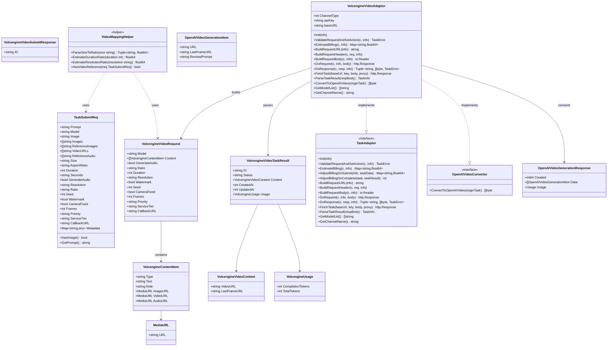
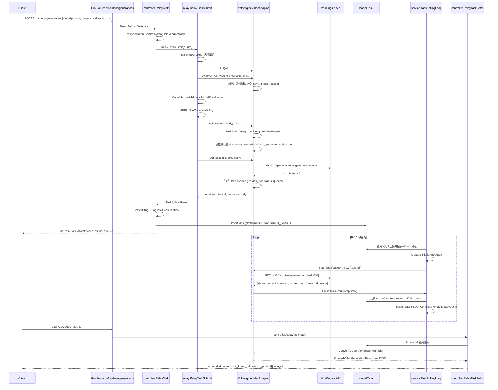
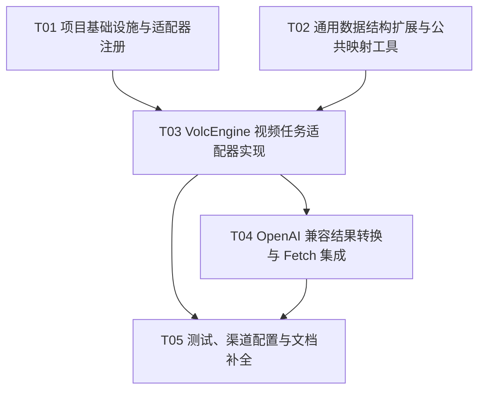

# new-api 火山方舟/豆包视频生成能力架构设计

> 本文档基于 `docs/prd-volcengine-video-generation.md` 进行系统架构设计与任务分解。  
> 目标：在 new-api 中通过 OpenAI 兼容接口 `/v1/videos/generations` 接入火山方舟（VolcEngine）及豆包视频（DoubaoVideo）渠道的视频生成能力，复用现有 task 平台实现异步任务+轮询。

---

## Part A：系统设计

### 1. 实现方案 + 框架选型

#### 1.1 核心思路

new-api 已经具备成熟的 **异步任务（Task）平台**：

- 提交入口：`controller.RelayTask` → `relay.RelayTaskSubmit`
- 统一轮询：`service.TaskPollingLoop` / `UpdateVideoTasks`
- 结果查询：`controller.RelayTaskFetch` → `relay.RelayTaskFetch`
- 计费模型：预扣费 + 轮询终态结算 + `OtherRatios`（时长/分辨率等）

火山方舟/豆包视频生成 API 与现有 `relay/channel/task/doubao` 所对接的 `/api/v3/contents/generations/tasks` 接口完全一致，因此可以**最大程度复用该 pipeline**：

1. 请求经过 `TokenAuth` / `Distribute` 中间件；
2. 按渠道类型进入 `TaskAdaptor`；
3. 适配器完成 OpenAI 字段 → 火山方舟字段的转换；
4. 提交成功后生成 `task_xxx` 公开任务 ID 写入数据库；
5. 后台轮询服务查询上游任务状态，更新 `result_url` 并结算；
6. 用户通过 `GET /v1/videos/{task_id}` 拉取 OpenAI 兼容结果。

#### 1.2 新建 adaptor 还是扩展现有 taskdoubao？

**建议：新建独立 adaptor 包 `relay/channel/task/volcenginevideo`**，而不是直接扩展 `relay/channel/task/doubao`。理由如下：

| 维度 | 扩展 taskdoubao | 新建 volcenginevideo adaptor |
|------|------------------|------------------------------|
| 渠道类型 | 豆包视频使用 `ChannelTypeDoubaoVideo = 54` | 火山方舟使用 `ChannelTypeVolcEngine = 45` |
| 模型列表 | 豆包视频模型列表 | 火山方舟模型列表可独立演进 |
| 计费倍率 | 豆包视频计费 | 火山方舟计费可独立配置 |
| 渠道名称 | `doubao-video` | `volcengine-video` |
| 可维护性 | 混用同一 adaptor 后续难以拆分 | 结构清晰，未来差异可隔离 |

**复用策略**：

- 将公共逻辑（如 `size` → `ratio` 映射、duration/resolution 倍率估算、content 数组构建）下沉到 `relay/channel/task/taskcommon`；
- `volcenginevideo` 与 `doubao` 两个包都引用这些 helper；
- 请求/响应结构体在 `volcenginevideo` 包内定义，与 `doubao` 包保持独立。

#### 1.3 技术选型

- **语言/框架**：Go（与 new-api 一致），Gin 路由，GORM/数据库模型复用；
- **无新增第三方依赖**：仅使用项目已有依赖（`samber/lo`、`gin-gonic/gin` 等）；
- **模式**：Adaptor 模式 + 异步任务轮询；
- **接口规范**：OpenAI 兼容 `/v1/videos/generations` 与 `/v1/videos/{task_id}`。

---

### 2. 文件列表

#### 新增文件

| 相对路径 | 说明 |
|----------|------|
| `relay/channel/task/volcenginevideo/adaptor.go` | VolcEngine 视频任务 adaptor 主实现 |
| `relay/channel/task/volcenginevideo/constants.go` | 模型列表、渠道名称、计费倍率表 |
| `relay/channel/task/volcenginevideo/request.go` | 火山方舟请求结构体（content 数组等） |
| `relay/channel/task/volcenginevideo/response.go` | 火山方舟提交/查询响应结构体 |
| `relay/channel/task/volcenginevideo/convert.go` | OpenAI 兼容结果转换（`OpenAIVideoConverter`） |
| `relay/channel/task/volcenginevideo/adaptor_test.go` | 单元测试 |

#### 修改文件

| 相对路径 | 说明 |
|----------|------|
| `relay/relay_adaptor.go` | 在 `GetTaskAdaptor` 中注册 `ChannelTypeVolcEngine` → `volcenginevideo.TaskAdaptor` |
| `relay/common/relay_info.go` | 扩展 `TaskSubmitReq`，新增视频生成相关字段（`generate_audio`、`resolution`、`ratio`、`seed`、`watermark`、`camera_fixed`、`frames`、`priority`、`service_tier`、`callback_url`、`reference_video`、`reference_audio` 等） |
| `relay/common/relay_utils.go` | 更新 `isKnownTaskField` 白名单，支持 multipart 表单下的新增字段 |
| `relay/channel/task/taskcommon/helpers.go` | 新增公共映射 helper：`size` → `ratio`、duration/resolution 估算、参考视频检测 |
| `dto/openai_video.go` | 新增 `OpenAIVideoGenerationResponse` / `OpenAIVideoGenerationItem` 等 OpenAI 视频生成结果 DTO |
| `controller/channel-test.go` | 在渠道测试逻辑中将 `ChannelTypeVolcEngine` 加入 `/v1/videos/generations` 测试路径 |
| `relay/channel/task/doubao/constants.go` | 视产品需求补充豆包视频模型别名（可选） |
| `main.go` | 检查/确认 task polling adaptor 注入逻辑无需修改（已复用现有 wiring） |
| `go.mod` | 无需新增依赖，仅作为依赖声明基线检查 |

---

### 3. 数据结构与接口

#### 3.1 Mermaid 类图



#### 3.2 关键 Go 结构体定义

```go
// 火山方舟创建任务请求（/api/v3/contents/generations/tasks）
type VolcengineVideoRequest struct {
    Model         string                  `json:"model"`
    Content       []VolcengineContentItem `json:"content"`
    GenerateAudio bool                    `json:"generate_audio"`
    Ratio         string                  `json:"ratio,omitempty"`
    Duration      int                     `json:"duration,omitempty"`
    Resolution    string                  `json:"resolution,omitempty"`
    Watermark     bool                    `json:"watermark,omitempty"`
    Seed          int                     `json:"seed,omitempty"`
    CameraFixed   bool                    `json:"camera_fixed,omitempty"`
    Frames        int                     `json:"frames,omitempty"`
    Priority      string                  `json:"priority,omitempty"`
    ServiceTier   string                  `json:"service_tier,omitempty"`
    CallbackURL   string                  `json:"callback_url,omitempty"`
}

type VolcengineContentItem struct {
    Type     string    `json:"type,omitempty"`
    Text     string    `json:"text,omitempty"`
    Role     string    `json:"role,omitempty"`
    ImageURL *MediaURL `json:"image_url,omitempty"`
    VideoURL *MediaURL `json:"video_url,omitempty"`
    AudioURL *MediaURL `json:"audio_url,omitempty"`
}

type MediaURL struct {
    URL string `json:"url,omitempty"`
}

// 创建任务上游响应
type VolcengineVideoSubmitResponse struct {
    ID string `json:"id"`
}

// 查询任务上游响应
type VolcengineVideoTaskResult struct {
    ID      string `json:"id"`
    Model   string `json:"model"`
    Status  string `json:"status"`
    Content struct {
        VideoURL     string `json:"video_url"`
        LastFrameURL string `json:"last_frame_url,omitempty"`
    } `json:"content"`
    Usage struct {
        CompletionTokens int `json:"completion_tokens"`
        TotalTokens      int `json:"total_tokens"`
    } `json:"usage"`
    Error struct {
        Code    string `json:"code"`
        Message string `json:"message"`
    } `json:"error"`
    CreatedAt int64 `json:"created_at"`
    UpdatedAt int64 `json:"updated_at"`
}

// OpenAI 视频生成返回（GET /v1/videos/{task_id}）
type OpenAIVideoGenerationResponse struct {
    Created int64                         `json:"created"`
    Data    []OpenAIVideoGenerationItem   `json:"data"`
    Usage   *Usage                        `json:"usage,omitempty"`
}

type OpenAIVideoGenerationItem struct {
    URL           string `json:"url"`
    LastFrameURL  string `json:"last_frame_url,omitempty"`
    RevisedPrompt string `json:"revised_prompt,omitempty"`
}
```

#### 3.3 Task Adaptor 需要实现的方法

`VolcengineVideoAdaptor` 必须完整实现 `relay/channel.TaskAdaptor` 接口，并额外实现 `relay/channel.OpenAIVideoConverter` 接口用于 OpenAI 兼容结果返回。

核心方法职责：

- `Init(info)`：读取 `ChannelBaseUrl`、`ApiKey`、`ChannelType`。
- `ValidateRequestAndSetAction(c, info)`：调用 `relaycommon.ValidateBasicTaskRequest` 完成 prompt/图片校验；默认 `action = generate`。
- `EstimateBilling(c, info)`：根据 `duration`、`resolution`、`video_input` 返回 `OtherRatios` 用于预扣费。
- `BuildRequestBody(c, info)`：将 `TaskSubmitReq` 转换为 `VolcengineVideoRequest`（content 数组 + ratio/duration/resolution 等）。
- `DoResponse(...)`：解析上游提交响应，生成 OpenAI 兼容任务对象（`status: queued`，公开 `task_id`）。
- `FetchTask(...)`：对 `GET /api/v3/contents/generations/tasks/{id}` 发起查询。
- `ParseTaskResult(respBody)`：将上游状态 `queued/running/succeeded/failed/expired/cancelled` 映射为内部 `TaskStatus`。
- `ConvertToOpenAIVideo(originTask)`：在 `GET /v1/videos/{task_id}` 时把 `originTask.Data` 转换为 `OpenAIVideoGenerationResponse`。

---

### 4. 程序调用流程



---

### 5. 待明确事项（Anything UNCLEAR）

基于 PRD 第 5 节提出的问题，给出架构侧建议：

| 问题 | 建议方案 | 需要产品经理确认 |
|------|----------|------------------|
| **模型 ID 与渠道路由** | 火山方舟渠道（`ChannelTypeVolcEngine = 45`）与豆包视频渠道（`ChannelTypeDoubaoVideo = 54`）分别使用独立 adaptor；用户传入 `model` 直接透传，同时保留渠道模型映射能力。 | 确认是否在渠道配置中分别提供“火山方舟-视频生成”和“豆包视频”两种类型；是否启用渠道模型映射。 |
| **多模态参考字段表达** | P0 支持 OpenAI 兼容顶层字段：`image`（首帧）、`reference_images`、`reference_video`、`reference_audio`；更复杂的 content 数组格式（如 GPT-4o messages）放 P1 或 P2。 | 确认客户端字段名是否采用上述方案；参考资源是否仅支持 URL，还是必须支持 base64。 |
| **异步结果返回机制** | 复用现有 task 轮询（15s 一轮，单任务 1s 间隔），超时时间沿用 `TaskTimeoutMinutes`；客户端通过 `GET /v1/videos/{task_id}` 拉取结果，不新增 SSE。 | 确认视频生成任务是否接受 15s 轮询；是否需要在 P1 支持 `callback_url` 主动回调。 |
| **计费与用量统计** | 建议按“模型单价 × duration 倍率 × resolution 倍率 × video_input 倍率”计费；上游返回的 `completion_tokens` 仅作为 token 计费回退。 | 确认视频模型计费单位（按次/按秒/按 token）；是否需要在价格表中新增 `duration`/`resolution` 倍率。 |
| **错误状态与重试** | `failed` / `expired` / `cancelled` 均标记为 `TaskStatusFailure` 并退款；不自动重试创建任务；`cancelled` 不暴露取消接口。 | 确认是否接受此策略；是否需要 P1 级主动取消接口。 |

---

## Part B：任务分解

### 6. 依赖包列表

本次改造**不引入新的第三方 Go 包**，仅使用 new-api 现有依赖：

```
- github.com/gin-gonic/gin: HTTP 框架与上下文
- github.com/samber/lo: 集合/指针辅助
- github.com/pkg/errors: 错误包装（现有代码风格）
```

`go.mod` 无需新增依赖，但需在 T01 中作为基线确认。

---

### 7. 任务列表（按依赖顺序）

#### T01：项目基础设施与适配器注册（P0）

- **Source Files**：
  - `go.mod`（基线检查，无新增依赖）
  - `main.go`（确认 `service.GetTaskAdaptorFunc` wiring 已覆盖 `relay.GetTaskAdaptor`）
  - `relay/relay_adaptor.go`（新增 `ChannelTypeVolcEngine` → `volcenginevideo.TaskAdaptor` 分支）
- **任务描述**：
  1. 确认无新增第三方依赖；
  2. 在 `relay/relay_adaptor.go` 中 import `relay/channel/task/volcenginevideo`；
  3. 在 `GetTaskAdaptor` 的 switch 中增加 `case constant.ChannelTypeVolcEngine: return &volcenginevideo.TaskAdaptor{}`；
  4. 确保 `main.go` 的 adaptor 注入链路无需改动。
- **Dependencies**：无
- **Priority**：P0

#### T02：通用数据结构扩展与公共映射工具（P0）

- **Source Files**：
  - `relay/common/relay_info.go`（扩展 `TaskSubmitReq`）
  - `relay/common/relay_utils.go`（更新 `isKnownTaskField` 白名单）
  - `relay/channel/task/taskcommon/helpers.go`（新增 `size→ratio`、duration/resolution 估算 helper）
  - `dto/openai_video.go`（新增 `OpenAIVideoGenerationResponse` / `OpenAIVideoGenerationItem`）
- **任务描述**：
  1. 在 `TaskSubmitReq` 中新增视频生成参数字段（`generate_audio`、`resolution`、`ratio`、`seed`、`watermark`、`camera_fixed`、`frames`、`priority`、`service_tier`、`callback_url`、`reference_video`、`reference_audio` 等），保持向后兼容；
  2. 更新 `isKnownTaskField`，确保 multipart 表单下新增字段进入 `metadata` 或直接解析；
  3. 在 `taskcommon` 中实现 `ParseSizeToRatio`（如 `1920x1080`→`16:9`）、`EstimateDurationRatio`、`EstimateResolutionRatio`、`HasVideoReference`；
  4. 在 `dto/openai_video.go` 中定义 `OpenAIVideoGenerationResponse` 和 `OpenAIVideoGenerationItem`。
- **Dependencies**：T01（仅需要 adaptor 包存在以便编译；可与 T01 并行开发，但合并顺序在 T01 之后）
- **Priority**：P0

#### T03：VolcEngine 视频任务适配器实现（P0）

- **Source Files**：
  - `relay/channel/task/volcenginevideo/adaptor.go`（新建）
  - `relay/channel/task/volcenginevideo/constants.go`（新建）
  - `relay/channel/task/volcenginevideo/request.go`（新建）
  - `relay/channel/task/volcenginevideo/response.go`（新建）
- **任务描述**：
  1. 定义 `VolcengineVideoRequest`、`VolcengineContentItem`、`MediaURL`、`VolcengineVideoSubmitResponse`、`VolcengineVideoTaskResult`；
  2. 实现 `TaskAdaptor` 接口：`Init`、`ValidateRequestAndSetAction`、`BuildRequestURL`、`BuildRequestHeader`、`BuildRequestBody`、`DoRequest`、`DoResponse`、`FetchTask`、`ParseTaskResult`、`EstimateBilling`、`AdjustBillingOnSubmit`、`AdjustBillingOnComplete`、`GetModelList`、`GetChannelName`；
  3. `BuildRequestBody` 中完成字段映射：prompt → `text/user`，`image` → `first_frame`，`reference_images` → `reference_image`，`reference_video` → `reference_video`，`reference_audio` → `reference_audio`；`size` → `ratio`；设置默认值；
  4. `ParseTaskResult` 映射状态：`queued`→QUEUED、`running`→IN_PROGRESS、`succeeded`→SUCCESS、`failed/expired/cancelled`→FAILURE；解析 `video_url`、`last_frame_url`、`usage`。
- **Dependencies**：T01、T02
- **Priority**：P0

#### T04：OpenAI 兼容结果转换与 Fetch 集成（P0）

- **Source Files**：
  - `relay/channel/task/volcenginevideo/convert.go`（新建，实现 `OpenAIVideoConverter`）
  - `dto/openai_video.go`（同 T02，填充 Usage 字段）
  - `relay/relay_task.go`（确认 `videoFetchByIDRespBodyBuilder` 已支持 adaptor 自定义转换，无需修改）
  - `controller/relay.go`（确认 `RelayTaskFetch` 路径已接入）
- **任务描述**：
  1. 在 `convert.go` 中实现 `ConvertToOpenAIVideo(*model.Task) ([]byte, error)`：从 `originTask.Data` 反序列化 `VolcengineVideoTaskResult`，构建 `OpenAIVideoGenerationResponse`（包含 `created`、`data[].url`、`data[].last_frame_url`、`revised_prompt`、`usage.completion_tokens`）；
  2. 返回失败任务时填充 `error` 字段（可选，优先复用现有 `OpenAIVideo` 失败结构）；
  3. 与 `relay/relay_task.go` 的 `videoFetchByIDRespBodyBuilder` 链路联调，确保 `GET /v1/videos/{task_id}` 能返回新格式。
- **Dependencies**：T03
- **Priority**：P0

#### T05：测试、渠道配置与文档补全（P1）

- **Source Files**：
  - `controller/channel-test.go`（将 `ChannelTypeVolcEngine` 加入视频生成测试路径）
  - `relay/channel/task/volcenginevideo/adaptor_test.go`（新建，覆盖请求映射、状态解析、结果转换）
  - `relay/channel/task/doubao/constants.go`（视情况补充 Seedance 模型别名）
- **任务描述**：
  1. 在 `controller/channel-test.go` 的视频生成测试分支中支持 `ChannelTypeVolcEngine`；
  2. 编写 `adaptor_test.go`，覆盖 `size`→`ratio` 映射、content 数组生成、上游响应解析、失败状态映射；
  3. 视产品需求更新 `doubao/constants.go` 中的模型别名；
  4. 检查前端渠道配置是否需要展示“火山方舟-视频生成”模型列表。
- **Dependencies**：T03、T04
- **Priority**：P1

---

### 8. 共享知识（Shared Knowledge）

- **平台标识**：
  - 火山方舟视频渠道 platform 为 `strconv.Itoa(constant.ChannelTypeVolcEngine)`，即 `"45"`；
  - 豆包视频渠道 platform 为 `"54"`，继续使用 `relay/channel/task/doubao`。
- **渠道类型常量**：
  - `constant.ChannelTypeVolcEngine = 45`
  - `constant.ChannelTypeDoubaoVideo = 54`
- **模型列表**：`volcenginevideo/constants.go` 与 `doubao/constants.go` 中分别维护各自支持的 Seedance 模型 ID，如 `doubao-seedance-2-0-260128`。
- **字段默认值**：
  - `duration` 默认 `5`；
  - `resolution` 默认 `"720p"`；
  - `generate_audio` 默认 `true`；
  - `watermark` 默认 `false`。
- **Size → Ratio 映射**：
  - `1920x1080` → `16:9`
  - `1080x1920` → `9:16`
  - `512x512` → `1:1`
  - 已包含 `:` 的字符串（如 `16:9`）直接透传；未知则透传或报错。
- **Content role 映射**：
  - `prompt` → `type=text, role=user`；
  - `image`（第一张） → `type=image_url, role=first_frame`；
  - `reference_images` → `type=image_url, role=reference_image`；
  - `reference_video` → `type=video_url, role=reference_video`；
  - `reference_audio` → `type=audio_url, role=reference_audio`。
- **计费**：
  - `OtherRatios` 键名建议：`duration`、`resolution`、`video_input`；
  - 模型价格表中按基础单价配置，系统通过 `OtherRatios` 自动乘算；
  - 按次计费（`UsePrice=true` 或 `TaskPricePatches` 命中）不参与 `OtherRatios` 乘积。
- **错误状态**：
  - 上游非 200 提交返回 `fail_to_fetch_task`；
  - 轮询中 `failed` / `expired` / `cancelled` 均转为 `FAILURE` 并退款；
  - 5xx 查询错误保持原状态等待下一轮轮询。
- **轮询配置**：
  - 主循环 `service.TaskPollingLoop` 每 15 秒执行一次；
  - 同渠道任务间 sleep 1 秒，避免速率限制；
  - 超时使用 `constant.TaskTimeoutMinutes`。
- **命名规范**：
  - 新包名：`volcenginevideo`；
  - adaptor 结构体：`TaskAdaptor`；
  - 常量：`ModelList`、`ChannelName`、`videoInputRatioMap`；
  - 文件名：`adaptor.go`、`constants.go`、`request.go`、`response.go`、`convert.go`。

---

### 9. 任务依赖图


