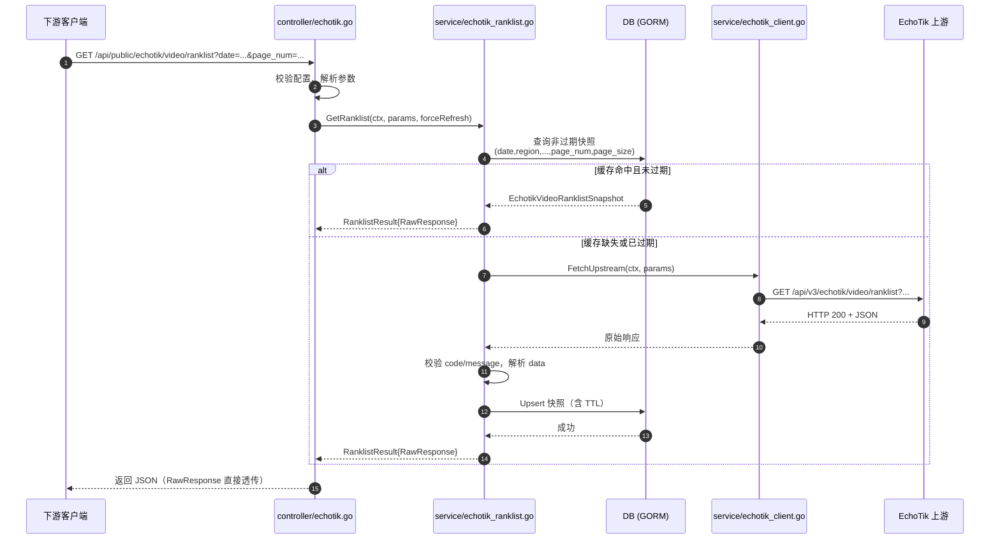
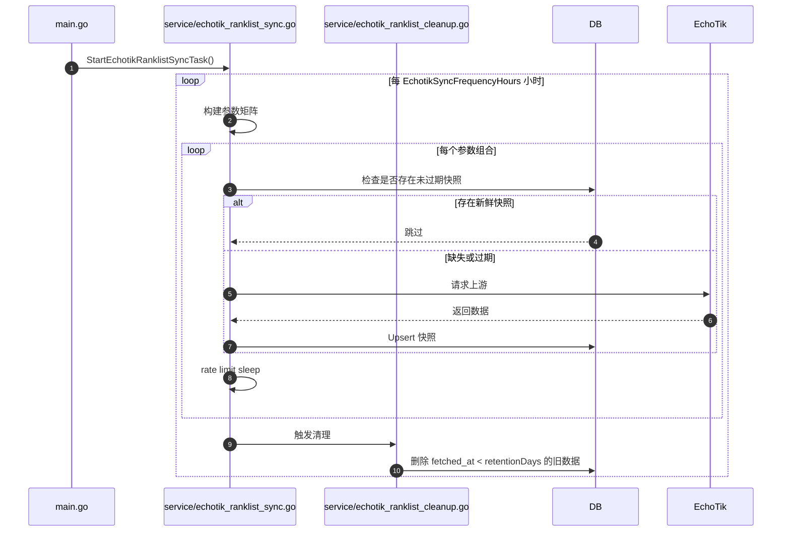
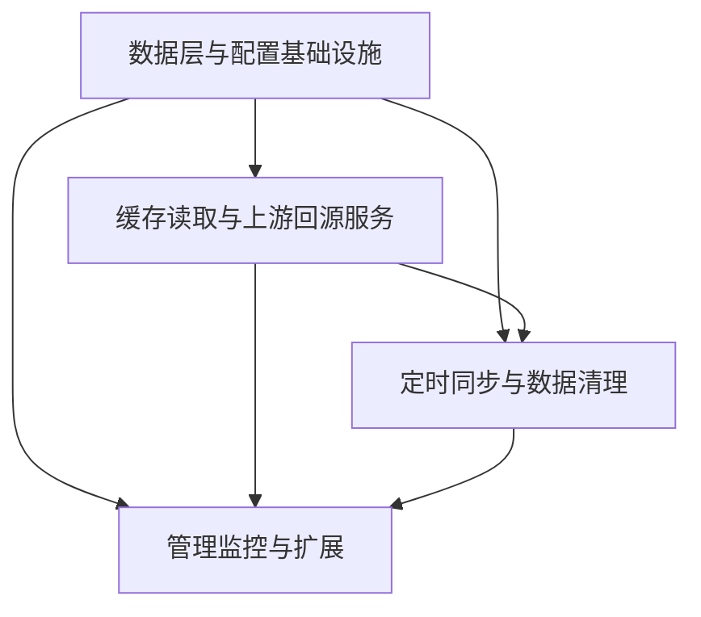
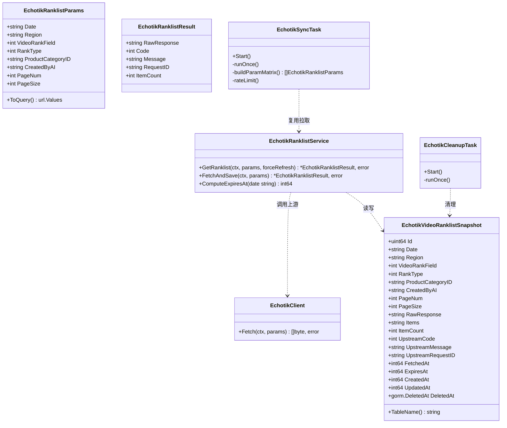

# EchoTik 视频榜单本地缓存方案设计

## 1. 总体策略

### 1.1 推荐方案：缓存优先 + 上游回源（Cache-First with Fallback），配合定时预热

建议采用 **缓存优先 + 上游回源** 作为核心策略，同时在后台对高频参数组合进行 **定时预热同步**。即：

- 下游请求 `/api/public/echotik/video/ranklist` 时，优先读取本地数据库缓存；
- 若缓存不存在或已过期，则回源到 EchoTik `/api/v3/echotik/video/ranklist`，拿到响应后持久化到本地，再返回给下游；
- 后台定时任务按配置的组合主动拉取数据，提前填满缓存，降低下游首次请求的延迟。

### 1.2 为什么不采用“纯本地 + 定时全量同步”

| 维度 | 缓存优先 + 回源 | 纯本地 + 全量定时同步 |
|------|----------------|----------------------|
| 参数空间 | 按需填充，只缓存被请求过的组合 | 需要覆盖 `date × region × rank_field × rank_type × product_category_id × created_by_ai × page_num`，组合爆炸 |
| 上游压力 | 仅缓存未命中时请求，压力可控 | 全量同步容易触发上游限流，且大量组合无访问价值 |
| 实时性 | 命中缓存立即返回； miss 时同步拉取 | 依赖同步周期，无法响应新参数组合 |
| 实现复杂度 | 中 | 高（需要枚举、调度、容错、重试） |
| 数据一致性 | 通过 TTL 控制，过期自动回源 | 需要复杂的同步窗口和兜底机制 |

EchoTik 榜单数据是 **按日期切片的历史数据**（某日某榜单一旦生成即固定），天然适合长周期缓存；但请求参数组合太多，全量预同步 ROI 低。因此 **缓存优先 + 回源** 更符合实际业务形态。

### 1.3 关键设计原则

1. **对下游透明**：请求参数、响应结构、状态码保持与现有接口一致，下游无需改造。
2. **以页为缓存单元**：缓存键为 `(date, region, video_rank_field, rank_type, product_category_id, created_by_ai, page_num, page_size)`，与上游请求一一对应。
3. **不可变日期长缓存，当日数据短缓存**：历史日期数据不会变化，可长期缓存；当天/昨日数据设置较短 TTL，兼顾时效与上游压力。
4. **单实例主节点负责同步**：复用项目已有 `common.IsMasterNode` 机制，避免多实例重复同步。
5. **无额外依赖**：复用现有 `gopool + time.Ticker` 实现后台任务，避免引入 cron 库。

---

## 2. 数据库 Schema

### 2.1 GORM 模型

```go
package model

import "gorm.io/gorm"

// EchotikVideoRanklistSnapshot EchoTik 视频榜单分页缓存快照
// 每行对应一次上游请求的一个分页结果
type EchotikVideoRanklistSnapshot struct {
	Id                uint64         `json:"id" gorm:"primaryKey;autoIncrement"`
	Date              string         `json:"date" gorm:"type:varchar(10);not null;uniqueIndex:idx_echotik_ranklist_uq,priority:1"`
	Region            string         `json:"region" gorm:"type:varchar(16);not null;uniqueIndex:idx_echotik_ranklist_uq,priority:2"`
	VideoRankField    int            `json:"video_rank_field" gorm:"not null;uniqueIndex:idx_echotik_ranklist_uq,priority:3"`
	RankType          int            `json:"rank_type" gorm:"not null;uniqueIndex:idx_echotik_ranklist_uq,priority:4"`
	ProductCategoryID string         `json:"product_category_id" gorm:"type:varchar(64);default:'';uniqueIndex:idx_echotik_ranklist_uq,priority:5"`
	CreatedByAI       string         `json:"created_by_ai" gorm:"type:varchar(8);default:'';uniqueIndex:idx_echotik_ranklist_uq,priority:6"`
	PageNum           int            `json:"page_num" gorm:"not null;uniqueIndex:idx_echotik_ranklist_uq,priority:7"`
	PageSize          int            `json:"page_size" gorm:"not null;uniqueIndex:idx_echotik_ranklist_uq,priority:8"`

	// 原始数据
	RawResponse string `json:"-" gorm:"type:longtext;not null"` // 上游完整 JSON 响应
	Items       string `json:"-" gorm:"type:longtext"`          // data 数组 JSON，便于后续按 video_id 检索
	ItemCount   int    `json:"-"`                               // data 长度

	// 上游元信息
	UpstreamCode      int    `json:"-"`
	UpstreamMessage   string `json:"-" gorm:"type:varchar(255)"`
	UpstreamRequestID string `json:"-" gorm:"type:varchar(128);index"`

	// 缓存控制
	FetchedAt int64 `json:"-" gorm:"bigint;not null;index"`
	ExpiresAt int64 `json:"-" gorm:"bigint;not null;index"`

	// 时间戳
	CreatedAt int64          `json:"created_at" gorm:"bigint"`
	UpdatedAt int64          `json:"updated_at" gorm:"bigint"`
	DeletedAt gorm.DeletedAt `gorm:"index"`
}

func (EchotikVideoRanklistSnapshot) TableName() string {
	return "echotik_video_ranklist_snapshots"
}
```

### 2.2 索引设计

| 索引名 | 字段 | 说明 |
|--------|------|------|
| `idx_echotik_ranklist_uq` | `date, region, video_rank_field, rank_type, product_category_id, created_by_ai, page_num, page_size` | 复合唯一索引，保证同一参数组合只有一条缓存，并作为查询索引 |
| `idx_expires_at` | `expires_at` | 清理过期/超保留期数据时使用 |
| `idx_fetched_at` | `fetched_at` | 按拉取时间排序、统计时使用 |
| `idx_upstream_request_id` | `upstream_request_id` | 问题排查时快速定位上游请求 |

### 2.3 JSON 存储策略

- **`RawResponse`**：保存 EchoTik 返回的完整 JSON（含 `code`、`message`、`requestId`、`data`）。这样下游可以直接透传，保证响应格式 100% 一致。
- **`Items`**：单独保存 `data` 数组的 JSON。第一期仅作为冗余，便于后续做 `video_id` 检索、导出、分析等扩展。
- **`ItemCount`**：缓存 `len(data)`，便于管理后台快速统计条目数。

### 2.4 幂等性

通过复合唯一索引实现：同一参数组合多次拉取时执行 **upsert**（GORM `Save` 或 `Clauses(clause.OnConflict{UpdateAll: true})`），不会产生重复行。`UpdatedAt` 会被刷新，`ExpiresAt` 按策略重新计算。

---

## 3. 文件与模块布局

| 文件 | 类型 | 说明 |
|------|------|------|
| `model/echotik_ranklist.go` | 新增 | GORM 模型 `EchotikVideoRanklistSnapshot` 及基础 CRUD |
| `setting/operation_setting/echotik_setting.go` | 修改 | 新增缓存/同步/保留相关配置项 |
| `model/main.go` | 修改 | `AutoMigrate` 注册新模型 |
| `dto/echotik_ranklist.go` | 新增 | 请求参数、内部传输结构定义 |
| `service/echotik_ranklist.go` | 新增 | 缓存查询、回源、保存核心服务 |
| `service/echotik_client.go` | 新增 | 封装对 EchoTik 上游的 HTTP 调用（可复用现有 `service.GetHttpClient`） |
| `controller/echotik.go` | 修改 | `EchotikVideoRanklist` 改为先读本地缓存再回源 |
| `service/echotik_ranklist_sync.go` | 新增 | 定时同步/预热任务 |
| `service/echotik_ranklist_cleanup.go` | 新增 | 过期数据清理任务 |
| `main.go` | 修改 | 启动同步与清理任务 |
| `model/echotik_ranklist_item.go` | 新增（可选） | 若后续需要按视频维度检索，将 `data` 拆成子表 |
| `controller/echotik_admin.go` | 新增（可选） | 管理接口：缓存状态、强制刷新、手动触发同步 |
| `router/api-router.go` | 修改（可选） | 注册管理接口路由 |

---

## 4. API 设计

### 4.1 接口地址与鉴权

- **地址**：`GET /api/public/echotik/video/ranklist`（保持不变）
- **鉴权**：`Authorization: Bearer sk-xxx`（保持不变）
- **查询参数**：与原接口一致，继续透传给 EchoTik

| 参数 | 类型 | 必填 | 说明 |
|------|------|------|------|
| `date` | string | 是 | `yyyy-MM-dd` |
| `region` | string | 是 | 如 `US` |
| `video_rank_field` | integer | 是 | `1`=热门榜，`2`=带货榜 |
| `rank_type` | integer | 是 | `1`=日榜，`2`=周榜，`3`=月榜 |
| `page_num` | integer | 是 | 页码，从 1 开始 |
| `page_size` | integer | 是 | 每页条数，最大 10 |
| `product_category_id` | string | 否 | 商品一级类目 ID |
| `created_by_ai` | string | 否 | `true` / `false` |
| `force_refresh` | string | 否 | `true` 时强制回源（可选，默认 `false`） |

### 4.2 响应结构

保持 EchoTik 原始响应格式：

```json
{
  "code": 200,
  "message": "success",
  "requestId": "xxx",
  "data": [
    {
      "video_id": "xxx",
      "nick_name": "xxx",
      "total_views_cnt": 1000000,
      "...": "..."
    }
  ]
}
```

实现时直接返回 `RawResponse` 的字节数组，不再二次序列化，避免字段顺序或类型差异。

### 4.3 处理流程

```go
func EchotikVideoRanklist(c *gin.Context) {
    // 1. 校验 EchoTik 配置是否启用
    // 2. 解析并校验查询参数
    // 3. 构造 EchotikRanklistParams
    // 4. 调用 service.GetRanklist(ctx, params, forceRefresh)
    // 5. 若返回结果，直接 c.Data(http.StatusOK, "application/json", []byte(result.RawResponse))
    // 6. 若出错，按原格式返回 {success:false, message:"..."}
}
```

### 4.4 缓存命中与回源规则

1. **命中非过期缓存**：直接返回 `RawResponse`。
2. **缓存缺失 / 已过期 / `force_refresh=true`**：
   - 校验上游 URL（复用 `common.ValidateURLWithFetchSetting`）；
   - 使用 Basic Auth 请求 EchoTik；
   - 解析响应，仅当 `code == 200` 且 `data` 非空时保存；
   - 通过 upsert 写入 `EchotikVideoRanklistSnapshot`；
   - 返回响应。
3. **回源失败但存在过期缓存**（可选降级）：返回过期缓存并记录 warning，避免下游完全不可用。
4. **回源失败且无缓存**：返回 `502 Bad Gateway` 或对应上游错误。

### 4.5 分页行为

- 缓存按 `(page_num, page_size)` 分页单元存储。
- 下游翻页时，每一页独立查找缓存；缺失则单独回源该页。
- 上游最大 `page_size=10`，若下游传 `page_size<=10` 直接按原值缓存；未来可考虑统一以 `page_size=10` 向上游拉取，再本地切片 serving，但第一期保持与上游请求 1:1，避免排序/截断风险。

### 4.6 TTL 计算策略

根据 `date` 与当前日期的差距计算 `ExpiresAt`：

| 数据日期 | 默认 TTL | 说明 |
|----------|----------|------|
| 当天 | 1 小时 | 数据可能仍在汇总中 |
| 近 7 天（不含当天） | 6 小时 | 短期榜单可能被修正 |
| 7 天以前 | 30 天 | 历史数据基本固定 |

所有 TTL 通过 `EchotikSetting` 配置项可覆盖。

---

## 5. 同步策略

### 5.1 调度方式

复用项目现有后台任务模式：`sync.Once + gopool.Go + time.NewTicker`，在 `main.go` 启动。避免引入 `robfig/cron` 等第三方库。

```go
// main.go
service.StartEchotikRanklistSyncTask()
service.StartEchotikRanklistCleanupTask()
```

如果未来需要更复杂的 cron 表达式（如“每天凌晨 2 点”），可再评估引入 `github.com/robfig/cron/v3`。

### 5.2 参数组合同步范围

预同步不应全量，而应聚焦 **高频/默认组合**：

- 日期：昨天、今天、前天（共 3 天）。
- 区域：配置项 `EchotikSyncRegions` 中的区域（默认 `US`）。
- `video_rank_field`：`1`、`2`。
- `rank_type`：`1`、`2`、`3`。
- `product_category_id`：空字符串（默认）+ 配置的热门类目列表。
- `created_by_ai`：空字符串（默认）。
- `page_num`：`1` 到 `EchotikSyncMaxPages`（默认 1）。
- `page_size`：`10`。

组合数量估算（默认配置）：
`3 天 × 1 区域 × 2 字段 × 3 类型 × 1 类目 × 1 AI 筛选 × 1 页 = 18 次请求/轮`。

### 5.3 同步执行细节

- **主节点限定**：仅在 `common.IsMasterNode == true` 时启动。
- **单次执行锁**：使用 `atomic.Bool` 防止上一轮未结束又进入下一轮。
- **顺序串行 + 限速**：使用 `time.Ticker` 或 `rate.Limiter` 控制 QPS（默认 1 req/s），避免触发上游限流。
- **跳过已新鲜缓存**：每组合同步前先查 `ExpiresAt`，未过期则跳过。
- **失败隔离**：单组合失败记录 warning，不影响后续组合。
- **环境开关**：支持 `DISABLE_ECHOTIK_SYNC=true` 关闭定时同步。

### 5.4 幂等性

- 数据库层：复合唯一索引保证同一参数组合唯一。
- 应用层：同步任务在拉取前可再次检查 `ExpiresAt`，避免并发重复拉取。
- 写入层：使用 `ON CONFLICT UPDATE` 语义覆盖旧记录。

### 5.5 限流

```go
const defaultEchotikSyncQPS = 1.0

// 每轮请求间 sleep 1/QPS
interval := time.Duration(float64(time.Second) / qps)
time.Sleep(interval)
```

### 5.6 数据保留与清理

- **保留策略**：快照保留 `EchotikCacheRetentionDays` 天（默认 90 天），超期物理删除。
- **清理频率**：每天执行一次，或每轮同步后顺带清理。
- **清理对象**：
  1. `deleted_at` 不为空的软删除记录（可选）；
  2. `fetched_at < now() - retentionDays` 的过期历史数据；
  3. 未来若支持 `force_refresh` 产生的旧版本记录，可清理除最新版外的历史（当前模型无版本概念，暂不实现）。

---

## 6. 数据流时序图

### 6.1 下游请求处理流程



### 6.2 定时同步与清理流程



---

## 7. 任务清单

### 依赖关系



### 任务详情

#### T01：数据层与配置基础设施（P0）

- **源文件**：
  - `model/echotik_ranklist.go`（新增 GORM 模型）
  - `setting/operation_setting/echotik_setting.go`（新增缓存/同步/保留配置）
  - `model/main.go`（`AutoMigrate` 注册新模型）
- **依赖**：无
- **说明**：完成数据库模型、索引、唯一约束以及可配置的 TTL/同步/保留参数。

#### T02：缓存读取与上游回源服务（P0）

- **源文件**：
  - `dto/echotik_ranklist.go`（新增请求参数与内部传输结构）
  - `service/echotik_ranklist.go`（新增缓存查询、回源、保存逻辑）
  - `service/echotik_client.go`（新增对 EchoTik 上游的 HTTP 调用封装）
  - `controller/echotik.go`（修改 `EchotikVideoRanklist` 走缓存优先逻辑）
- **依赖**：T01
- **说明**：实现下游请求的完整缓存命中/回源/保存流程，保持响应格式不变。

#### T03：定时同步与数据清理（P1）

- **源文件**：
  - `service/echotik_ranklist_sync.go`（新增定时预热任务）
  - `service/echotik_ranklist_cleanup.go`（新增过期数据清理任务）
  - `main.go`（启动同步与清理任务）
- **依赖**：T01、T02
- **说明**：按配置组合主动拉取并清理旧数据，控制上游 QPS，主节点限定执行。

#### T04：管理监控与扩展（P2）

- **源文件**：
  - `model/echotik_ranklist_item.go`（新增可选的视频子表，用于按 video_id 维度检索）
  - `controller/echotik_admin.go`（新增管理接口：缓存统计、强制刷新、手动触发同步）
  - `router/api-router.go`（注册管理接口路由）
- **依赖**：T01、T02、T03
- **说明**：为管理员提供缓存可视化和手动干预能力；视频子表为后续分析/导出预留。

---

## 8. 待确认问题与假设

### 8.1 需要用户/产品经理确认的问题

1. **同步频率**：默认每 6 小时预热一次高频组合是否合适？是否需要按时间段（如每天凌晨）集中同步？
2. **保留天数**：默认保留 90 天是否满足业务与合规要求？生产环境磁盘/数据库空间是否足够？
3. **是否支持强制刷新**：`force_refresh=true` 是否对所有下游开放，还是仅管理员可用？
4. **预同步区域与类目**：除 `US` 默认区域外，还需要预热哪些区域？带货榜需要预热哪些 `product_category_id`？
5. **失效降级**：当 EchoTik 上游不可用但本地存在过期缓存时，是否返回过期数据（stale-while-error）？
6. **page_size 处理**：下游可能传 `page_size < 10`，是否统一按 `page_size=10` 向上游拉取再本地切片，还是严格按照请求值缓存？
7. **是否拆分视频子表**：是否需要第一期就将 `data` 数组拆分为 `echotik_video_ranklist_item` 子表，以支持按 `video_id` 查询、导出、分析？

### 8.2 设计假设

- EchoTik 上游响应结构保持稳定（`{code, message, requestId, data}`）。
- 榜单数据按日期不可变：同一 `date` 的同一榜单多次拉取结果一致。
- 下游可接受缓存带来的秒级/小时级延迟（非实时行情）。
- 单实例部署或已启用 `common.IsMasterNode` 区分，多实例不会重复执行同步任务。
- 生产环境使用 MySQL/PostgreSQL；SQLite 仅用于开发/测试，longtext 类型在 SQLite 下由 GORM 自动映射为 TEXT。

---

## 9. 类与接口概览（可选参考）


